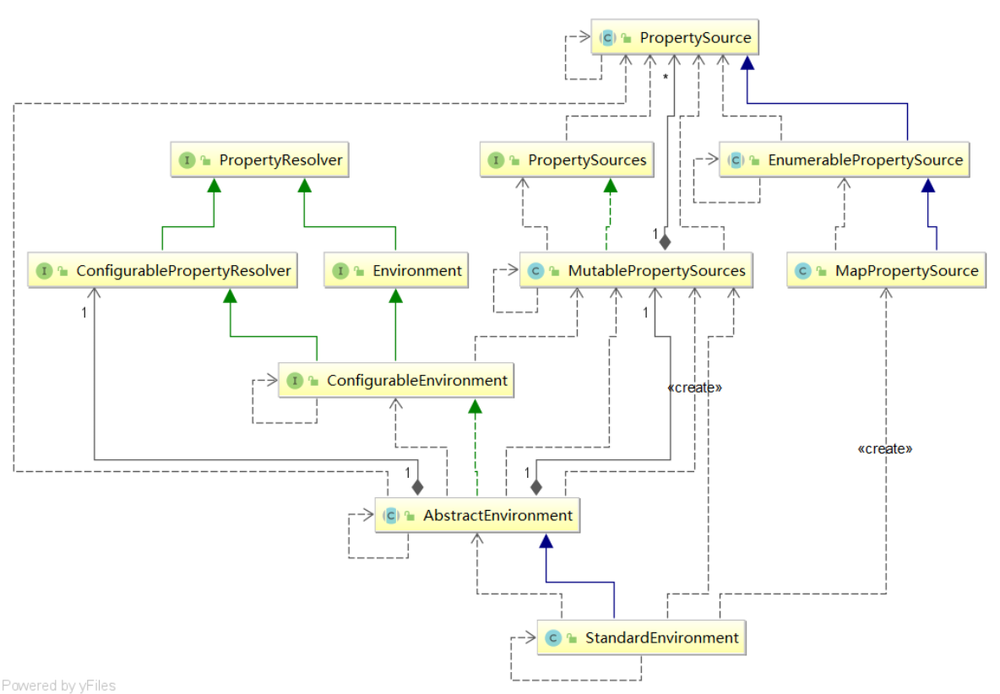

# Environment 、PropertySource、 PropertyResolver

* PropertySource：属性源，key-value属性对抽象，比如用于配置数据
* PropertyResolver：属性解析器，用于解析相应key的value
* Environment：环境，本身是一个PropertyResolver，但是提供了Profile特性，即可以根据环境得到相应数据（即激活不同的Profile，可以得到不同的属性数据，比如用于多环境场景的配置（正式机、测试机、开发机DataSource配置））

