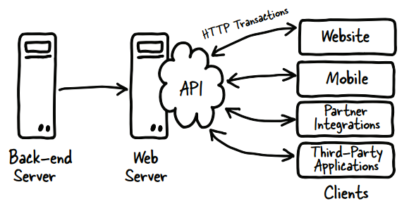

# 一、什么使API极为诱人的?

```
本章涵盖了
 定义web API及其功能
 确保良好的开发人员体验
 避免常见的陷阱
```

​	API是进入计算机系统的接口，是应用程序编程接口。从历史上看，api最初是计算机系统之间高度耦合的接口。Web api更加自由，也更少地捆绑在一起，它们已经发展了相当长一段时间，但是最近开发人员发现它们可以使用的Web api出现了巨大的爆炸式增长。许多这些API的开发都没有考虑到最终用户(在本例中是使用该API的开发人员)，从而导致开发人员体验不佳，web API也不太成功。

​	极为诱人的API易于使用、文档化良好、支持良好，并且支持的用例得到了良好的沟通和演示。使用您的API应该是一种愉快和迷人的体验，而不是经历一系列令人沮丧和永无止境的挑战。

​	本书将帮助您了解如何创建深受开发人员喜爱的web api，这些api具有吸引力和目的性，并将获得成功。它还讨论了决定是否应该拥有平台时应该考虑的因素。本书所包含的指导方针对于任何类型的web API都是有意义的，无论它的技术或受众是什么。

​	读完这本书后，您将对创建出色的web api所需的过程有一个深刻的理解，这些api能够吸引客户工程师，并在开发人员与同事分享经验时自然地扩展平台。尽管业界使用了许多不同类型的api，每种api都有自己的优势，但本书主要关注RESTful web api的开发。Web api将服务器的功能与客户机的逻辑和特性解耦，从而鼓励客户机开发人员以最适合其应用程序的方式使用数据。将服务器和客户机紧密连接在一起的非web api可以实现客户机和服务器之间的特定集成。例如，SQL是一种绑定到许多数据库的接口语言，它表示API，但是交互主要关注特定的操作。以一种更自由的方式公开数据并不适用于人们对数据库或其他紧密耦合系统的许多使用。

​	此外，您将对创建RESTful API所涉及的技术有一个很好的基本了解。REST代表具象状态传输，指的是基于资源的api，客户机通过请求而不是操作与服务器交互。web API的创建在技术上很简单:熟练的开发人员可以使用Flask、Django、Ruby on Rails或Node.js在几分钟内构建一个基本的REST API。如果没有清晰的计划、设计和目标，该API就不太可能优秀、可用或成功。如何使用这些技术决定了一个成功的、不可抗拒的API和一个在没有用户的生态系统中处于闲置状态的API之间的差别。无论您是产品经理、技术主管、工程经理、API开发人员，甚至是想要评估您已经创建或正在使用的API的开发人员，这本书都是为您量身定制的。

​	本章的重点是帮助您理解web API的整体生态系统，这些术语的含义是什么，在创建自己的API时您希望完成(和避免)什么，以及如何决定是否需要API。

## 1.1 将社交api集成到web内容中

​	您可能一直使用包含api的产品。您在新闻站点和博客上看到的共享按钮使用这些社交站点的api，如Twitter、Facebook或LinkedIn。如果您可以使用Twitter登录，您正在访问的站点将使用Twitter的API来识别您。这将带来更好的用户体验，因为您不需要记住更多的用户名和密码，而且您可以直接享受系统。图1.1展示了一个显示多个共享按钮的网站，允许读者将页面添加到他们在社交网络中的提要中。图1.2显示了API如何将更改传播到客户端，以便客户端更新其应用程序指南。


> 图1.1 一个博客包含了一个Twitter feed以及多个社交网络共享的API功能。
>
> ​	窗口小部件为每个社交网络(google +、Twitter、LinkedIn和facebook)提供按钮，并且这个小部件以一种易于实现的方式将该网络的API集成到站点中。


> 图1.2 与监控应用程序的API交互示例。
>
> ​	当监测应用程序检测到一个变化，它可以传播到一个网站，移动应用程序，短信通知，或电子邮件。


> 图1.3 这个图表描述了一个使用Freebase、Amazon和Netflix的适应的混搭网站。
>
> ​	用户将看到与特定类型相匹配的基于书籍的电影网格，对于每一部电影，用户都有机会在Netflix上观看电影或在Amazon上购买书籍。这是一个混搭组合多个api为用户创建集成体验的例子。

​	RESTful API是一个平台，它将数据公开为要操作的资源。例如，联系人记录管理应用程序可能使您能够与用户、联系人和位置进行交互。它们中的每一个都将作为资源或对象公开，您可以与之交互，无论是读取还是写入更改。当您创建设计良好的RESTful API时，开发人员用户可以创建通常称为mashup的应用程序。mashup将多个api组合在一起，创建一个新的用户体验(参见图1.3)。

​	如您所见，在图1.3中，我使用Freebase(将其视为世界信息数据库)、Amazon和Netflix创建了一个混搭网站。mashup允许用户查找已被制作成电影的书籍，然后在Amazon上购买或将其添加到Netflix队列中。我使用了来自Freebase的信息来为电影添加类型信息，这样用户就可以浏览并找到他们最感兴趣的电影。这是一个简单的例子，它混合了三个不同的api，为用户探索数据空间创建了一种新方法。通常，网站或应用程序还利用社交网络的api来登录、共享和显示用户提要。

​	这是一个很好的地方来强调这本书的一个主要概念。客户的开发经验是API成功的最重要因素。如果您试图鼓励创造力和与更大的社区的合作，或者鼓励开发人员通过api帮助您重新构思主要产品，那么REST可能是您最好的选择。另一方面，如果您的API需要基于操作的方法，这些方法以特定的方式执行少量任务，那么您很可能希望使用SOAP(简单对象访问协议)或其他为更紧密耦合的客户机和服务器设计的技术来创建非rest API。无论哪种方式，需要考虑的最重要的事情是您的客户想要什么，以及您希望他们如何使用您的API。记住，开发人员也是人。

## 1.2 什么是web API?

​	API这个术语在计算的大部分历史中都被用来指计算机系统之间的接口，或者现有系统上不同程序之间的接口。这些系统通常是对等的，其中没有一个系统是特定的服务器或客户机。例如，邮件服务器可能使用数据库来存储信息，但是系统本质上是一起设计的，紧密耦合以便无缝地一起工作。最近，这个术语已经扩展到包括web api，在这些系统中，客户机可以是任何东西，从web浏览器到移动应用程序，都可以与web服务器联系，并对该服务器上的数据进行操作。这里的主要区别是，编写客户机的开发人员与编写接口的开发人员不同，系统是真正解耦的。

​	要理解web API的概念，理解系统之间的通信方式是很有用的。想想很久以前的电话总机系统。你的手机只会做两件事:接通总机和制造噪音。如果你想给你的梅阿姨打电话，你就拿起听筒，按响铃声。接线员接完电话后，你要给她梅阿姨的电话号码，她会让梅阿姨的电话发出声音，然后她会把你的两条电话线连起来。在本例中，您联系了总机(在本例中充当服务器)，并向操作员提供了一个特定的标识符，而那个人连接了您的电话。这方面的协议是众所周知的，在自动切换技术成为可能之前很久，电话用户就能够相互交流了。图1.4显示了API如何与前端客户端和后端服务器交互。

​	类似地，HTTP是一个众所周知的协议，用于驱动web流量浏览器生成。web API是客户端使用定义的接口通过HTTP协议与web服务器交互的系统;这可以是内部系统，也可以是外部系统。要理解这在浏览器上下文中是如何工作的，当您在浏览器的地址栏中输入一个地址时，您要求该浏览器检索一个惟一的资源，比如获取一个电话号码。浏览器询问服务器与该标识符关联的信息，然后返回该信息并对其进行格式化，以便您在窗口中查看。Web API客户机对系统进行类似的读和写调用，但是响应的格式是供程序处理的，而不是供浏览器显示的。最著名的api之一是Twitter，它的api向第三方开发人员开放，允许这些开发人员创建与Twitter直接集成的应用程序。我将在第4章详细讨论HTTP。



> 图1.4 与API的基本交互是与后端服务器或服务器的直接连接，以及与前端客户端定义良好的交互。
>
> ​	这允许无数的前端应用程序，无论是移动、网站桌面还是系统集成，而无需更改后端服务器。


> 图1.5 这个例子显示了公共术语如何映射到API概念。
>
> ​	资源是惟一的名称，方法很容易理解，选项和上下文允许客户机通过API事务表达特定的概念。

​	在使用协议之后，为通过该协议发送的消息提供一种描述良好的格式非常重要。请求是什么样子的?预期会有什么反应?为了帮助您理解需要通过客户机和服务器之间的事务、通过HTTP发送的请求和响应来通信什么，我将把这些问题带回现实世界。为了支持计算机系统的需要，RESTful web API必须支持在平台上创建、读取、更新和删除项。图1.5描述了web API如何工作，并将其与实际资源(咖啡店订购的冰茶)进行了比较。

​	要理解这是如何工作的，请考虑一下在咖啡店点饮料时的情况(图1.6)。


> 图1.6 咖啡店中的客户交互。
>
> ​	尽管这个图看起来很复杂，但是要意识到交互表示您与服务提供者进行过多次的交换。确认可以像收银员点头一样简单，顾客的每一个请求都是一个简单的请求。

​	当你要一杯冰茶时，你已经创建了一个新项目:订单。向该订单添加选项(例如额外的ice)将更新该项目。当你让收银员告诉你你点了什么菜时，你已经读过了。如果你不小心把钱包落在家里，不得不取消订单，那件物品就会被删除。系统涉及到更复杂的因素，但这是web API事务的本质。

​	您将发现使用RESTful web API的几个优点，它将系统中的数据公开为客户机应用程序和平台之间交互的对象。当两个系统在深层次上紧密联系在一起时，很难在不破坏另一方的情况下对任何一方做出改变。这降低了工作效率，并造成了对意外行为的脆弱性，尤其是当应用程序变得不同步时。编写由文档化的接口将系统分隔开的代码可以保护两者不受意外更改的影响。在保护内部方法不被意外使用的同时，更容易测试API和记录接口。

​	那么，API能为您提供哪些功能呢?我们将在本书后面更深入地探讨业务目标。掌握可以利用API的各种方法还取决于对API可以做什么的理解(参见图1.7)。


> 图1.7此图显示了集成在一起的多个系统。
>
> ​	在左边，您可以看到Fitbit、MyFitnessPal和Withings进入Runkeeper系统，该系统可以将您的所有健身数据集中在一个地方。右边的图片显示了Netflix和它整合的各种类型的设备，巩固了它在视频行业的领导地位。

​	图1.7演示了web api可以实现的几种类型的集成。移动设备是api之间的主要驱动力;在几乎所有情况下，对API的需求都是由具有响应性的移动应用程序的需求驱动的。对于开发api的公司来说，移动几乎是一个通用的用例。由于这个原因，它通常是主要用例。允许您的客户开发人员将他们的系统与您的平台集成，可以节省为每个单独的合作伙伴创建自定义实现所需的开发资源。

### 1.2.1 您需要API吗?

​	您首先要回答的问题之一是是否必须创建web API。与任何其他产品一样，创建没有任何目的的API注定会失败。在确定API的业务价值的过程中，这个问题应该很清楚。无论您是想提高参与度、支持移动策略，还是与其他系统集成，API都需要花费时间和资源来正确创建。

​	API可以提高速度、吸引合作伙伴和启用移动设备，但是如果您的企业不需要(也不会需要)这些东西，web API可能不适合您。但是，仍然有必要通过实践来确定在什么时候可能需要API。

### 1.2.2 选择REST APIs 

​	在决定是否将REST用于API时，请考虑客户的需求和必须与之交互的系统。在过去的几年里，rest风格的API已经成为最流行的web API类型。以前的API结构与REST的主要区别在于，REST API是围绕系统中的名词而不是动词来设计的。

​	REST api旨在通过允许开发人员消费者决定如何使用可用数据来鼓励创造力和创新。与开放源码一样，这种开放性可能会引起那些专注于保护其专有信息的大型企业的关注，但是在谨慎设计时，安全性和隐私可以在开放api和内部RESTful api中得到保留。这类API的另一个术语是平台，它将底层系统描述为开发人员用来构建集成或应用程序的基础。

### 1.2.3 JSON 

​	当前，REST API最流行的响应格式是JavaScript对象表示法(JSON)，这是一种表示服务器和客户机之间传递的数据的有效方法。

​	JSON格式紧凑，易于在慢速网络上传输。因此，在网络连接有问题的设备(如移动设备)上是可管理的。解释语言，如JavaScript、PHP、Perl和Python，可以很容易地使用JSON。事实上，使用这些语言的开发人员对这些对象很熟悉，这也是JSON如此流行的原因之一。此时，如果您正在创建一个新的API，并且必须选择一种格式，那么您可能希望使用JSON。添加第二种输出类型会增加更多的开销和重复，因此，除非您的客户出于某种原因显式地需要某种其他格式(如XML)，否则最好坚持使用一种格式。选择支持两种不同的格式将导致相当大的技术负担，从而导致在开发产品时需要做额外的工作，因为您必须将用例测试加倍，并增加开发时间。

## 1.3 开发人员的经验

​	开发人员使用API的经验是API成功的最关键因素。一个向外部开发人员开放且开发人员体验较差的API很可能将第三方开发人员推向您的竞争对手。您甚至必须在创建内部API时考虑到开发人员的经验。在没有优秀文档和教程的情况下创建内部api将导致巨大的支持负担，因为您的消费者在编写其实现时遇到困难，并且在不了解如何最好地使用您的api时遇到困难。

​	良好的开发人员体验始于理解API的目标，并将这些目标与希望参与其中的开发人员进行沟通。您可以与他们共享的信息越多，他们就越能够决定是否要使用您的api。请记住，当开发人员开始使用您的API时，无论是内部的、合作伙伴的还是开放的API，开发人员给您的唯一东西是他或她永远无法得到的:时间。证明您认识到这一点对于与这些用户建立信任和互利的关系至关重要。

​	一旦确定了API的业务价值、度量和用例，就要将这些信息传递给开发人员。只要你能做到透明，信任的关系很容易就能实现。在阅读本书的每个部分时，请仔细考虑是否有充分的理由不与开发人员共享关于业务价值、度量和用例的信息。如果没有，那就分享吧!您可能不认为开发人员会想要了解您的业务价值或用例，但是向他们提供这些信息可以清楚地告诉他们您是认真对待您的API的。允许您的客户在API完成之前查看您的设计文档，这使您有机会在开发过程中获得有价值的反馈。准确地告诉开发人员您将如何度量API的成功—无论是用户参与度、最终用户数量还是其他因素—使他们有机会与您的团队合作，从而改进那些您认为对API的成功至关重要的指标。

​	提供工具、示例代码和教程对开发人员的体验也非常重要。提供语音呼叫和SMS消息api的公司Twilio有一个目标，即任何进入其站点的开发人员都应该能够在5分钟内从其系统成功拨打一个电话。拥有这种可用的练习可以抓住潜在的开发人员，并让他们参与到您的系统中。虽然他们可能只计划浏览你的网站5 - 10分钟，但打这个电话会鼓励他们投入更多时间去了解他们能做什么。

### 1.3.1 版本控制

​	版本控制是API管理中最困难的方面之一。假设您可以在稍后对其进行修复，那么新创建的API看起来可能相当不错。不幸的是，使用哪个版本的选择掌握在开发人员手中，而开发人员很可能是您无法控制的。一旦开发人员与您的系统进行了集成或应用程序，他们就不太可能有动机迁移到新的、不兼容的版本，除非有对他们至关重要的新功能。您需要认真对待您的第一个版本，因为您可能会在很长一段时间内支持该版本。

​	不更改或删除现有功能的兼容版本通常都很受欢迎，但是一旦您需要进行破坏现有实现的更改，您就会面临来自开发人员社区的阻力，特别是如果您不赞成他们坚持使用的版本。即使你给他们一个很长的迁移警告期，他们也可能不想重做他们已经做过的工作。另一方面，维护旧版本会创建重复的代码，并要求对早期代码和现有代码进行修复。当开发人员使用多个版本时，故障排除和支持将变得更加困难。这意味着您的第一个版本需要是一个可靠的竞争者，您打算长期使用它。每周或每两周发布一个新版本的网站模型并不适用于API。虽然API确实提供了一个解耦的世界，但是开发人员仍然依赖于开始时的版本，所以您需要了解新版本的价格。

### 1.3.2 市场开发人员

​	最后，确保您的营销目标是针对开发人员的。开发人员在访问您的门户时会遇到一个主要问题:我为什么要关心这个问题?这通常可以分解为我能做什么?X怎么做呢?不幸的是，文档常常被困在每个部分的功能领域中?这不能满足这些问题的需要。开发人员往往不会受到他们想玩玩具的漂亮图片或口号的启发。给他们示例代码和应用程序，以及他们开始使用您的平台时所需的构建块。

​	所有这些想法将在整个图书开发人员经验中被重新审视，这将驱动您做出的大部分决策。(开发人员支持的具体主题将在第9章中更详细地讨论。)遵循这些指导原则将帮助您避免第一代api中常见的一些问题。

## 1.4 组织APIs常见的陷阱

​	虽然看起来api是一个新事物，但是REST api已经问世超过10年了。在这一点上，业界正在从开路先锋转向更稳定、更用心的API创建者，他们可以利用以前平台的经验教训。这意味着您可以从第一个api所犯的错误中学习，这些错误是在没有考虑如何使用和度量api的情况下创建的。Twitter、Netflix和Flickr都有非常常用的著名api，但是您可能没有意识到已经创建了数万个api，随着api变得越来越常见，这个数字将上升到数十万。许多这样的api都被抛在了一边，甚至有更多的api正在一个相对拥挤的市场中挣扎着取得成功。通过拥有一个具有出色开发体验的可用API，可以将您的平台与竞争对手区分开来，这将帮助您登上堆栈的顶端。

​	我将讨论几个具体的例子来说明平台公司所犯的常见错误。请记住，我作为示例使用的API在长期内取得了成功，但是早期的错误使它们付出了金钱、资源和信誉的代价，并且在某些情况下阻止了它们更改设计以改进API。

### 1.4.1 缺乏远见

​	当Netflix API首次发布时，它向开发人员社区开放。该产品的目标是让百花齐放，让第三方开发人员能够创建令人惊叹的应用程序，这些应用程序将带来新的订户，并为这些应用程序赚钱，同时增加Netflix的订户基础。对于开发人员如何使用API的指导很少，并且主要关注API做了什么，而不是提供教程和用例。开发人员被吸引到这个平台上并创建了许多应用程序，但收益从未出现过。因为公司对API的目标是不集中的，开发人员不知道公司想让他们用API实现什么。因此，许多客户在没有添加新功能的情况下重新创建了Netflix网站的功能。Netflix雇佣了一个大型团队来支持开放API，并鼓励开发人员全身心地投入其中，创建应用程序并将其集成到系统中。但是，某种程度上的使用条款限制了第三方开发人员与系统集成的方式，削弱了他们所希望的创新。在这个案例中，主要的问题是Netflix要求属性，不允许与其他供应商合并信息，最关键的是，要求广告与Netflix的内容无关。

​	通过合作伙伴使用其API(使用API将Netflix集成到各种视频设备中)，Netflix发现，通过在设备(如Xbox、蓝光播放器和智能电视)和合作伙伴产品(如Windows)中创建有效的集成，API是确立市场主导地位的一种极好的方式。这个商业决定对Netflix来说是一个伟大的决定，但它的API现在专注于一个特定的细分市场。但是，第三方开发人员的存在意味着Netflix需要继续使用资源来启用和支持其他用例。事实证明，这是对资源的昂贵使用，没有什么商业价值。随着时间的推移，Netflix将API更多地集中在设备市场，而不是开放版本的API。对开放开发者的支持下降，新功能只提供给合作伙伴和设备制造商，开放API最终完全退役。

​	这是一个很好的例子，一个创新者创造了一个产品，这个产品有很强的负面开发体验，但最终证明对业务有很好的价值。与开发人员的沟通鼓励他们进行创新和创建，而这些开发人员相信资源将继续对他们可用。这种情况使许多平台上的开发人员感到不快，因为他们花费了大量的时间和金钱来实现最终完全失败的应用程序。

### 1.4.2 优先考虑开发人员的体验

​	Twitter最初只有一个网页，你可以在上面输入你的信息，你可以关注别人或者发送信息，这就是它的功能范围。没有图像管理，没有列表，也没有其他的社交系统功能。开发人员喜欢这个API;虽然一开始开发人员的体验有点尴尬，但是很容易想象使用这样的系统可以做什么。许多Twitter功能最初是由外部开发人员作为其产品的一部分创建的，Twitter采用这些新功能是因为用户喜欢它们。这是一个不错的设置，尽管开发人员对他们的想法被Twitter窃取的感觉有些不满意。

​	最终，情况变得更糟了。Twitter重写了它的使用条款，这样开发人员就不能创建与它的产品直接竞争的应用程序，而现有的这类应用程序需要被淘汰。这意味着当Twitter采用一个新特性时，任何依赖该特性来区别于Twitter的现有应用程序都将不复存在。Twitter希望用户将共享和社交媒体集成到自己的应用程序中，而不是直接基于Twitter创建应用程序。不幸的是，由于这条消息是在几次失误之后才被分享的，所以开发人员社区大体上对Twitter相当不满，公司的信誉因此受损。幸运的是，Twitter拥有庞大的用户基础，因此没有受到影响。

​	Twitter最终意识到，它的API的某些方面在没有被大多数开发人员客户使用的情况下，会浪费时间和资源。例如，所有Twitter调用都可以使用JSON或XML检索，一些客户更喜欢使用JSON或XML这种更广泛的结构。不过，只有不到5%的开发人员使用XML版本，因此Twitter创建了一个新的不兼容版本，这个版本将API改进为与大多数开发人员使用的API更加匹配的版本。正如我所提到的，创建向后不兼容的版本更改的成本很高。Twitter花了很长时间才“日落”旧API，许多开发人员仍然对这个变化感到不满。

​	作为一个创新者，Twitter在开发其API时必然会经历一些成长的痛苦。在这一点上，它拥有最好的开发人员门户之一，拥有优秀的教程、论坛形式的支持，以及一个文档良好的API，该API既简单又一致。如果Twitter在一开始就知道用户将如何使用这个平台，或者拥有另一个API来为其平台建模，那么它就能够在一开始就创建正确的API。另一方面，Twitter从开发人员那里吸取了宝贵的经验教训，观察他们使用API并了解他们所做的事情。有时候你需要打破规则来找出正确的答案，但是知道正确的计划是什么可以帮助你避免不必要的错误，帮助你获得你想要的成功。

### 1.4.3 糟糕的API设计

​	Flickr是最早的照片共享服务之一，也是最早的api之一。尽管它试图创建一个RESTful API，但它创建的API使用的是操作而不是对象(动词而不是名词)。Flickr在其API中进行了改进，但是许多开发人员已经实现了旧的API，所以他们很难创建一个新的、更好的版本。最初的设计选择有助于理解一些问题，这些问题是由于缺乏对创建RESTful api的基本技术的理解而产生的。

​	为了帮助您了解这一点，我将描述Flickr做出的非restful选择的一个示例。要从Flickr删除照片，使用者必须向与该照片相关的delete_photo资源发出请求。最初，将通过向delete_photo资源发送GET请求来删除此照片。对服务器进行更改的RESTful方法是使用适当的HTTP谓词Flickr。在本例中，DELETE是删除资源的正确方法，GET应该只用于读取资源的现有值。区别可能看起来很小，但是当您违反这些规则时，您将为使用该API的开发人员创建一种情况，即您的API以一种意想不到的方式运行。与为产品的最终用户设计一样，您不希望创建这样一种情况，即系统的行为让开发人员感到意外。

> REST
> DELETE /photos/1234
> Flickr
> GET /photos/1234/delete_photo 

​	第4章讨论了这方面的细节，但现在我将指出Flickr实现的一些问题。

​	首先，在REST api中，使用GET方法的请求不应该更改服务器上的数据。这一点之所以重要，原因之一是如果您的API不遵循这条规则，web爬虫程序或其他自动化系统可能会意外地更改或删除系统中的所有项。因为强认证的发展,这已经不是一个主要问题,但重要的是要认识到，大多数应用程序和网站开发人员都知道这条规则，所以做出这种设计选择会导致API的行为不是开发人员所期望的。HTTP提供了一组定义良好的谓词。在本例中，有一个DELETE方法将资源从系统中删除，因此完成此任务的正确方法是删除资源而不是GET to操作。

​	这里的另一个问题是，通过公开操作而不是对象，开发人员在使用API时受到了限制。公开名词而不是动词意味着开发人员可以自由地想象数据的新用途。此外，对相同对象的操作位于相同的地址，这与面向对象的设计匹配得更好，并有助于增强开发人员体验的一致性。如果一个特定的API对象不支持特定的方法(比如DELETE)，系统可以返回一个与HTTP规范一致的错误代码，开发人员将知道如何处理这个错误。

​	遵循API的REST规范似乎并不十分重要。这是你的系统;您可以选择如何实现它。但是请记住，您的开发人员客户可能熟悉REST api的工作方式，并且每当您更改工作方式时，他们很可能会感到困惑或做出错误的假设。如有可能，请遵循第4章所列的一般原则。您的API与其他现有API越相似，开发人员的体验就越好。完成这些先决条件之后，就可以创建API了。

## 1.5 API创建过程

第七章是所有这些的集合;您将学习创建成功且引人入胜的web API所需的步骤。如图1.8所示，这些步骤包括:

```
确定业务价值
选择度量标准
定义用例
设计API和创建模式模型
```

​	很多时候，很容易跳过我在本书中介绍的步骤，但是像您的主要产品一样，您的web API应该是一流的公民,与您为您的网站或应用程序所付出的设计、实现和支持平台的努力是一样的。将您的API当作一个真正的产品来对待，这将极大地帮助您在第一次就获得正确的平台。

### 1.5.1 确定您的业务价值

​	许多最初的平台产品都有模糊的目标。第三方开发人员经历了这样一个世界:他们必须努力理解公司想让他们用API做什么，更糟的是，他们所依赖的平台经历了巨大的变化，或者干脆被弃用。如果他们从一开始就明确地确定他们的商业目标，这是可以避免的。

​	当考虑到商业价值时，想想那些新创业公司经常针对的电梯游说。如果你和你公司的CEO一起坐电梯，他问你为什么要有一个API，你需要能够简洁地回答这个问题，让他相信这是一个有价值的产品。“开发人员与”或“API使用”并不是一个很好的目标。您需要一个与更大的业务相关的具体目标，比如“增加用户参与度”、“建立行业领导地位”、“将活动从主要产品转移到API”或“吸引并留住合作伙伴”。盈利是一个很好的目标，但除非你的API是你的主要产品，否则你需要把它看作是一个支持产品，提高你产品的价值。

​	处理好业务价值的另一个重要原因是资源争用。你的公司只能支付一定数量的工程师的工资，通常这些工程师被分为创收产品和支持工程师。API是一种笨拙的产品，一个好的API是不直接添加到底线的。如果你不能始终如一地简明扼要地解释为什么你的API对公司有价值，以及它是如何支持和提高现有的盈利产品，你的API很可能会受到影响。当公司的领导不理解API的价值时，当工程师有时间更新API时，它可能会被放到次要位置，或者更糟的是，完全退役。

​	当您阅读本书时，请继续思考您想要用您的API实现什么，以及您想让您的开发人员做什么，这样您就可以谨慎地创建您的API来获得成功。

### 1.5.2 选择度量标准

​	无论您的平台的业务价值是什么，您的CEO都想知道您是否正在实现它，如果您能够演示您的API是如何工作的，那么从其他团队获得支持就会容易得多。您需要这些信息，以便能够快速评估您正在创建的API，或者您所做更改的有效性。图1.9展示了一些常见的业务价值，以及可以用来跟踪实现这些目标的进度的指标。

​	您经常会看到诸如“正在使用的开发人员密钥数量”或之类的API指标“开发的应用程序的数量”，但这是一种内部类型的度量，不太可能对平台本身的业务价值有意义。开发人员必须获得密钥才能试用您的系统，而其中90%的密钥可能完全不活动且毫无意义。相反，知道平台为客户提供了哪些操作不是很好吗?或者有多少用户通过API进行交互?或者用户每天与您的系统交互多少次?或者您的合作伙伴中有多少人创建了集成到他们的系统中?增加与系统的接触是一个伟大的目标，并且相对容易度量，尽管您需要确保正在发生的操作对您的业务有好处。试着想想你的API是如何提升整个公司的目标的，而不是决定有多少人已经开始与你的系统集成。

### 1.5.3 定义用例

​	一旦您确定了您的业务价值，以及您将如何度量它，就应该考虑您想要支持哪些用例了。您的主要产品常常是一个很好的目标用例，无论是整个产品还是子集。例如，如果您的API中有一个共享组件，您可能希望通过您的平台突出显示并提高该特性的参与度。根据可能有用的API特性来考虑主要产品，这是开始考虑希望支持哪些用例的有效方法。

​	如果你想让手机开发者参与进来，你很可能会这么做，因为人们花在智能手机上的时间太多了，而且已经习惯于在较小的屏幕上期待出色的用户体验，你需要了解手机开发者的需求，并解决他们的问题。这个用例非常重要，因此我强烈建议您考虑它，即使在您不久的将来还没有移动设备。这个用例将对您在设计系统时所做的选择产生很大的影响。移动开发人员需要API具有高性能和健壮性，并且他们不太可能使用一个API来在一次调用中为单个屏幕提供所需的所有信息(理想情况下是所有相关信息和没有额外数据)。您的用户可能走进隧道或电梯而失去连接，开发人员希望应用程序足够快速和健壮来处理这些情况。除非API是用这些开发人员作为用例来设计的，否则很容易创建一个不能用于移动用例的API。

​	伙伴集成也是用例的一个强有力的候选。在设计API时，合作伙伴的参与常常是一个伟大的业务目标;这些合作伙伴关系带来一致和可靠的收入，您希望让合作伙伴尽可能轻松地将您的API集成到他们使用的系统中。如果您的主要产品是它们所依赖的服务，那么您可以在这些系统上公开度量，以便它们可以与您的仪表板集成。如果您有社交或通信元素，他们可能希望在其员工门户中显示新闻流。无论哪种情况，评估这些用例都很重要。合作伙伴的参与通常是公司的一个关键目标，支持它将使你的产品成为这个目标的核心。

### 1.5.4 设计你的API

​	开发人员通常会在主题出现时立即创建API。他们不愿意花时间去创建设计，这是因为web api，尤其是REST api，很容易实现，而且很难抑制他们创建一个可以快速编码的产品的热情。图1.10显示了在不考虑一致性的情况下，单独创建几个不同的API时，有机增长的API是什么样子的。

​	不幸的是，没有经过深思熟虑的设计而创建的api常常看起来有点像放在车库里几个月的土豆，芽以奇怪的角度长出来，彼此完全不相干，没有吸引力，没有明确的目标或一致性。我经常将创建的api称为Wild Wild REST，因为创建功能完整但不可用的系统非常容易。后端架构师倾向于从可靠性、可伸缩性和效率方面考虑开发。但是web API是用户界面的一种形式，所以花时间定义如何使用该API以及它应该是什么样子是非常重要的，并将原型化或开发推迟到该任务完成之后。

​	设计API的过程可能很有挑战性，除非您有某种可用的系统来描述API完成后的样子。与早期的API结构不同，REST不需要任何关于API做什么或如何使用它的文档。从历史上看，这意味着REST api是在没有明确的总体设计的情况下创建的，但是这会产生各种各样的问题。首先，API的产品经理通常是对API本身的用例最了解的人，但是如果不能讨论具体的描述，这些产品经理可能无法权衡提议的API是否合适。

​	这个问题的答案在于模式建模系统。这些产品允许您在任何开发开始之前描述API的接口。在开始开发之前，经过深思熟虑的设计可以鼓励开放的交流，并防止重复开发工作和误解需求带来的挫折。当一个模型被创建并用于驱动开发过程时，用例可以被紧密地映射到特定的端点集(每个命名的API资源都被称为一个端点)，并且可以以一种有意义的方式对工作进行优先级排序。可以检查API，以确保端点是一致的，并且没有任何明显的漏洞或功能不匹配。可以为客户或测试部署一个模拟服务器，以确定用例是否简单，并且测试和示例客户端可以使用这个结构化文档来保持最新的API函数和特性。

​	为REST api建模模式并不一定是一项简单的任务;确保不同的产品以相同的方式呈现相同的信息是需要时间和工作的。例如，与会计和报告相关的端点可能会以不同于文档管理系统的方式显示用户及其会计信息，而文档管理系统将显示所有权和编辑信息。这个过程可以帮助您在开发过程中避免这些冲突，并以最小的难度在截止日期前完成任务。后端系统通常将所有这些信息隔离，但在设计API时，应该将数据视为内聚系统中的项，而不是单独系统中的独特项。当API设计留给后端架构师时，这是一个经常被忽略的主要准则，后端架构师通常关注可伸缩性、性能和精度，而不是可用性。您的API设计应该包括每个端点的可读定义;响应的方法、字段和格式;以及系统中任何其他重要的元数据。

​	第7章讨论了建模模式，我们将探讨三种主要的模式建模语言中的两种:RAML和OpenAPI(以前是Swagger)。它们都使用Markdown或JSON定义API端点的行为，并且都支持通信、文档和测试。每一个都是一个开放标准，但是每一个都受到最初创建它的公司的支持，如果您正在使用一个相关的系统来进行API管理、设计或文档，那么最好使用匹配的建模语言。下面是模式建模语言的示例，让您了解每种语言中维护了哪些信息。图1.11描述了一个Blueprint模式模型。


> 图1.11简单notes API的蓝图定义。Blueprint使用Markdown进行格式化，您可以看到这是一个人类可读的文档。只要有人了解HTTP交互的基本知识，他们就能够解析这个文档，这意味着您的产品经理、客户和与您交互的其他开发团队在您开始编码之前就能够理解您的API。

​	Apiary是一家提供API设计工具和支持的公司。Apiary支持的模式建模语言Blueprint使用Markdown。如本书所述，该系统关注于整个开发周期。除了提供结构化语言来描述API之外，Apiary还使运行模拟服务器变得很容易，并允许客户对即将到来的API更改进行评论。Apiary提供了直观的设计工具，使任何人都可以轻松地描述API，并提供了一个方便的初学者模板，供您在开始时使用。


> 图1.12 OpenAPI示例标记。与Blueprint不同，OpenAPI(以前的Swagger)支持JSON和YAML作为其标记语言，并具有在系统中包含对象抽象(例如用户或联系人)的功能，这鼓励读者以面向对象的方式考虑API的资源。

​	图1.12展示了用OpenAPI(以前称为Swagger)建模的模式，OpenAPI是最流行和最活跃的模式建模语言之一。这是唯一使用JSON而不是Markdown进行模式建模的语言，而且它还支持第三种标记语言YAML (YAML代表另一种标记语言)。这个系统的功能与其他两个系统的功能相匹配，但是没有任何简单的工具可以用来创建OpenAPI文档，也没有现成的模板来帮助您入门。对于新用户来说，这将导致更陡峭的学习曲线，并可能阻碍您使用该系统。


> 图1.13 MuleSoft的RAML。RAML和Blueprint一样支持Markdown，但是s创建的模式比Blueprint更有表现力。此外，与OpenAPI框架一样，它们比Blueprint更支持抽象对象，从而更容易在复杂系统中实现和维护一致的api。

​	最后，图1.13显示了一个RAML模式模型的示例。MuleSoft是一个API管理系统，RAML是其模式建模语言。该语言旨在鼓励API提供者之间重用最佳实践。此外，该语言和工具旨在使API的发现和探索更加容易。与Apiary一样，MuleSoft提供了模板和工具来软化学习曲线。

​	这些选项都不一定比其他选项更好，而且它们都有不同的特性和重点。第7章介绍了两种主要的模式建模语言RAML和OpenAPI。无论您使用什么系统，拥有模式模型都将创建一个工件，该工件表示您为API所做的设计选择。

### 1.5.5 行业标准

​	在设计API时，需要记住的一点是，与网站或应用程序不同，开放API在发布后将是公开的。您无法向竞争对手隐藏模式。这不是一个问题，许多公司认为他们的API模型是他们的竞争优势，但这些公司是错误的。您所呈现的数据和用于使其更吸引人的算法是您的API与您所在行业的其他公司的区别所在。在发布之前，您的API应该是保密的，这种强烈的想法导致了同一行业的公司之间在模式上的巨大差异。这就造成了这样一种情况:开发人员必须更加努力地将类似的API集成在一起以创建更好的客户端，因为每个API都要求重新开始开发，而组合结构不同的数据的任务就落在了开发人员的肩上。

如果您认为您的API是一个公共接口，那么很明显，您应该努力向您所在行业的其他公司学习，并与他们一起努力实现最佳实践。这种方法将帮助整个API生态系统更快地成熟，并鼓励更多的开发人员试用您的API。如果你考虑一个行业，比如健身，很容易发现体重和每天的步数是非常简单的。在Fitbit和Runkeeper之间创建访问、管理和与这些项目交互的不同方式，增加了开发人员在集成这些系统时遇到的困难。

​	图1.14介绍了API Commons的概念，在这个概念中，组织可以上传它们的模式模型，供其他API生产者重用。这种功能将帮助API行业转向最佳实践，改善使用这些API的开发人员的体验。


> 图1.15从其他公司的模式构建API，可以让您在设计自己的API时使用不同API提供者生成的模式，同时仍然使已经实现了这些其他API的开发人员能够轻松地与您的平台集成。

​	为了与这个想法保持一致，创建了API Commons作为存储和共享设计模式的地方。这个项目的想法是，具有设计模式的公司可以将它们签入共享存储库，其他公司和组织可以使用共享模式引导它们自己的模式。图1.15说明了如何使用API Commons通过使用其他组织的API作为基础来创建新的API。

​	公司可以选择使用Twitter描述的用户定义，以及Withings使用的体重模型和Fitbit使用的步骤描述，来创建一个监控减肥的应用程序。事实上，一些集成已经使用了这些类型的信息，规范API交互将使开发人员更容易创建这些应用程序。

​	这种方法有几个优点。考虑发布新平台的公司可以看看他们行业的其他人都做了些什么。具有类似目的的Web api可以迁移到一个兼容的结构，从而简化了开发人员创建集成的学习过程。最后，随着越来越多的公司将模式放到系统中，最佳实践将不断发展，新的api可以提供更一致的接口，并改善开发人员的体验。如果没有这种系统，api演变成一个成熟的生态系统将是一个漫长而痛苦的过程。

### 1.5.6 设计驱动的开发

​	在开发完整的应用程序时，需要同时部署整个应用程序，新版本应该尽可能完整，因为更新应用程序会给用户带来负担。另一方面是网站。一个网站可以每天推出一个新版本，坏掉的功能通常可以很快修复。新功能可以根据需要添加或删除,用户不需要做任何事情为了利用新版本(另一方面,用户很少可以选择回到早期版本与新一)如果他们不高兴。

​	api位于这个范围的中间。正如前面提到的，中断导致现有实现中断的更改在时间、资源和可信度方面代价高昂，但是可以在现有版本中添加新功能。尽管应用程序需要升级才能获得这些新特性，但设计良好的API可以在现有数据结构中添加新功能或新信息，而不会破坏开发人员现有的应用程序。

​	因此，可以创建一个目标API，然后在此基础上构建。找出最重要的用例，例如，mobile，并找出该用例的最小可行产品(MVP)。(MVP是一款产品，它可以实现产品的基本功能，而不需要任何额外的附加功能。)也许您只想让人们能够查看您的产品线或查看他们朋友的活动提要。确保您知道为了支持这个用例并为此开发您的API, API需要做什么。api非常适合敏捷开发过程，在敏捷开发过程中，较短的迭代允许频繁地检查更改和添加，以便保持在正确的轨道上。

​	通常，当设计没有提前确定时，结果产品不能满足客户的用例。在测试或审查API时可能会发现这个问题，但即使出现这种情况，也必须将产品发送回开发部门重新尝试。除了开发人员、营销人员或管理人员，没有人喜欢错过最后期限，因此确保充分理解需求有助于确保开发工作准确定位于它应该在的位置。

​	因为您将为您的API创建一个模式模型，所以很容易确保每个端点都有文档和测试，以确保编码的产品满足预期的行为。此外，用例的存在使得测试集成产品变得容易，以确保这些用例实际上是容易的。设计优先的方法将许多争论带到流程的前端，并允许更精简的开发。

### 1.5.7 支持您的开发人员

​	在一本专注于为您的API消费者优化开发人员体验的书中，我将不讨论您的API的支持部分。有时api发布时没有一个可靠的支持系统，这可能会在您的开发人员社区中造成很大的挫折。不要把社区中的开发人员看作是必须与之打交道的闯入者，而是要把他们看作有价值的合作伙伴，并以此来支持他们。

​	开发人员支持包括一个开发人员门户，其中包括文档、示例代码和用于查找帮助的良好沟通的流程。您的文档应该包括您的用例，以教程的形式呈现，您的业务价值，以及您计划使用的度量。提供这些信息将使您的开发人员用户能够帮助您成功。要获得良好的开发人员体验，第一步是当您向开发人员展示您致力于API和他们的成功时，他们所感受到的信任。

​	吸引开发人员意味着要预先执行大量的支持工作。虽然主流产品的消费者对插图和标语反应良好，但开发人员希望立即开始。他们喜欢以示例代码的形式使用构建块。当开发人员能够在尽可能短的时间内调用API时，就会产生参与感和兴趣，这对于平台的成功是非常宝贵的。

研究开发人员体验的最佳门户是Twitter。该公司投入了大量精力来确保其拥有清晰的文档和优秀的教程。Twitter还确保社区中有大量的示例代码，开发人员可以利用这些代码编写自己的应用程序。

​	另一个很好的例子是暮光。它的目标是使任何新开发人员能够在不到五分钟的时间内调用它的API。虽然这并不可能适用于所有API，但是在创建入门文档时，这是一个很好的目标。

## 1.6 摘要

​	本章讨论了在非常高的级别上创建api的主题。此时，您应该理解API是什么以及如何使用它。我分享了一些警世故事，来解释为什么深思熟虑的设计过程如此重要。第一章的主题如下

* 什么是web API?web API与其他API系统的不同之处在于，它的设计目的是将系统彼此解耦，允许新的和不同的集成。
* web API可以做什么?web API可以为您的系统添加接口，您的内部客户、合作伙伴开发人员和外部第三方工程师可以使用众所周知的成熟技术将您的系统与他们的系统集成在一起。
* 开发人员的经验是这个过程中最重要的方面。专注于你正在创建的平台的可用性将会带来一个更成功的产品。
* 最常见的陷阱是由于跳过了本章中概述的第一类API流程的一部分。如果没有用例，就没有办法检查和确保得到的API满足最初声明的目标。

第2章将介绍一个实时API，您可以作为客户机与之交互，并了解它是如何工作的。高级开发人员将有机会自己安装系统，但是每个人都将有机会看到基本REST web API的界面。