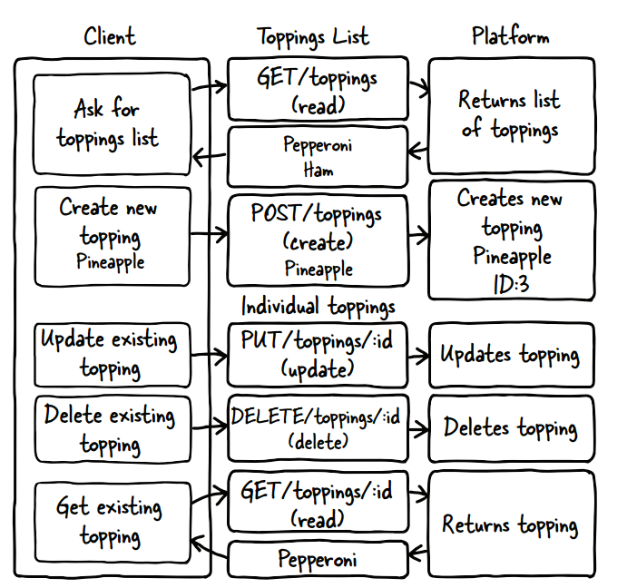

# 二、使用web APIs

```xml
本章涵盖了
 一个简单API的结构
 检查对API的调用的方法
 API和客户机应用程序之间的交互
 在系统上部署示例API和应用程序
```

​	接下来的几章将详细介绍服务器-客户机交互，但是本章通过一个简单的API示例和示例应用程序帮助您理解概念。大多数基本的API示例都使用待办事项列表，但这有点过度使用了。我决定走一条不同的路:我选择了一个列表应用程序，其中包含披萨配料。注意，这个特殊的应用程序在设计上很简单;目标是向您展示如何与API交互，以及应用程序如何与API交互。如果这是一个生产应用程序，它将拥有一个完整的批萨，或者批萨，并且不会共享数据库，但是为了实现这些目标，我已经尽可能地减少了复杂性，以便使基本原则更加清晰。

​	查看API很有趣，但它不一定能帮助您理解它如何驱动应用程序。此外，在浏览器中执行诸如创建和删除之类的操作是很有挑战性的，所以除了API之外，我还包含了一个简单的应用程序，它使用这个API和JavaScript。这个应用程序运行API中的所有功能，以便您可以看到应用程序如何与web API交互。

​	为了了解这在实践中是如何工作的，我使用Node创建了一个基本的API。一个基于javascript的web服务器框架。(您可以通过`www.nodejs.org`了解关于这个框架的更多信息。)该API支持表示完整系统所需的所有操作:创建、读取、更新和删除。第一个任务是使用read功能在浏览器中探索API。

​	此应用程序在`www.tibleapis.com/demo`的web主机上运行。您可以查看那里的应用程序并遵循本章中的概念。如果您是一名开发人员，并且希望更深入地研究代码，请使用本章末尾的练习使示例在您自己的系统上运行，包括Node.js应用程序和HTML/JavaScript web应用程序。第2.6节还描述了这个API和应用程序的各种移动部分，以便您可以随意使用它。

## 2.1 HTTP基础知识

​	要理解API交互中客户机和服务器之间的事务，您需要基本掌握HTTP的工作原理。第4章更详细地讨论了这个主题，但是现在我将提供关于协议的一些高级信息。

​	您可能最熟悉HTTP作为web浏览器从web服务器获取信息的方式。HTTP事务由客户机到服务器的请求(就像浏览器请求web页面一样)和服务器返回客户机的响应(对于浏览器，web页面来自服务器)组成。首先，我将描述HTTP请求中的元素。您熟悉URL，即您在浏览器上的address框中键入的地址，但是该地址只是从浏览器发送到服务器以处理web请求的信息的一部分。

### 2.1.1 HTTP请求

​	图2.1说明了组成HTTP请求的元素，以及如何使用这些部分的示例。HTTP请求通常与头一起发送，为事务设置上下文。HTTP请求总是有一个方法;方法是HTTP协议的谓词。要了解浏览器的功能，请假设您正在访问我的主网站。以下是由浏览器发送的请求片段

```  
 header: Accept: text/html这告诉服务器浏览器想要返回html格式的页面。它是人类最易读的格式，所以浏览器请求它是有道理的。
 Method:GET这是HTTP中的读取方法，通常是浏览器在读取web页面时使用的方法。
 URL: http://irresistibleapis.com—这是您为浏览器指定的惟一部分。
 Body: none—GET请求不需要主体，因为您不需要更改服务器上的任何内容，而是读取其中的内容。
```


> ​	图2.1 HTTP请求总是有一个方法，并将发送到特定的URL或资源。根据特定的调用，可以发送头来指定关于请求的信息。如果调用的目的是向系统写入新信息，则会发送一个主体来传递该信息。

​	CRUD的所有操作(创建、读取、更新和删除)都由HTTP中的方法表示

```
 Create: POST
 Read: GET
 Update: PUT
 Delete: DELETE
```

​	URL是资源的唯一标识符。它与internet上的任何其他URL一样，只是在本例中它用于描述应用程序系统中的资源。如果请求需要参数，例如搜索关键字，则将它们包含在请求的参数中。要查看参数的外观，下面是一个示例搜索请求

```html
http://www.example.com/api/v1.0/search?keyword=flintstone&sort=alphabetical
```

​	在本例中，被调用的资源是`http://www.example.com/api/v1.0 /search`。问号和后面的所有内容都是参数，它们提供了关于客户机在响应中需要什么的更多信息。主体部分只发送给create (POST)和update (PUT)事务。接下来，我将描述HTTP响应的各个部分。

### 2.1.2 HTTP响应

​	图2.2显示了典型HTTP服务器响应的元素。服务器可能会发回几个头，给出关于系统和响应的信息。所有请求都有一个方法，所有响应都有一个状态代码。更详细地描述这些状态码在第4章,但是现在它年代足以知道2 xx意味着请求成功,3 xx是一个重定向到另一个位置,4 xx是一个错误的请求从客户端,和5 xx意味着服务器有问题。在前面的例子中，调用我的网站时，服务器的响应如下:

```
 Status code: 200 -一切工作正常。
 Headers:
    - Content-Type: text/html -根据客户的要求
    -Date:<响应日期>
    - Content-Length: <响应>的大小
 Body—页面的内容。这是您在浏览器中查看源代码时所看到的内容，HTML页面告诉浏览器如何呈现页面以及显示什么内容。
```


> ​	图2.2响应总是有一个状态代码，一个设计良好的平台将发送头信息来提供关于响应的信息(例如大小或内容类型)。对于大多数请求，将从服务器发回一个主体来提供关于资源当前状态的信息。

### 2.1.3 HTTP交互

​	客户机和服务器之间的每个HTTP事务都由一个请求(从客户机发送到服务器)和一个响应(从服务器发送回客户机)组成。没有更高层次的相互作用;每个请求/响应都是无状态的，并且从头开始。为了帮助您更好地理解这一点，我将继续讨论特定的API。

## 2.2 The Toppings API

​	有许多不同风格的API可用，但我在这里使用和讨论最多的是具象状态传输(Representational State Transfer, REST)风格的API，这是最常见的web API类型。正如在第1章中所讨论的，REST api被设计为将每个资源作为名词使用。系统中的特定资源具有惟一标识符，即URL，就像您在浏览器中访问的资源一样。此URL标识系统中的资源，并设计为在查看时可理解。例如，使用REST API，您可以使用以下请求查看现有的Toppings列表

```html
http://irresistibleapis.com/api/v1.0/toppings
```

​	这些是实际的url，通过GET (read)操作检索。如果将前面的URL放到浏览器中，您将看到如图2.3所示的结果。

​	您可以立即在浏览器中访问这个URL，并获得关于单个Toppings 或Toppings 列表的信息。图2.3显示了这个调用在web浏览器中的样子。在您自己的web浏览器中尝试这两个调用，看看从这类服务检索信息有多容易。同样，这与任何其他web请求一样，只是格式化后供计算机使用。

​	现在，要查看单个Toppings ，需要从检索的列表中获取id字段并将其附加到URL。基本上，你的意思是，给我Toppings 列表，然后，但只有ID为1的那个。几乎所有api都是这样工作的。父级是项列表，添加ID将检索列表中的单个成员。

```
http://irresistibleapis.com/api/v1.0/toppings/1
```

​	使用不同的HTTP方法(如2.1节所述)访问相同的资源来更新、查看或删除特定的项，以告诉服务器您想要做什么。您可以通过向列表本身发送一个POST来添加新项(因此在前面的例子中，/toppings端点将用于添加一个新的toppings)。这种类型的API鼓励开发人员的参与和创新，并且跨多个API提供者的一致性使开发和编写客户机变得更容易。


> ​	图2.3浏览器中web调用的示例结果。响应是JSON，一种用于web api的通用标记语言。如您所见，格式化使得理解响应的内容变得很容易。

## 2.3 API设计

​	要完成这些步骤，请想象一个比萨店的在线网站。用户在与批萨订购系统交互时遇到了困难，希望能够定制自己的批萨。公司想提高顾客的满意度。这表示该平台的业务价值。图2.4演示了对系统的每次调用及其格式化方式。



> ​	图2.4此图表示了与API系统的完整交互集。GET请求读取资源的当前值，无论是列表还是单个项。POST只允许在列表级别使用，并在系统中创建一个新资源。PUT updates和DELETE删除现有资源。创建、读取、更新和删除这四个必需的方法都在这个图中表示。

​	为了提供这一点，他们需要创建一个系统，该系统始终允许用户选择不同的披萨配料，并将它们保存在一个列表中(用例)。公司决定通过确定完成已启动订单的人员的增加来衡量成功。幸运的是，对于本例，计算API如何满足这些需求相对容易。

​	因为我正在创建一个基于资源的API，所以每个请求都是一个惟一的URL，它描述后端结构的一个部分，并使用一个方法描述客户机想要对该资源做什么。在本例中，我只有两种不同类型的资源:单独的浇头和浇头列表。单个浇头资源(如`/api/v1.0/toppings/1`)用于查看、编辑和删除单个toppings。列表资源`/api/v1.0/toppings`用于查看所有toppings或向列表添加新的toppings。表2.1显示了对API的每个调用及其功能的描述。


​	就是这样。通过将HTTP方法与资源的url组合起来，平台特性可以创建、读取、更新和删除可用的操作。但你打这些电话会得到什么?当您获取单个浇头的资源时，您将获得有关该浇头的信息。现在在浏览器中尝试一下

```
http://irresistibleapis.com/api/v1.0/toppings/1
```


​	这个响应用JavaScript对象表示法(JSON)表示，这是第1章首先描述的格式化语法。第4章将更详细地介绍JSON，但现在您可以看到数据是如何构造的。(如果您想了解更多关于JSON的信息，可以访问`http://json.org`。)大括号表示一个对象，它是一组名称和值对。这里所表示的是一个JSON结构，描述了一个对象toppings，它的ID为1，标题为Pepperoni。客户端可以访问这个资源地址来查看、删除或更新现有的toppings。这意味着单个浇头的URL是`http://tibleapis.com/api/v1.0/toppings`的toppings列表，后面跟着来自该结构的toppings ID，因此它是`http://tibleapis.com/api/v1.0/toppings/1`。

​	如果直接获取浇头列表的资源，则返回的信息包括一个列表，而不是单个对象。在浏览器中调用此URL可以查看列表:`http://tibleapis.com/api/v1.0/toppings`。

​	在本例中，因为请求的是对象列表，所以方括号显示返回的对象包含一个浇头列表。每个浇头看起来都如清单2.1所示。同样，这也是JSON中表示信息的方式。要理解这些调用和响应，请记住对象(带有键和值)用大括号表示，列表(未命名的项集合)用方括号表示。在一些编程语言中，它们被称为散列和数组。

​	这两个调用都可以通过标准的web浏览器进行。如果其他人已经向列表中添加了项，您将看到列表视图中也包含了这些项;这是对API系统的实时调用，并返回适当的信息。在本例中，API由node生成。如果您是一个有兴趣学习更多关于系统后端知识的开发人员，那么本章末尾的练习3将为您提供关于如何独自运行这个系统以及运行在API之上的应用程序的信息。

​	这个简单的API交互使您有机会开始理解第4章中涉及的一些主题。

## 2.4使用web API

### 2.4.1浏览器

​	浏览器可以很容易地调用特定的资源。注意，在我的演示API中，这很简单，因为不需要担心身份验证。挑战在于浏览器无法轻松地更新、删除或创建新项。在浏览器中使用开发工具或web inspector也可以提供有关调用的更多信息。

​	例如，Chrome web浏览器有开发工具，允许您检查它处理的流量。图2.5显示了这些工具在浏览器中的样子。我将根据我前面所描述的，把你在这里看到的分解开来。请注意，Chrome工具在选项卡中同时显示了请求和响应。

### 2.4.2命令行(curl)

​	如果您熟悉命令行，还可以使用curl命令调用API。这个工具非常简单，可以使用所有可用的方法与API进行更全面的交互，而不是像浏览器那样限制事务读取操作。curl是基于unix的系统(比如Linux和Macintosh)上的原生版本，您可以通过`http://curl.haxx.se/download.html`轻松地为Windows安装它。

### 2.4.3 HTTP嗅探器

​	浏览器已经能够很好地显示它们正在进行的调用的信息，但是由于几个原因，这种方法的使用有限。正如我前面提到的，浏览器只能够发送读请求，这限制了您能够探索的操作。当您提交表单时，它会创建一个create (POST)请求，但是您不能在浏览器中任意调用这些操作。

## 2.5 API与客户端的交互

​	看到这些对API的GET调用有点意思，但不幸的是，您不能使用浏览器看到POST、PUT或DELETE调用。curl在探索系统时并不直观。如果没有使用API的某种应用程序，就很难探索和可视化这种接口的优雅和简单性。

​	为了与这个简单的API保持一致，我创建了一个简单的应用程序来练习这个API，它为您的虚拟披萨创建了一个浇头列表。同样，对于一个真正的应用程序，可能会有一个完整的披萨和一个下订单的方法，但是这个应用程序故意尽可能简单，所以很容易理解它是如何工作的。

​	我将按照与上一节相同的顺序进行。这是我们的披萨，有意大利辣香肠、菠萝和泡菜。加载初始页面将生成一个API调用，我们将从系统中获得当前的浇头列表。

​	首先，查看直接在`/API/v1.0/toppings`上调用API时返回的JSON表示，如图2.7所示。图2.8显示了在后端执行此API调用时应用程序的外观。


> ​	图2.7这里是API toppings列表的JSON表示，JSON是平台使用的标记语言。如前所述，大括号表示对象或字典，方括号表示数组或对象列表。


> ​	图2.8 toppings列表的应用程序视图显示了相同的信息，如图2.4所示。这个屏幕是通过调用toppings列表并根据返回的信息创建HTML创建的。如果服务器上的列表发生变化，图2.4和图2.5都会发生变化，以不同的方式显示相同的信息。

​	现在看看主应用程序`http://tibleapis.com/demo`。使用JSON数据，这个简单的应用程序可以构建首页。有些项目是静态的，它们不会改变。例如，页面的上半部分总是相同的，带有显示标题和添加新浇头的按钮。不过，下半部分是基于从API检索到的信息创建的。列出了每个浇头，浇头的ID用于创建一个适当的按钮来处理该特定项。用户不需要理解ID和顶部名称之间的关系，但是可以通过编程使用ID设置页面，使其功能正确。注意图2.4中的API中的信息如何直接映射到图2.5中的应用程序中显示的s。该页面上的按钮直接映射到其他API调用，如表2.2所示。


​	当我们遍历API操作时，使用您选择的HTTP嗅探器在交互发生时监视流量。请注意，由于此系统是活动的，其他人可能添加、删除或编辑了浇头，并且它们可能不匹配。您可以随意使用按钮来调整浇头，使其与您喜爱的浇头(墨西哥胡椒?太阳晒干的西红柿吗?乐高玩具吗?)

​	前一个示例中的第一个操作是从批萨中删除pickle，单击此页上pickles条目的Delete将执行此操作。这个按钮知道要操作哪个ID，因为它在呈现清单时嵌入到页面中。


> ​	图2.9 `HTTPScoop`屏幕显示了系统发出的所有调用的列表。在本例中，您可以看到调用DELETE方法从系统中删除/toppings/2资源，并且成功了，如code列中的2XX响应所示。

​	单击Delete按钮将执行Delete调用，然后调用API来重新呈现已删除浇头的浇头列表。如果您正在使用HTTP嗅探器，或者已经将浏览器配置为显示web流量，则可以看到来自系统的这个调用。图2.9显示了它在HTTPScoop中的样子。

​	如您所见，应用程序获取了几个不同的框架文件，然后获得了主页的完整清单。当我单击Delete时，应用程序向API服务器发送了一个Delete请求，然后请求一个新的浇头列表。所有请求都成功了，因此刷新主页以显示新列表。图2.10显示了我从toppings列表中删除了有问题的pickle之后的列表。

​	要编辑现有的配料(在本例中是将意大利辣香肠更改为火腿)，请单击View按钮。这样做会对特定项进行read调用，并允许您编辑标题。使用此技术将意大利辣香肠编辑为火腿，然后单击Save，就会像原来的示例一样执行PUT操作。观察您的HTTP嗅探器或浏览器流量，以了解这个过程是如何工作的。图2.11显示了对于特定的浇头，编辑页面的外观。在本例中，我将标题从意大利辣香肠更改为火腿。


> ​	图2.10从系统中删除浇头后，浇头列表的HTML表示不再显示已删除的浇头。如果平台调用(to /toppings)，您将看到更改也反映在JSON表示中。


> 图2.11顶部屏幕的编辑允许您更改现有资源的标题。

​	当将此更改放入API时，它将把项s的标题从意大利辣香肠更改为火腿，并更新数据库以永久地反映更改。在`HTTPScoop`中查看的PUT请求显示了请求和响应(参见图2.12)。


> ​	图2.12当您更改现有资源的标题时，信息将发送到服务器，服务器将返回该项的新表示形式。在这种情况下，对象非常简单;标题是唯一可以更改的字段。这是一个简单的演示，演示了更新如何在API平台上工作。

​	与前面关联的curl请求一样，调试演示了客户机发送一个请求，其中包括请求项的新信息。PUT请求替换系统中现有项的信息。在响应中，服务器返回一个响应，显示资源的新值。返回的对象与放入系统的对象匹配。没有`HTTPScoop`，这看起来有点神奇，但是您现在应该已经看到了一个模式;这些常见操作直接映射到应用程序后端的系统调用。


> ​	图2.13浇头列表现在包括火腿和菠萝;泡菜被删除了(谢天谢地)，意大利辣香肠也被更新为火腿。同样，如果调用/toppings资源，也会看到JSON表示中显示的更改。

​	同样，一旦编辑了顶部，应用程序将重新显示主页，现在显示的是火腿和菠萝(图2.13)。

​	那还剩下什么?现在我要把我多余的奶酪加到披萨里，因为这是我最喜欢吃的东西。单击主页上的Add New Topping按钮，会出现一个用于添加新浇头的页面，如图2.14所示。请记住，向列表中添加新项是POST操作，这将在后端发生。图2.15显示了发送此邮件时的API事务。

​	这个示例再次演示了PUT(更新特定的现有项)和POST(通过将其添加到指定列表创建新项)之间的区别。在向系统添加这个新浇头之后，应用程序再次请求浇头列表，这将再次将web页面带回主页。这就完成了使用应用程序来运行后端API的电路。运行此应用程序的单个页面非常简单，因为所有逻辑和操作都在使用API的后端进行。

​	既然您已经有机会查看了一些特定的流量，那么请花些时间来研究示例应用程序和各种HTTP检查方法。因为这个示例应用程序在您的浏览器中运行，所以您可以选择在浏览器中使用开发人员工具来监视流量，或者使用HTTP嗅探器进行此探索。对于本书中的练习，您将需要使用HTTP嗅探器，因此选择您最熟悉的一个，并开始熟悉它的使用。

## 2.6 总结

​	本章包括以下概念:

```
 简单web API系统的结构包含完整平台所需的操作:创建、读取、更新和删除。
 一个基本的HTTP事务包含一个明确定义的请求和响应，为web api创建一个基础。
 从HTTP嗅探器到Chrome开发工具，监控流量的能力使得理解系统之间发生的事情变得容易得多。
 RESTful API理想将端点定义为名词，而不是动词。在这些思想和它们所使用的HTTP事务之间，web API系统就完成了。
```

​	现在您已经了解了简单API中的各种移动部分，您可以从更高的层次开始考虑您自己的API:如何使用我在这里讨论的简单部分来构建整个系统，从而构建一个出色的API系统。这一章是关于底部向上，以及如何齿轮和车轮一起工作，使事情工作。下一章将帮助您学习如何自顶向下思考:您的API系统的目标是什么，以及如何最有效地实现它们.

