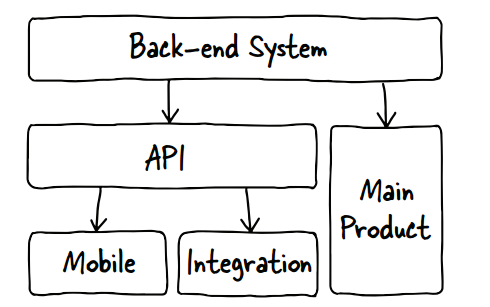

# 三、API优先

``` 
本章涵盖了
 代码的一致性
 功能平等
 增长速度
 外部/开放和内部
 API优先开发的例子
```

​	在设置API时，整个平台的远景非常重要，从确定业务价值到结构和设计决策。我将暂时从api的实际描述后退一步，以便讨论一个总体模型，它通常优于与主要产品并行创建api的旧模型。

​	以前为具有多个不同接口的产品线(如mobile或integration)创建的模型，使得针对不同客户端用例的每个可用的集成点都是独立构建的。这通常会导致一些不幸的结果，api创建了已经为主要产品编写的代码，api的功能和功能总是落后于其他api，以及大量的技术债务，因为对系统的每个更改都需要被拉入每种类型的客户机中。

​	API优先说的是什么。API first模型描述的模型中后端只与API和所有产品进行接口，而不是产品优先--主要前端网站、手机集成等与API本身的集成接口。

## 3.1 为什么先选择API 优先?

​	API优先对任何公司都很有意义。只要您有一个以上的产品，就应该有一个层来保护客户机免受服务器上的更改。您的网站和移动应用程序都应该能够从系统中获取信息。一个文档良好的系统接口，在考虑到特定用例的情况下精心设计，允许您在后端自由地更改内容，只要接口没有更改。只要坚持使用文档化的接口，就可以完全关闭数据库、添加伸缩性或重构后端。集成测试更容易，并且运行在API上的主要产品本质上将通过该平台的日常使用定期测试系统的完整性。

​	要首先理解为什么API是一个好主意，您首先必须理解现有模型是什么样子的。支持web API平台的各种体系结构模型都是可用的，但是许多现有的API都是使用一种模式创建的，其中API与主产品并行地直接访问后端。这意味着，如果您想创建新产品，您必须编写更多的系统来访问后端，或者扩展API，使其同时支持这两种替代产品。此外，一个API常常被认为是一个额外的，拥有产品而不是产品生态系统的重要成员是件好事。这种态度造成了一些问题，因为企业往往专注于创造收入的产品;如果这个API没有被理解的值，那么它很可能会受到缺少所需资源的影响。

### 3.1.1 作为副产品的APIs

​	图3.1显示了api通常的设置示例。如您所见，API与主要产品是分开的，即使所有次要产品(如移动产品或合作伙伴集成)都运行了API，主产品和API驱动的产品中可用的特性和功能之间也可能存在不匹配。例如，主产品可能会获得一个新的活动提要，但是由于编码是在主产品中进行的，所以它不会出现在API中(或者作为移动应用程序或合作伙伴集成中的扩展)。从理论上讲，保持特性和对象结构上的所有内容完全一致是可行的，但是要将API作为系统的核心技术来对待，需要进行大量的工作，而不是重构基础设施。后端系统是API和主要产品的关键组件，以这种方式分离客户端会使对产品或API中可能出现的问题进行分类和修复变得更加困难。从后端(通过API)到产品线(包括主web产品、移动客户端和用于合作伙伴集成的API)的所有内容都保持在同一管道中，这有助于确保一致性和可靠性，而且随着产品的增长，扩展会变得容易得多。



> ​	图3.1这是一个API，它的设置与最初创建的平台一样多:主产品直接与后端系统交互，将API作为产品层次结构中的二等公民。主产品中的任何新更改或特性都必须在API中进行复制，从而导致特性不一致和不兼容的资源表示。

​	一旦确定了希望用户与系统交互的方式，最好在任何地方都支持这种方式。假设一个公司有一个产品，可以为用户创建和更新联系信息;我们叫它Addresser。Addresser的主要产品是一个用户可以查看他们的联系人和信息的网站，还有一个与后端交互的移动应用程序。网站对后端进行一个特定的调用，并按照要求得到格式化的结果。另一方面，移动应用程序调用API, API以不同的格式提供信息。图3.2演示了这种情况，其中主产品直接与后端系统通信，因此可能以不同的方式检索数据。当后端系统团队添加一个新位置字段功能,和发件人网站开始使用它,它不出现在API,也在移动应用程序中,直到一个工程师有时间把它翻倍的工作量必须保持产品的一致性和增加的可能性在一个产品或另一个错误。这意味着，在将该字段添加到主要产品和API中的可用性之间可能存在延迟。当多个系统试图复制一个接口时，会产生大量的技术债务;这个设置意味着为了保持特性一致性，需要重复工作。在这种情况下，移动应用程序将不允许或查看位置，导致开发人员的不满和客户的困惑和愤怒。


> ​	图3.2当一个API是到后端许多不同接口中的一个时，一个简单项(例如一个用户)的表示可以在许多方面不同。此外，如果更改后端(在本例中是数据库)以添加更多信息，则需要更改与每个客户机系统的交互，API本身的客户机也是如此。这造成了大量的技术债务，因为对系统的任何更改都必须在几个不同的地方重复。

​	当您有多个团队在创建没有共享愿景的产品时，这些团队之间的沟通也往往很差。Addresser mobile团队没有理由与主网站团队交互，以帮助后端团队创建同时适用于两种产品的api。这可能导致在一个代码库中修复错误，而在另一个代码库中修复错误，或者导致系统中可用项之间的不一致，这取决于使用的是哪个接口。

### 3.1.2 API优先模型

​	那么，如果先设计API，这个系统会是什么样子呢?图3.3显示了一个API First模型。网站和移动设备从同一个API接口获取信息。这确保了这些资源在整个产品线中是一致的。注意，仅仅因为一个API资源在系统中可用，您不必将它公开给整个世界，所以您可以决定哪个API资源是内部的、仅与合作伙伴共享的，还是向任何人开放的。准备好您的API仍然是一个好主意，因为当一个主要的合作伙伴要求访问一些特定的资源来支持一个用例时，您已经准备好了。对于Addresser，可以将API设计为通过API将用户和联系人发送给合作伙伴和客户端开发人员。在某个时候，合作伙伴可能想要创建一个基于位置的活动提要，但是为了创建这个提要，他们需要访问用户联系人的位置。在API First模型中，这个API是可用的，因为它被网站和移动应用程序使用。您可以决定将其公开给希望为您的客户创建新功能的合作伙伴。

​	API First还鼓励后端团队和每个客户端工程团队之间的通信。在高层次上理解用例可以帮助您创建易于为您预先理解的用例实现的api，并且更有可能支持将来出现的用例。一旦您将API创建为一个更大的团队，您就会发现许多地方有不同的团队提供互补的资源，从而为一个结构更加良好的系统添加资源。


> ​	图3.3在API First模型中，后端只与API交互，API反过来驱动主产品和所有其他实现主产品、移动设备和其他集成。这减少了对重复代码的需求，并允许每个客户端专注于它所需要的部分。

## 3.2 代码的一致性

​	当您有两个独立的系统做同样的事情时，您就创建了一个具有重复代码的世界。在Addresser的情况下，主要产品将需要user对象，但是与API的交互也需要此资源。如果对后端系统的查询可能使用不同的字段或连接的数据，那么最终产品将彼此不一致，这是用户对公司整体不满意的常见原因。

​	当您的代码库以这种方式发散时，您就开始为您的公司创建技术债务，而不管谁负责编写api。需要两个测试系统，当在主产品中发现一个bug时，它不一定在API中得到修复，反之亦然。当您构建越来越多直接与后端绑定的系统(例如，您可能拥有访问数据库以进行报告的内部系统)时，您会对特定的服务器实现产生更多的依赖。如果您在不同的系统之间共享一些代码，但不是所有代码，对该实现的更改可能会意外地破坏产品。此外，当以高度耦合的方式编写代码时(不同的系统为了方便编码而紧密依赖于其他系统)，您的系统是高度相互依赖的，并且容易发生故障。

​	这个问题对开发人员体验方面也有影响。在每个项目都单独使用后端系统的情况下，系统很可能具有不同的接口，并以不同的方式表示资源，这给开发人员和最终用户带来了挫折。后端系统通常是为了满足特定需求,除非API是专为一个一致的开发人员体验所有接口,开发人员可能需要花费大量的时间试图找出可用的年代,以及应用程序如何检索它的平台。

``` 
	API优先在哪里不起作用?
	在系统之间放置API层可能会阻碍大规模系统的性能，比如股票交易系统，在这种系统中，接口需要完全安全、快速和令人难以置信的性能。在某些情况下，有必要将系统紧密地耦合起来以提高性能。许多客户，无论是主要产品、报表还是管理应用程序，都将性能放在一致性和可靠性之后，并且通过相同的接口运行所有产品代码将加快开发速度并减少错误。
```

​	图3.4显示了每个客户机(包括API)通过自己的接口访问后端时的系统交互。

​	正如您所看到的，每个客户机都获取并使用用户的表示，但是每个客户机向系统发送的请求略有不同。API层公开整个数据结构，但是主要产品和报告系统只获取它们需要的内容。由于这种差异，测试对数据库的更改需要与每个团队一起工作，以确保没有损坏，这要求服务器团队跟踪所有客户机。在我供职于大型技术公司的这些年里，这一直是个严重的问题;当一个组拥有一个系统，而另一个组决定直接利用它，而没有经过一致同意的接口时，当服务器系统发生更改时，客户机系统就会崩溃。例如，如果开发人员在employee数据库上发现了一个未文档化的方法来访问employee数据信息，以便创建一个用于联系人管理的应用程序，那么这个应用程序很容易发生更改，因为他们没有与原始组合作以确保他们的用例被理解。


> ​	图3.4当为不同的客户端维护不同的实现时，用户体验是不同的，例如，如果报表系统为特定的用户添加了新的功能来包含公司，那么API就需要添加它。在这个系统中，移动和集成客户端也需要添加它。

​	API不能解决生产过程中可能出现的所有问题，但是它可以使编写代码和架构更改变得更容易，并且可以保持正确的思路。一旦您决定尝试API第一种方法，重点就从尝试维护不同产品和代码库之间的一致性转移到设计、创建和维护经过严格测试和良好设计的共享接口。这种类型的解耦代码不直接依赖于其他系统的裸接口，保护了双方免受意外更改的影响。

​	如何创建这种模型?API需要有一个文档良好且易于理解的接口，对后端进行的调用应该完全受保护，不受通过任何其他方法进行客户机访问的影响。这个过程确实需要预先进行更多的考虑，但是有很大的优势，您将在以下几节中了解到这一点。

## 3.3 功能平等

​	在API的第一个描述中，我提到了一个名为Addresser的联系人应用程序。这类模型产生的一个常见问题是，主要产品在1月份获得一个新特性，但是API必须等待(有时是几个月)提供相同功能所需的工程资源。这个问题是可以避免的，但是很少有公司会因为一些额外的事情而推迟发布其主要产品。直到工程组织确定API是一个一流的产品,这种延迟会存在,并且在许多情况下,理解新功能团队是沿着新项目创建API之前,导致一个API创建了几个月后,如果,一个工程师不熟悉的目标功能改变与原始团队。结果是一个设计很差的API。

​	但是，如果API是主要产品的一部分，那么它将作为主要更改的一部分进行更新、测试和部署。它已经准备好被主要产品使用和测试，当您想要将它公开给其他应用程序和开发人员时，不管是内部的还是外部的，它都已经准备好了。有了可发布的特性，您就可以快速地启用合作伙伴集成了。相信我，您的高级合作伙伴一看到这个功能，就会想要它，并将其开放给您的内部和外部开发人员合作伙伴，供您根据需要使用。

​	即使这个API最终只被工程团队用于主要产品，这种方法仍然鼓励产品资源表示的一致性，并将帮助您的产品开发人员轻松创建集成和应用程序。API First还允许后端工程团队在不影响开发人员的情况下更改后端数据库或服务器系统;接口被文档化并被理解。因为客户端正在经历这个抽象层，所以工程团队确切地知道他们需要支持对后端系统的任何更改。您已经对接口进行了文档化，所以当您的公司决定添加新产品时，可用的资源已经准备好了，并且文档化得很好。想要使用API的新客户端可以从模式模型开始工作，以确保他们想要实现的用例简单而高效。

## 3.4 提高生产率

​	年代有点不合常理,在系统中添加额外的层可以减少整体的工作,你的工程师要做的,但记住,一旦你定义的接口设计和工程团队开始使用它,他们可以共享客户端库和其他工具与稳定的API进行交互的接口。尽管可以在没有这个额外层的情况下编写模块化和解耦的代码，但是要做到这一点要困难得多。如果没有一个指导的远景，每个开发组织将准确地确定他们需要什么来满足他们的目标，因此客户将会产生分歧而不是聚合。首先，API意味着您需要分配资源，以确保您的API能够轻松地支持您的主要产品，并且您的接口是一致的。其目标不是通过减少对数据的访问来限制开发人员合作伙伴，而是确保他们从单个源获得了所需的东西。

​	一旦您的开发人员使用API来提供产品(无论是内部报告系统还是第三方应用程序)，他们就不再需要编写重复的代码来访问后端系统。当新资源可用时，每个客户机都可以访问它们，并且您可以根据需要将它们公开给不同类别的开发人员(内部的、合作伙伴的、外部的)。

​	通过API运行所有应用程序还可以减少对同一对象的多个表示形式的需求(例如，姓名、姓氏和全名)。但拥有两种不同的表达方式也是有价值的;如果客户机应用程序的用户更喜欢一种表示，那么客户机很容易切换到使用这种表示。

​	您的系统的质量也将得到改善。当您拥有一个所有数据都流经的接口时，您可以更容易且一致地测试它。平台的更改可以通过单元测试(所有代码都应该是)以及基于您所支持的用例的集成测试来运行。事实上，您可以为您的系统使用用例，包括主产品、报告系统和集成，作为您创建的API的指导模型，这些用例还可以驱动您对系统进行的测试。

​	虽然您的后端工程师可能不喜欢前面的额外工作，但是他们将开始意识到这将节省他们的时间和精力。您的开发合作伙伴将感谢您提供的特性一致性，让他们能够访问所有有意义的东西，而不是您有机会在API中实现的特性。如果你做决定只抑制特性内部发展,你可以你的外部沟通开发社区他们明白有一个业务案例阻止访问,如果他们可以为您提供一个用例的支持,您可以重新决定。如果数据不能通过API获得，那么做出这样的决定将带来更多的开销，并且这种不一致将扼杀开发人员用户的热情和创造力。

## 3.5 内部/外部访问

​	与公开透明的数据访问相对的是，当企业考虑向整个世界公开所有数据时，它们会经历一种扣人心弦的恐惧。开放API生态系统就是这样开始的，开放API使第三方开发人员能够访问系统并更改或查看人们的信息。这是web api的一个可见方面，它导致了一些关于基于应用程序和/或用户访问系统来限制访问的不准确假设。大型或高度安全意识的公司担心，拥有一个开放的API会在不受任何控制或限制的情况下公开它们的专有数据。消除这些假设的最简单方法是了解API管理如何允许公司控制对特定功能的访问。图3.5演示了一个OAuth请求，这是API身份验证和授权的选项之一。

​	为API开发的身份验证和授权系统(如OAuth)使定义API的哪些部分对内部开发人员开放变得相对容易，而不是向合作伙伴或外部开发人员开放。除了身份验证和授权之外，这些机制还可以知道哪些开发人员和哪些用户正在访问API，这在调试问题时提供了很大的帮助。


> ​	图3.5在OAuth请求中，客户机和服务器都知道应用程序和用户密钥，但是它们也在应用程序和用户级别共享秘密。请求是使用非机密数据构建的，加密是使用共享机密完成的。客户端创建请求并使用共享密钥对其签名，然后将其发送到服务器。服务器接收请求并对请求签名，然后将它创建的签名与客户机发送的签名进行比较。如果它们匹配，则客户机通过身份验证检查，允许继续请求。

​	身份验证和授权机制使您能够完全控制哪些人可以访问您的系统。根据数据的结构和希望从公共api中保留的信息类型，可以决定为每种类型的数据公开不同的字段。事实上，这是一种API抽象层简化了向合作伙伴提供系统访问的方法，而不必允许他们直接访问公司的关键数据系统。在设计良好的内部API上添加一个身份验证系统，以便向客户和合作伙伴公开某些元素，这要比为他们从头创建一个新接口简单得多。

​	这并不是说向开放开发人员生态系统公开信息是一个坏主意。第三方开发人员可以通过预览新的API资源来提供帮助，为您提供工作方面的反馈，并为您验证那些用例，以确保它们如您所期望的那样工作。这是对API的一种免费测试，如果不存在阻碍API功能的业务用例，则一定要公开它。如果向系统写入是公司关心的事情，那么允许开放的开发人员对资源进行读访问可以通过暴露您以前没有考虑过的API问题来帮助您。利用这种潜力;当您将开发人员视为合作伙伴时，他们通常愿意使用您系统的beta版或发布候选版本，以便在竞争对手面前占得先机。

​	在规划您的API时，另一个需要考虑的问题是，即使您的API只是内部的，您也希望像创建最终可能向外界公开的API一样小心地创建它。这有几个原因。首先,你可能最终要开放API,如果它没有t精心制作了一个奇妙的开发人员的经验,你会要么遭受设计不良的后果API或重新开始创建一个新的API,重复的工作。第二，也是更重要的一点，假设因为客户是内部的，所以不必为他们创造良好的体验，这是一个糟糕的想法。当开发人员被迫使用不可用的系统时，当这些开发人员无法离开时，就会产生巨大的支持负担，他们会不停地向您抱怨那些给他们带来麻烦的事情。在设计API时，考虑谁将使用它(内部、外部、合作伙伴)。当您在防火墙后面时，身份验证和授权就不那么重要了，但是当您能够准确地跟踪谁在使用平台做什么时，仍然可以更容易地对问题进行分类。

​	无论API的客户是谁，API First都将为平台组织提供相同的优势。一致且解耦的代码将减少bug和回归。特性平等性将使潜在客户更容易地与您的系统集成，而无需在需求明确之后匆忙追赶。API首先提高了编写代码的质量和速度，允许开发人员专注于新功能，同时减少了跟踪问题的时间。

## 3.6 案例研究

​	虽然API最初在理论上看起来是一个很好的想法，但是我一直听到工程师、经理和管理人员说他们不可能为他们的公司实现这种类型的系统。的确，在基础设施中添加额外的层可以预先创建更多的工作，但是好处远远大于坏处。在进一步的背景下，本节将讨论一些案例研究，以演示公司是如何转向该模型的，或者是如何开始使用该模型的，以及它们所享受的结果。

### 3.6.1 以API为主要产品

​	Twilio是一家成功的公司，它通过API提供电话服务(参见图3.6)。例如，如果您想将SMS或其他电话功能添加到您的应用程序中，您需要使用它的api集成暮光，并且您的开发时间将大大减少。电话是一件困难的事情，而暮光是一个很好的例子，一个公司通过简化困难的(但重要的)功能赚了很多钱。

​	真正的Twilio产品是API，他们根据开发人员使用多少来收费。公司一开始时,api,它已被限制的基本产品,但随着开发者合作伙伴越来越多地开始使用平台以更复杂的方式,为什么Twilio意识到它会创建api的配置、计费等网站功能,支持其主要产品。它仍然有一些不公开API的后端系统，但是开发人员可以使用该系统做的任何事情都可以通过API获得。


> ​	图3.6暮光系统，内部和外部功能的api。虽然暮光只在内部使用它的计费和配置API，但是它在确保它所做的每件事都使用相同的API系统时所执行的规程有助于确保系统的一致性和健壮性。

​	这里有一个重要的注意，我们将在第9章重新回顾:当谈到开发人员支持时，暮光被广泛认为是行业领导者;它有一个由布道者组成的团队，他们每年参加数百次黑客马拉松，帮助开发人员熟悉它的平台。暮光对开发人员的支持有着强烈的承诺，甚至鼓励它的布道者帮助开发人员处理与暮光不直接相关的代码。它的目标是提供文档和资源，以便新的开发人员能够在5分钟内成功地进行第一次API调用。拥有这样一个布道者团队的主要优势之一是，他们可以不断地直接从开发人员那里得到反馈，然后再反馈给开发团队。

### 3.6.2 移动端优先

​	Instagram，一个照片应用程序，最初是作为一个移动应用程序创建的。该公司使用的最有效的后端是一个web API, Instagram创建了一个仅供其移动应用程序使用的后端。几个月后，用户开始请求一个网站并与其他系统集成，但Instagram团队没有资源或时间来实现这些事情。由于缺乏访问权限，一些第三方开发人员对系统进行了逆向工程，创建了一个API，这鼓励Instagram向开发人员开放自己的API系统。但是，由于它首先从API开始，所以围绕平台添加API管理和身份验证相对快速和简单，开发人员随后就拥有了他们需要的东西，以便创建他们正在寻找的产品。

### 3.6.3 重构API优先模型

​	Etsy是一个主要的在线工艺品市场，仅2013年一年的商品销售总收入就超过了10亿美元。2014年，该公司决定一次性改用API First模型。之前的API非常成功，允许第三方开发人员与系统集成，满足了买家和卖家的需求。不幸的是，系统是后端数据库的镜像，没有针对特定的用例进行设计，使用或维护效率也不高。移动应用程序开发人员感到沮丧的是，他们不得不多次调用来呈现单个屏幕的反模式，这会使移动应用程序变得脆弱且性能低下(用户往往会走进电梯或驶入隧道，而应用程序能够高效地获取所需信息是非常重要的)。

​	Etsy重构了后端和api来支持新方案，并创建了强大的RESTful api，在此基础上重新构建了主要产品。为了支持移动客户端和其他需要稍微不同设置的客户端，该公司创建了一个名为BeSpoke的批处理系统，可以将资源标识为其他资源的包。将这种复杂性转移到服务器意味着Etsy可以更好地支持所有开发人员，并跟踪资源的使用情况，它还可以为这些捆绑的响应运行并发请求，从而进一步提高了效率。业务逻辑在系统的API级别进行维护，因此无论用户在哪里与系统进行接口，身份验证和可见性都是一致的。这一雄心勃勃的项目取得了Etsy所希望的结果:提高资源和产品之间的速度和一致性。

​	随着公司的发展，Etsy之前的系统也在不断地发展，因此利用这个机会对系统进行重构使Etsy能够提高系统的响应能力、可伸缩性和一致性。这种变化也带来了意想不到的好处。Etsy注意到其开发团队之间的沟通明显改善;移动团队和网站团队在定义客户体验以及从API中需要什么方面进行了互动。Etsy甚至还有一个意想不到的好处，活动艺术家feed (其中一款产品并没有针对这一变化)能够将异步调用从几秒变为亚秒级调用，而它没有针对其中一个产品进行更改。这一变化意味着Etsy能够从定期离线刷新资源转向在用户请求时按需返回信息，从而减少了资源需求，并提供更好、更准确的用户体验。

​	第二个例子是，3scale是一家API管理公司，它为公司提供了一个平台，提供了管理和管理其API的工具(参见图3.7)。毫不奇怪，所有内部和外部流程以及公司使用的所有系统都运行在web api上。

​	客户对产品可以做的任何事情都可以通过API来完成，因为这些产品直接运行在同一个平台上。当3scale开始时，公司希望解决api上的流量管理问题，以确保它是安全的、可伸缩的和可访问的。3scale的首席执行官兼联合创始人史蒂夫·威尔莫特(Steve Willmott)经常说，他的目标是让每个人都能拥有一个API。

​	首先，解决方案是将流量交付从管理中分离出来:在云中部署管理仪表板、分析和策略管理，并提供多种语言(Java、Ruby和Python等)的代码插件。这些客户机中的每一个都在3scale s云平台上访问了一组api。使用插件，客户可以在自己的应用程序中部署功能。这些插件发展得很快，API协调所有调用，捕获统计数据并成为服务的骨干。后来3scale为Varnish和Nginx等web代理添加了扩展，这样它们就可以成为功能齐全、高性能的流量网关，所有这些都可以与api通信。


> ​	图3.7 scale s从标准实现到API的演变首先将其从一个大多数客户可见功能都可以通过平台使用的系统迁移到一个系统，其中系统中的每个功能都可以通过相同的API平台工作。同样，这使得3scale s系统更加健壮，并且更容易根据需求向用户公开新功能。

​	3scale s仪表板的最初版本没有提供api。考虑到它正在捕获分析数据并让客户不断要求复杂的配置，很明显，满足这些需求的唯一方法是跨所有功能添加api。在2010年的一个主要版本更改中，3scale为平台的每个部分以及所有用户界面开发了全面的API，并将这些接口切换到真正的API之上运行。

​	从那时起，API和产品总是并行更新的。3scale处在一个竞争激烈的市场中，以这种方式在api上运行业务使公司能够启用更多的客户用例。今天，许多客户使用3scale作为其他系统下的平台，以添加更多的功能。流量管理API体系结构还意味着，如今3scale可以将管理应用于跨各种系统(从内容交付网络到客户自己的web服务器层)交付的API。

### 3.6.4 API优先战略方向

​	Akamai是一家提供内容交付服务的公司，为那些希望为其web属性添加可靠性和可伸缩性的公司提供服务。Akamai的api业务模型与这里讨论的其他公司略有不同:Akamai与使用Akamai工具配置、维护和更新其属性(网站)的管理员合作，而不是直接与使用内容的客户打交道。这个系统的本质是大量的internet运行在Akamai服务器上，因此对访问或配置控件的任何更改都需要小心控制。

​	从历史上看，Akamai有许多api供客户用于报告和配置，但是这些api在身份验证和交互方面不一致。希望与这些系统集成的客户每次与新API集成时都需要学习一个新模型，而且支持、维护和改进都是不一致的，令人沮丧。

​	2012年，该公司决定使用一个名为EdgeGrid的API系统，将所有配置和产品行为转移到API First模型中。由于需要保护稳定和安全，Akamai无法在不危及其关键系统的情况下进行突然重构。30%的互联网流量来自Akamai服务器，因此任何错误或问题都可能对互联网和公司本身造成严重影响。

​	Akamai致力于使改变API的第一个最好的和最有效的方式,首先决定搬到API作为一个战略方向:把前面的自助服务门户和其他产品可用的API,这些API,在适当情况下,合作伙伴和客户。随着新产品的创建或现有产品的更新，web api也随之创建。一个API架构团队帮助产品团队创建与其他团队一致的API。

​	Akamai有一个积极的目标，使其系统符合这个模型:同时考虑到现有系统的敏感性，该公司的目标是在几年内完成大部分工作。考虑到大多数系统已经存在多年，根据当前和预测的使用情况重新设计组件并重新构建它们需要时间。意识到在这种情况下,一个重要的事情是,当你要求多个业务单位或团队一起工作作为一个更大的团队,你需要指导,视野,和支持的高级主管(重构自身不会产生新的收入)和从一个架构团队谁可以审查的新api重新创建,以确保他们符合整体平台战略的目标。

## 3.7 总结

​	在本章中，您首先了解了API的概念、它能为您的公司带来的优势，以及如何选择合适的隐私级别。我们探索了一些公司的案例研究，这些公司已经决定以这种方式实施他们的系统。

​	本章涵盖了以下主题：

* API First设计方法将web API移到后端服务器前面，以便所有产品、API和集成都运行在相同的系统上。
* 如果不首先使用API，则必须编写和维护与主要产品代码重复的API代码，这将降低系统的性能和不一致的行为。
* 当一个API是产品的一个附加部分时，给主要产品的新特性将会滞后于API，直到需要时才会改变。他们应该同时被创造出来，有着相同的目标和愿景——或者，理想情况下，他们应该是一样的东西。
* 删除重复的代码，并在团队之间进行强大的通信，以及在系统之间定义强大的交互点，可以使平台开发人员更容易地发布新特性或更改。
* 仅仅因为API具有一些开放的方面，并不意味着您必须向外界开放所有内容。创建一个可靠的、一致的平台来满足您的内部需求本身就是一个有效的目标——如果您确实想在外部公开信息，您可以使用一些额外的安全机制来保护敏感数据。
* Etsy是一个最好的例子，对于那些首先从一个更单一的模型中使用API的公司来说。转向API首先提高了它的速度，增加了跨蒸汽通信，并改进了它甚至没有针对的产品部分。

下一章将向您介绍web api——从它们背后的HTTP框架到REST api如何与该框架一起工作以创建功能的描述。