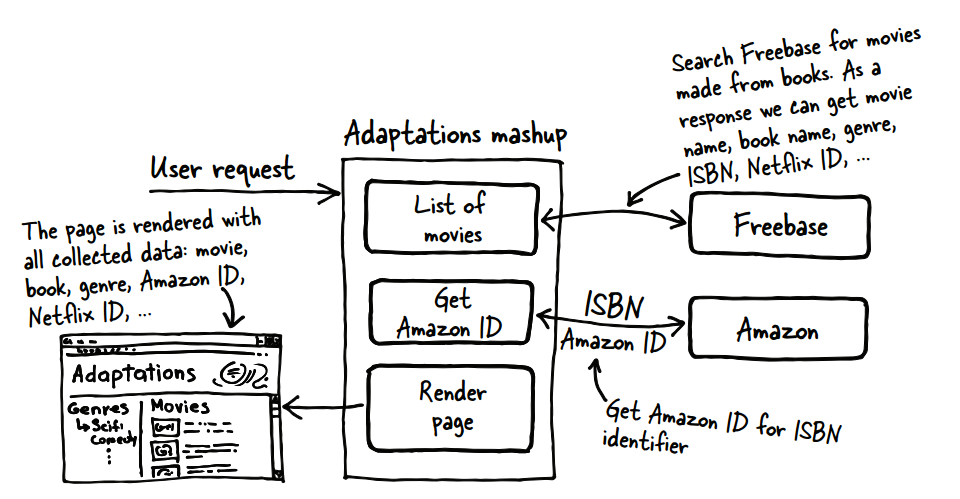
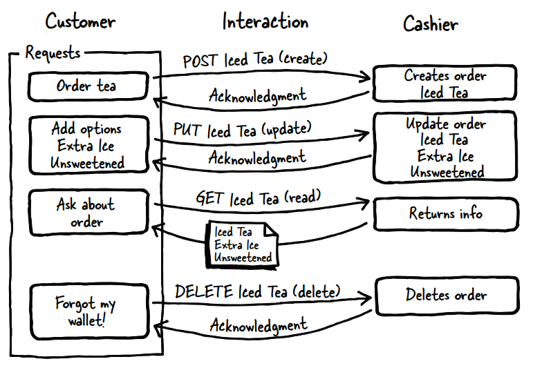

# 什么使API极为诱人的?

```
本章涵盖了
 定义web API及其功能
 确保良好的开发人员体验
 避免常见的陷阱
```

​	API是进入计算机系统的接口，是应用程序编程接口。从历史上看，api最初是计算机系统之间高度耦合的接口。Web api更加自由，也更少地捆绑在一起，它们已经发展了相当长一段时间，但是最近开发人员发现它们可以使用的Web api出现了巨大的爆炸式增长。许多这些API的开发都没有考虑到最终用户(在本例中是使用该API的开发人员)，从而导致开发人员体验不佳，web API也不太成功。

​	极为诱人的API易于使用、文档化良好、支持良好，并且支持的用例得到了良好的沟通和演示。使用您的API应该是一种愉快和迷人的体验，而不是经历一系列令人沮丧和永无止境的挑战。

​	本书将帮助您了解如何创建深受开发人员喜爱的web api，这些api具有吸引力和目的性，并将获得成功。它还讨论了决定是否应该拥有平台时应该考虑的因素。本书所包含的指导方针对于任何类型的web API都是有意义的，无论它的技术或受众是什么。

​	读完这本书后，您将对创建出色的web api所需的过程有一个深刻的理解，这些api能够吸引客户工程师，并在开发人员与同事分享经验时自然地扩展平台。尽管业界使用了许多不同类型的api，每种api都有自己的优势，但本书主要关注RESTful web api的开发。Web api将服务器的功能与客户机的逻辑和特性解耦，从而鼓励客户机开发人员以最适合其应用程序的方式使用数据。将服务器和客户机紧密连接在一起的非web api可以实现客户机和服务器之间的特定集成。例如，SQL是一种绑定到许多数据库的接口语言，它表示API，但是交互主要关注特定的操作。以一种更自由的方式公开数据并不适用于人们对数据库或其他紧密耦合系统的许多使用。

​	此外，您将对创建RESTful API所涉及的技术有一个很好的基本了解。REST代表具象状态传输，指的是基于资源的api，客户机通过请求而不是操作与服务器交互。web API的创建在技术上很简单:熟练的开发人员可以使用Flask、Django、Ruby on Rails或Node.js在几分钟内构建一个基本的REST API。如果没有清晰的计划、设计和目标，该API就不太可能优秀、可用或成功。如何使用这些技术决定了一个成功的、不可抗拒的API和一个在没有用户的生态系统中处于闲置状态的API之间的差别。无论您是产品经理、技术主管、工程经理、API开发人员，甚至是想要评估您已经创建或正在使用的API的开发人员，这本书都是为您量身定制的。

​	本章的重点是帮助您理解web API的整体生态系统，这些术语的含义是什么，在创建自己的API时您希望完成(和避免)什么，以及如何决定是否需要API。

## 将社交api集成到web内容中

​	您可能一直使用包含api的产品。您在新闻站点和博客上看到的共享按钮使用这些社交站点的api，如Twitter、Facebook或LinkedIn。如果您可以使用Twitter登录，您正在访问的站点将使用Twitter的API来识别您。这将带来更好的用户体验，因为您不需要记住更多的用户名和密码，而且您可以直接享受系统。图1.1展示了一个显示多个共享按钮的网站，允许读者将页面添加到他们在社交网络中的提要中。图1.2显示了API如何将更改传播到客户端，以便客户端更新其应用程序指南。


> 图1.1 一个博客包含了一个Twitter feed以及多个社交网络共享的API功能。
>
> ​	窗口小部件为每个社交网络(google +、Twitter、LinkedIn和facebook)提供按钮，并且这个小部件以一种易于实现的方式将该网络的API集成到站点中。


> 图1.2 与监控应用程序的API交互示例。
>
> ​	当监测应用程序检测到一个变化，它可以传播到一个网站，移动应用程序，短信通知，或电子邮件。



> 图1.3 这个图表描述了一个使用Freebase、Amazon和Netflix的适应的混搭网站。
>
> ​	用户将看到与特定类型相匹配的基于书籍的电影网格，对于每一部电影，用户都有机会在Netflix上观看电影或在Amazon上购买书籍。这是一个混搭组合多个api为用户创建集成体验的例子。

​	RESTful API是一个平台，它将数据公开为要操作的资源。例如，联系人记录管理应用程序可能使您能够与用户、联系人和位置进行交互。它们中的每一个都将作为资源或对象公开，您可以与之交互，无论是读取还是写入更改。当您创建设计良好的RESTful API时，开发人员用户可以创建通常称为mashup的应用程序。mashup将多个api组合在一起，创建一个新的用户体验(参见图1.3)。

​	如您所见，在图1.3中，我使用Freebase(将其视为世界信息数据库)、Amazon和Netflix创建了一个混搭网站。mashup允许用户查找已被制作成电影的书籍，然后在Amazon上购买或将其添加到Netflix队列中。我使用了来自Freebase的信息来为电影添加类型信息，这样用户就可以浏览并找到他们最感兴趣的电影。这是一个简单的例子，它混合了三个不同的api，为用户探索数据空间创建了一种新方法。通常，网站或应用程序还利用社交网络的api来登录、共享和显示用户提要。

​	这是一个很好的地方来强调这本书的一个主要概念。客户的开发经验是API成功的最重要因素。如果您试图鼓励创造力和与更大的社区的合作，或者鼓励开发人员通过api帮助您重新构思主要产品，那么REST可能是您最好的选择。另一方面，如果您的API需要基于操作的方法，这些方法以特定的方式执行少量任务，那么您很可能希望使用SOAP(简单对象访问协议)或其他为更紧密耦合的客户机和服务器设计的技术来创建非rest API。无论哪种方式，需要考虑的最重要的事情是您的客户想要什么，以及您希望他们如何使用您的API。记住，开发人员也是人。

## 什么是web API?

​	API这个术语在计算的大部分历史中都被用来指计算机系统之间的接口，或者现有系统上不同程序之间的接口。这些系统通常是对等的，其中没有一个系统是特定的服务器或客户机。例如，邮件服务器可能使用数据库来存储信息，但是系统本质上是一起设计的，紧密耦合以便无缝地一起工作。最近，这个术语已经扩展到包括web api，在这些系统中，客户机可以是任何东西，从web浏览器到移动应用程序，都可以与web服务器联系，并对该服务器上的数据进行操作。这里的主要区别是，编写客户机的开发人员与编写接口的开发人员不同，系统是真正解耦的。

​	要理解web API的概念，理解系统之间的通信方式是很有用的。想想很久以前的电话总机系统。你的手机只会做两件事:接通总机和制造噪音。如果你想给你的梅阿姨打电话，你就拿起听筒，按响铃声。接线员接完电话后，你要给她梅阿姨的电话号码，她会让梅阿姨的电话发出声音，然后她会把你的两条电话线连起来。在本例中，您联系了总机(在本例中充当服务器)，并向操作员提供了一个特定的标识符，而那个人连接了您的电话。这方面的协议是众所周知的，在自动切换技术成为可能之前很久，电话用户就能够相互交流了。图1.4显示了API如何与前端客户端和后端服务器交互。

​	类似地，HTTP是一个众所周知的协议，用于驱动web流量浏览器生成。web API是客户端使用定义的接口通过HTTP协议与web服务器交互的系统;这可以是内部系统，也可以是外部系统。要理解这在浏览器上下文中是如何工作的，当您在浏览器的地址栏中输入一个地址时，您要求该浏览器检索一个惟一的资源，比如获取一个电话号码。浏览器询问服务器与该标识符关联的信息，然后返回该信息并对其进行格式化，以便您在窗口中查看。Web API客户机对系统进行类似的读和写调用，但是响应的格式是供程序处理的，而不是供浏览器显示的。最著名的api之一是Twitter，它的api向第三方开发人员开放，允许这些开发人员创建与Twitter直接集成的应用程序。我将在第4章详细讨论HTTP。


> 图1.4 与API的基本交互是与后端服务器或服务器的直接连接，以及与前端客户端定义良好的交互。
>
> ​	这允许无数的前端应用程序，无论是移动、网站桌面还是系统集成，而无需更改后端服务器。


> 图1.5 这个例子显示了公共术语如何映射到API概念。
>
> ​	资源是惟一的名称，方法很容易理解，选项和上下文允许客户机通过API事务表达特定的概念。

​	在使用协议之后，为通过该协议发送的消息提供一种描述良好的格式非常重要。请求是什么样子的?预期会有什么反应?为了帮助您理解需要通过客户机和服务器之间的事务、通过HTTP发送的请求和响应来通信什么，我将把这些问题带回现实世界。为了支持计算机系统的需要，RESTful web API必须支持在平台上创建、读取、更新和删除项。图1.5描述了web API如何工作，并将其与实际资源(咖啡店订购的冰茶)进行了比较。

​	要理解这是如何工作的，请考虑一下在咖啡店点饮料时的情况(图1.6)。



> 图1.6 咖啡店中的客户交互。
>
> ​	尽管这个图看起来很复杂，但是要意识到交互表示您与服务提供者进行过多次的交换。确认可以像收银员点头一样简单，顾客的每一个请求都是一个简单的请求。

​	当你要一杯冰茶时，你已经创建了一个新项目:订单。向该订单添加选项(例如额外的ice)将更新该项目。当你让收银员告诉你你点了什么菜时，你已经读过了。如果你不小心把钱包落在家里，不得不取消订单，那件物品就会被删除。系统涉及到更复杂的因素，但这是web API事务的本质。

​	您将发现使用RESTful web API的几个优点，它将系统中的数据公开为客户机应用程序和平台之间交互的对象。当两个系统在深层次上紧密联系在一起时，很难在不破坏另一方的情况下对任何一方做出改变。这降低了工作效率，并造成了对意外行为的脆弱性，尤其是当应用程序变得不同步时。编写由文档化的接口将系统分隔开的代码可以保护两者不受意外更改的影响。在保护内部方法不被意外使用的同时，更容易测试API和记录接口。

​	那么，API能为您提供哪些功能呢?我们将在本书后面更深入地探讨业务目标。掌握可以利用API的各种方法还取决于对API可以做什么的理解(参见图1.7)。


> 图1.7此图显示了集成在一起的多个系统。
>
> ​	在左边，您可以看到Fitbit、MyFitnessPal和Withings进入Runkeeper系统，该系统可以将您的所有健身数据集中在一个地方。右边的图片显示了Netflix和它整合的各种类型的设备，巩固了它在视频行业的领导地位。

​	图1.7演示了web api可以实现的几种类型的集成。移动设备是api之间的主要驱动力;在几乎所有情况下，对API的需求都是由具有响应性的移动应用程序的需求驱动的。对于开发api的公司来说，移动几乎是一个通用的用例。由于这个原因，它通常是主要用例。允许您的客户开发人员将他们的系统与您的平台集成，可以节省为每个单独的合作伙伴创建自定义实现所需的开发资源。

### 您需要API吗?

​	您首先要回答的问题之一是是否必须创建web API。与任何其他产品一样，创建没有任何目的的API注定会失败。在确定API的业务价值的过程中，这个问题应该很清楚。无论您是想提高参与度、支持移动策略，还是与其他系统集成，API都需要花费时间和资源来正确创建。

​	API可以提高速度、吸引合作伙伴和启用移动设备，但是如果您的企业不需要(也不会需要)这些东西，web API可能不适合您。但是，仍然有必要通过实践来确定在什么时候可能需要API。

### 选择REST APIs 

​	在决定是否将REST用于API时，请考虑客户的需求和必须与之交互的系统。在过去的几年里，rest风格的API已经成为最流行的web API类型。以前的API结构与REST的主要区别在于，REST API是围绕系统中的名词而不是动词来设计的。

​	REST api旨在通过允许开发人员消费者决定如何使用可用数据来鼓励创造力和创新。与开放源码一样，这种开放性可能会引起那些专注于保护其专有信息的大型企业的关注，但是在谨慎设计时，安全性和隐私可以在开放api和内部RESTful api中得到保留。这类API的另一个术语是平台，它将底层系统描述为开发人员用来构建集成或应用程序的基础。

### JSON 

​	当前，REST API最流行的响应格式是JavaScript对象表示法(JSON)，这是一种表示服务器和客户机之间传递的数据的有效方法。

​	JSON格式紧凑，易于在慢速网络上传输。因此，在网络连接有问题的设备(如移动设备)上是可管理的。解释语言，如JavaScript、PHP、Perl和Python，可以很容易地使用JSON。事实上，使用这些语言的开发人员对这些对象很熟悉，这也是JSON如此流行的原因之一。此时，如果您正在创建一个新的API，并且必须选择一种格式，那么您可能希望使用JSON。添加第二种输出类型会增加更多的开销和重复，因此，除非您的客户出于某种原因显式地需要某种其他格式(如XML)，否则最好坚持使用一种格式。选择支持两种不同的格式将导致相当大的技术负担，从而导致在开发产品时需要做额外的工作，因为您必须将用例测试加倍，并增加开发时间。

## 开发人员的经验

​	开发人员使用API的经验是API成功的最关键因素。一个向外部开发人员开放且开发人员体验较差的API很可能将第三方开发人员推向您的竞争对手。您甚至必须在创建内部API时考虑到开发人员的经验。在没有优秀文档和教程的情况下创建内部api将导致巨大的支持负担，因为您的消费者在编写其实现时遇到困难，并且在不了解如何最好地使用您的api时遇到困难。

​	良好的开发人员体验始于理解API的目标，并将这些目标与希望参与其中的开发人员进行沟通。您可以与他们共享的信息越多，他们就越能够决定是否要使用您的api。请记住，当开发人员开始使用您的API时，无论是内部的、合作伙伴的还是开放的API，开发人员给您的唯一东西是他或她永远无法得到的:时间。证明您认识到这一点对于与这些用户建立信任和互利的关系至关重要。

​	一旦确定了API的业务价值、度量和用例，就要将这些信息传递给开发人员。只要你能做到透明，信任的关系很容易就能实现。在阅读本书的每个部分时，请仔细考虑是否有充分的理由不与开发人员共享关于业务价值、度量和用例的信息。如果没有，那就分享吧!您可能不认为开发人员会想要了解您的业务价值或用例，但是向他们提供这些信息可以清楚地告诉他们您是认真对待您的API的。允许您的客户在API完成之前查看您的设计文档，这使您有机会在开发过程中获得有价值的反馈。准确地告诉开发人员您将如何度量API的成功—无论是用户参与度、最终用户数量还是其他因素—使他们有机会与您的团队合作，从而改进那些您认为对API的成功至关重要的指标。

​	提供工具、示例代码和教程对开发人员的体验也非常重要。提供语音呼叫和SMS消息api的公司Twilio有一个目标，即任何进入其站点的开发人员都应该能够在5分钟内从其系统成功拨打一个电话。拥有这种可用的练习可以抓住潜在的开发人员，并让他们参与到您的系统中。虽然他们可能只计划浏览你的网站5 - 10分钟，但打这个电话会鼓励他们投入更多时间去了解他们能做什么。

### 版本控制

​	版本控制是API管理中最困难的方面之一。假设您可以在稍后对其进行修复，那么新创建的API看起来可能相当不错。不幸的是，使用哪个版本的选择掌握在开发人员手中，而开发人员很可能是您无法控制的。一旦开发人员与您的系统进行了集成或应用程序，他们就不太可能有动机迁移到新的、不兼容的版本，除非有对他们至关重要的新功能。您需要认真对待您的第一个版本，因为您可能会在很长一段时间内支持该版本。

​	不更改或删除现有功能的兼容版本通常都很受欢迎，但是一旦您需要进行破坏现有实现的更改，您就会面临来自开发人员社区的阻力，特别是如果您不赞成他们坚持使用的版本。即使你给他们一个很长的迁移警告期，他们也可能不想重做他们已经做过的工作。另一方面，维护旧版本会创建重复的代码，并要求对早期代码和现有代码进行修复。当开发人员使用多个版本时，故障排除和支持将变得更加困难。这意味着您的第一个版本需要是一个可靠的竞争者，您打算长期使用它。每周或每两周发布一个新版本的网站模型并不适用于API。虽然API确实提供了一个解耦的世界，但是开发人员仍然依赖于开始时的版本，所以您需要了解新版本的价格。

### 市场开发人员

​	最后，确保您的营销目标是针对开发人员的。开发人员在访问您的门户时会遇到一个主要问题:我为什么要关心这个问题?这通常可以分解为我能做什么?X怎么做呢?不幸的是，文档常常被困在每个部分的功能领域中?这不能满足这些问题的需要。开发人员往往不会受到他们想玩玩具的漂亮图片或口号的启发。给他们示例代码和应用程序，以及他们开始使用您的平台时所需的构建块。

​	所有这些想法将在整个图书开发人员经验中被重新审视，这将驱动您做出的大部分决策。(开发人员支持的具体主题将在第9章中更详细地讨论。)遵循这些指导原则将帮助您避免第一代api中常见的一些问题。