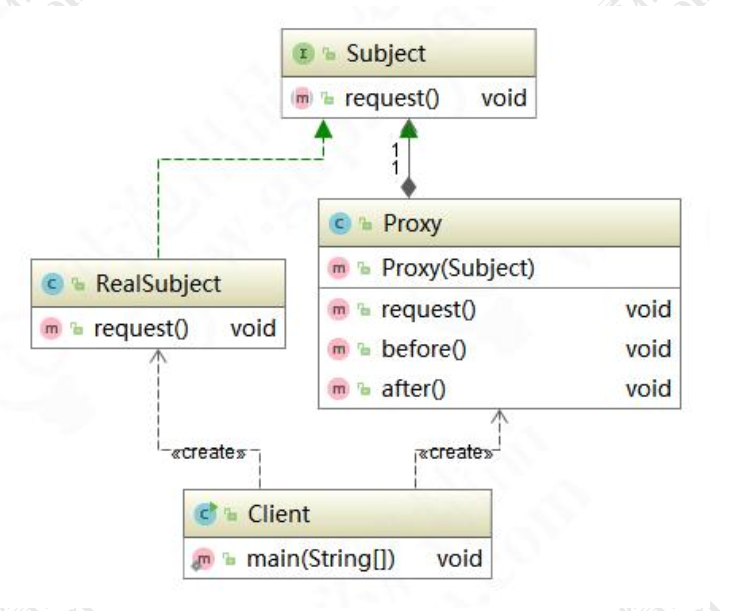

# 代理模式

## 代理模式的应用场景

​	在生活中，我们经常见到这样的场景，如：租房中介、售票黄牛、婚介、经纪人、快递、
事务代理、非侵入式日志监听等，这些都是代理模式的实际体现。代理模式（Proxy Pattern）的定义也非常简单，是指为其他对象提供一种代理，以控制对这个对象的访问。代理对象在客服端和目标对象之间起到中介作用，代理模式属于结构型设计模式。使用代理模式主要有两个目的：一保护目标对象，二增强目标对象。 

## 静态代理 



## 动态代理 

​	动态代理和静态对比基本思路是一致的（持有被代理对象），只不过动态代理功能更加强大，随着业务的扩展适应性更强。 

### JDK 实现方式 

```java
public class JDKMeipo implements InvocationHandler{
    //被代理的对象， 把引用给保存下来
    private Object target;
    
    public Object getInstance(Object target) throws Exception{
        this.target = target;
        Class<?> clazz = target.getClass();
        return Proxy.newProxyInstance(clazz.getClassLoader(),clazz.getInterfaces(),this);
    } 
    
    public Object invoke(Object proxy, Method method, Object[] args) throws Throwable {
        before();
        Object obj = method.invoke(this.target,args);
        after();
        return obj;
    }
}
```

### 高仿真 JDK Proxy 手写实现

​	不仅知其然，还得知其所以然。既然 JDK Proxy 功能如此强大，那么它是如何实现的呢？我们现在来探究一下原理，并模仿 JDK Proxy 自己动手写一个属于自己的动态代理。我们都知道 JDK Proxy 采用字节重组，重新生的对象来替代原始的对象以达到动态代理的目的。

```java
	JDK Proxy 生成对象的步骤如下：

1、拿到被代理对象的引用，并且获取到它的所有的接口，反射获取。

2、JDK Proxy 类重新生成一个新的类、同时新的类要实现被代理类所有实现的所有的接口。

3、动态生成 Java 代码，把新加的业务逻辑方法由一定的逻辑代码去调用（在代码中体现）。

4、编译新生成的 Java 代码.class。

5、再重新加载到 JVM 中运行。
```

​	以上这个过程就叫字节码重组。JDK 中有一个规范，在 ClassPath 下只要是$开头的 class文件一般都是自动生成的。 

```java
//通过反编译工具可以查看源代码
byte [] bytes = ProxyGenerator.generateProxyClass("$Proxy0",new Class[]{Person.class});
FileOutputStream os = new FileOutputStream("E://$Proxy0.class");
os.write(bytes);
os.close();
```

```java
public final class $Proxy0 extends Proxy implements Person{
    
    public $Proxy0(InvocationHandler invocationhandler){
    	super(invocationhandler);
    } 
    
    public final boolean equals(Object obj){
        try{
           return ((Boolean)super.h.invoke(this, m1, new Object[] {obj})).booleanValue();
        } catch(Error _ex) { 
            
        }catch(Throwable throwable){
            throw new UndeclaredThrowableException(throwable);
        }
    } 
    
    public final void findLove(){
        try{
            super.h.invoke(this, m3, null);
            return;
        } catch(Error _ex) { 
            
        }catch(Throwable throwable){
            throw new UndeclaredThrowableException(throwable);
        }
    } 
    
    public final String toString(){
        try{
        	return (String)super.h.invoke(this, m2, null);
        } catch(Error _ex) { 
            
        }catch(Throwable throwable){
        	throw new UndeclaredThrowableException(throwable);
        }
    } 
    public final int hashCode(){
    	try{
        	return ((Integer)super.h.invoke(this, m0, null)).intValue();
        } catch(Error _ex) { 
        
        }catch(Throwable throwable){
        	throw new UndeclaredThrowableException(throwable);
        }
    } 
    
    private static Method m1;
    private static Method m3;
    private static Method m2;
    private static Method m0;
    
	static{
        try{
        	m1 = Class.forName("java.lang.Object").getMethod("equals", 
                  new Class[] {Class.forName("java.lang.Object") });
        	m3 = Class.forName("com.gupaoedu.vip.pattern.proxy.Person")
                .getMethod("findLove", new Class[0]);
        	m2 = Class.forName("java.lang.Object").getMethod("toString", new Class[0]);
       		m0 = Class.forName("java.lang.Object").getMethod("hashCode", new Class[0]);
        } catch(NoSuchMethodException nosuchmethodexception){
        	throw new NoSuchMethodError(nosuchmethodexception.getMessage());
        } catch(ClassNotFoundException classnotfoundexception){
        	throw new NoClassDefFoundError(classnotfoundexception.getMessage());
        }
    }
}
```

​	我们发现$Proxy0 继承了 Proxy 类，同时还实现了我们的 Person 接口，而且重写了findLove()等方法。而且在静态块中用反射查找到了目标对象的所有方法，而且保存了所有方法的引用，在重写的方法用反射调用目标对象的方法。 

#### proxy

```java
public static Object newProxyInstance(GPClassLoader classLoader, Class<?> [] interfaces,
GPInvocationHandler h){
    try {
        //1、 动态生成源代码.java 文件
        String src = generateSrc(interfaces);
        //2、 Java 文件输出磁盘
        String filePath = GPProxy.class.getResource("").getPath();
        File f = new File(filePath + "$Proxy0.java");
        FileWriter fw = new FileWriter(f);
        fw.write(src);
        fw.flush();
        fw.close();
        //3、 把生成的.java 文件编译成.class 文件
        JavaCompiler compiler = ToolProvider.getSystemJavaCompiler();
        StandardJavaFileManager manage = compiler.getStandardFileManager(null,null,null);
        Iterable iterable = manage.getJavaFileObjects(f);
        JavaCompiler.CompilationTask task =
        	compiler.getTask(null,manage,null,null,null,iterable);
        task.call();
        manage.close();
        //4、 编译生成的.class 文件加载到 JVM 中来
        Class proxyClass = classLoader.findClass("$Proxy0");
        Constructor c = proxyClass.getConstructor(GPInvocationHandler.class);
        f.delete();
        //5、 返回字节码重组以后的新的代理对象
        return c.newInstance(h);
    }catch (Exception e){
    	e.printStackTrace();
    }
    return null;
}
```

### CGLib 调用 API 及原理分析 

```java
public class CglibMeipo implements MethodInterceptor{
    public Object getInstance(Class<?> clazz) throws Exception{
        Enhancer enhancer = new Enhancer();
        //要把哪个设置为即将生成的新类父类
        enhancer.setSuperclass(clazz);
        enhancer.setCallback(this);
        return enhancer.create();
    } 
    
    public Object intercept(Object o, Method method, Object[] objects, 
                            MethodProxy methodProxy) throws Throwable {
        //业务的增强
        before();
        Object obj = methodProxy.invokeSuper(o,objects);
        after();
        return obj;
    }
}
```

​	重写了 Customer 类的所有方法。我们通过代理类的源码可以看到，代理类会获得所有在 父 类 继 承 来 的 方 法 ， 并 且 会 有 MethodProxy 与 之 对 应 ， 比 如 `MethodCGLIB$findLove$0$Method`、

`MethodProxyCGLIB$findLove$0$Proxy`;这些方法在代理类的 findLove()中都有调用。 

​	调 用 过 程 ： 代 理 对 象 调 用 this.findLove() 方 法 -> 调 用 拦 截 器->methodProxy.invokeSuper

->CGLIB$findLove$0->被代理对象 findLove()方法。

​	此时，我们发现拦截器 MethodInterceptor 中就是由 MethodProxy 的 invokeSuper方法调用代理方法的，MethodProxy 非常关键，我们分析一下它具体做了什么。 

上面代码调用过程就是获取到代理类对应的 FastClass，并执行了代理方法。还记得之前生成三个 class 文件吗？
`Customer$$EnhancerByCGLIB$$3feeb52a$$FastClassByCGLIB$$6aad62f1.class`就是代理类的 FastClass，
`Customer$$FastClassByCGLIB$$2669574a.class` 就是被代理类的 FastClass。

​	CGLib 动态代理执行代理方法效率之所以比 JDK 的高是因为 Cglib 采用了 FastClass 机制，它的原理简单来说就是：为代理类和被代理类各生成一个 Class，这个 Class 会为代理类或被代理类的方法分配一个 index(int 类型)。这个 index 当做一个入参，FastClass就可以直接定位要调用的方法直接进行调用，这样省去了反射调用，所以调用效率比 JDK动态代理通过反射调用高。 

### CGLib 和 JDK 动态代理对比

1.JDK 动态代理是实现了被代理对象的接口，CGLib 是继承了被代理对象。

2.JDK 和 CGLib 都是在运行期生成字节码，JDK 是直接写 Class 字节码，CGLib 使用 ASM框架写 Class 字节码，Cglib 代理实现更复杂，生成代理类比 JDK 效率低。

3.JDK 调用代理方法，是通过反射机制调用，CGLib 是通过 FastClass 机制直接调用方法，CGLib 执行效率更高。 

## 代理模式与 Spring

### 代理模式在 Spring 源码中的应用

​	Spring 利用动态代理实现 AOP 有两个非常重要的类，一个是 `JdkDynamicAopProxy` 类和 `CglibAopProxy` 类 

### Spring 中的代理选择原则

1、当 Bean 有实现接口时，Spring 就会用 JDK 的动态代理

2、当 Bean 没有实现接口时，Spring 选择 CGLib。 

3、Spring 可以通过配置强制使用 CGLib，只需在 Spring 的配置文件中加入如下代码：

```xml
<aop:aspectj-autoproxy proxy-target-class="true"/> 
```

## 静态代理和动态的本质区别

1、静态代理只能通过手动完成代理操作，如果被代理类增加新的方法，代理类需要同步新增，违背开闭原则。

2、动态代理采用在运行时动态生成代码的方式，取消了对被代理类的扩展限制，遵循开闭原则。

3、若动态代理要对目标类的增强逻辑扩展，结合策略模式，只需要新增策略类便可完成，无需修改代理类的代码。 

## 代理模式的优缺点

​	使用代理模式具有以下几个优点：

1、代理模式能将代理对象与真实被调用的目标对象分离。

2、一定程度上降低了系统的耦合度，扩展性好。

3、可以起到保护目标对象的作用。

4、可以对目标对象的功能增强。

​	当然，代理模式也是有缺点的： 

1、代理模式会造成系统设计中类的数量增加。

2、在客户端和目标对象增加一个代理对象，会造成请求处理速度变慢。

3、增加了系统的复杂度。 