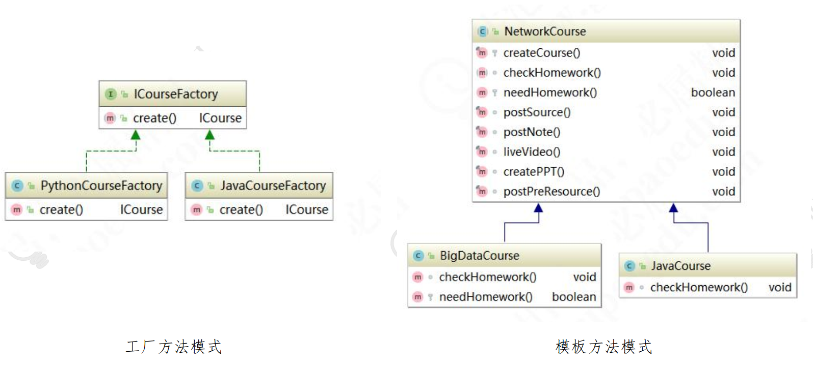

# 各设计模式总结与对比

## GOF 23 种设计模式简介 

| 1111111 | 设计模式                                                     |
| ------- | ------------------------------------------------------------ |
| 创建型  | 工厂方法模式（Factory Method）、抽象工厂模式（Abstract Factory）、 建造者模式（Builder）、原型模式（Prototype）、单例模式(Singleton) |
| 结构型  | 适配器模式(Adapter)、桥接模式（Bridge）、组合模式（Composite）、 装饰器模式（Decorator）、门面模式（Facade）、享元模式（Flyweight）、 代理模式（Proxy） |
| 行为型  | 解释器模式（Interpreter）、模板方法模式（Template Method）、 责任链模式（Chain of Responsibility）、命令模式（Command）、 迭代器模式（Iterator）、调解者模式（Mediator）、备忘录模式（Memento）、 观察者模式（Observer）、状态模式（State）、策略模式（Strategy）、 访问者模式（Visitor） |

## 设计模式之间的关联关系和对比 

### 单例模式和工厂模式

​	实际业务代码中，通常会把工厂类设计为单例。 

### 策略模式和工厂模式

1、工厂模式包含工厂方法模式和抽象工厂模式是创建型模式，策略模式属于行为型模式。

2、工厂模式主要目的是封装好创建逻辑，策略模式接收工厂创建好的对象，从而实现不同的行为。 

### 策略模式和委派模式

1、策略模式是委派模式内部的一种实现形式，策略模式关注的结果是否能相互替代。

2、委派模式更关注分发和调度的过程。

### 模板方法模式和工厂方法模式

​	工厂方法是模板方法的一种特殊实现。 



​	对于工厂方法模式的 create()方法而言，相当于只有一个步骤的模板方法模式。这一个步骤交给子类去实现。而模板方法呢，将 `needHomework()`方法和 `checkHomework()`方法交给子类实现，`needHomework()`方法和 `checkHomework()`方法又属于父类的某一个步骤且不可变更。 

### 模板方法模式和策略模式

1、模板方法和策略模式都有封装算法。

2、策略模式是使不同算法可以相互替换，且不影响客户端应用层的使用。

3、模板方法是针对定义一个算法的流程，将一些有细微差异的部分交给子类实现。

4、模板方法模式不能改变算法流程，策略模式可以改变算法流程且可替换。策略模式通常用来代替 if...else...等条件分支语句。 


1、WechatPay、JDPay、AliPay 是交给用户选择且相互替代解决方案。而 JdbcTemplate下面的子类是不能相互代替的。

2、策略模式中的 queryBalance()方法虽然在 pay()方法中也有调用，但是这个逻辑只是出于程序健壮性考虑。用户完全可以自主调用 queryBalance()方法。而模板方法模式中的 mapRow()方法一定要在获得 ResultSet 之后方可调用，否则没有意义。

### 装饰者模式和静态代理模式 

1、装饰者模式关注点在于给对象动态添加方法，而代理更加注重控制对对象的访问。 

2、代理模式通常会在代理类中创建被代理对象的实例，而装饰者模式通常把被装饰者作为构造参数。 


​	装饰者和代理者虽然都持有对方引用，但逻辑处理重心是不一样的。 

### 装饰者模式和适配器模式

1、装饰者模式和适配器模式都是属于包装器模式（Wrapper Pattern）。

2、装饰者模式可以实现被装饰者与相同的接口或者继承被装饰者作为它的子类，而适配器和被适配者可以实现不同的接口。 


​	装饰者和适配器都是对 `SiginService` 的包装和扩展，属于装饰器模式的实现形式。但是装饰者需要满足 OOP 的 is-a 关系，我们也讲过煎饼的例子，不管如何包装都有共同的父类。而适配器主要解决兼容问题，不一定要统一父类，上图中 `LoginAdapter` 和`RegistAdapter` 就是兼容不同功能的两个类，但 `RegistForQQAdapter` 需要注册后自动登录，因此既继承了 `RegistAdpter` 又继承了 `LoginAdapter`。 

### 适配器模式和静态代理模式

​	适配器可以结合静态代理来实现，保存被适配对象的引用，但不是唯一的实现方式。

### 适配器模式和策略模式

​	在适配业务复杂的情况下，利用策略模式优化动态适配逻辑。 

## Spring 中常用的设计模式对比 

| 设计模式                | 一句话归纳                                        | 举例                                                         |
| ----------------------- | ------------------------------------------------- | ------------------------------------------------------------ |
| 工厂模式（Factory）     | 只对结果负责，封装创建过程。                      | BeanFactory、Calender                                        |
| 单例模式（Singleton）   | 保证独一无二。                                    | ApplicationContext、Calender                                 |
| 原型模式（Prototype）   | 拔一根猴毛，吹出千万个。                          | ArrayList、PrototypeBean                                     |
| 代理模式（Proxy）       | 找人办事，增强职责。                              | ProxyFactoryBean、 JdkDynamicAopProxy、CglibAopProxy         |
| 委派模式（Delegate）    | 干活算你的（普通员工），功 劳算我的（项目经理）。 | DispatcherServlet、 BeanDefinitionParserDelegate             |
| 策略模式（Strategy）    | 用户选择，结果统一。                              | InstantiationStrategy                                        |
| 模板模式（Template）    | 流程标准化，自己实现定制。                        | JdbcTemplate、HttpServlet                                    |
| 适配器模式（Adapter）   | 兼容转换头。                                      | AdvisorAdapter、HandlerAdapter                               |
| 装饰器模式（Decorator） | 包装，同宗同源。                                  | BufferedReader、InputStream、OutputStream、HttpHeadResponseDecorator |
| 观察者模式（Observer）  | 任务完成时通知。                                  | ContextLoaderListener                                        |

## Spring 中的编程思想总结 

| Spring 思想 | 应用场景（特点）                                             | 一句话归纳1111111111111    |
| ----------- | ------------------------------------------------------------ | -------------------------- |
| OOP         | Object Oriented Programming（面向对象编 程）用程序归纳总结生活中一切事物。 | 封装、继承、多态。         |
| BOP         | Bean Oriented Programming（面向 Bean 编 程）面向 Bean（普通的 Java 类）设计程序， 解放程序员。 | 一切从 Bean 开始。         |
| AOP         | Aspect Oriented Programming(面向切面编 程)找出多个类中有一定规律的代码，开发时拆 开，运行时再合并。 面向切面编程，即面向规则编程。 | 解耦，专人做专事。         |
| IOC         | Inversion of Control（控制反转） 将 new 对象的动作交给 Spring 管理，并由 Spring 保存已创建的对象（IOC 容器）。 | 转交控制权（即控制权反转） |
| DI/DL       | Dependency Injection （ 依 赖 注 入 ） 或 者 Dependency Lookup（依赖查找） 依赖注入、依赖查找，Spring 不仅保存自己创 建的对象，而且保存对象与对象之间的关系。注入即赋值，主要三种方式构造方法、set 方法、直接赋值。 | 赋值                       |

## AOP 在 Spring 中的应用

​	SpringAOP 是一种编程范式，主要目的是将非功能性需求从功能性需求中分离出来，达到解耦的目的。主要应用场景有：Authentication（权限认证）、Auto Caching（自动缓存处理）、Error Handling（统一错误处理）、Debugging（调试信息输出）、Logging（日志记录）、Transactions（事务处理）。 

### 学习 AOP 之前必须明白的几个概念：

1、Aspect(切面)：通常是一个类，里面可以定义切入点和通知。

2、JointPoint(连接点)：程序执行过程中明确的点，一般是方法的调用。

3、Advice(通知)：AOP 在特定的切入点上执行的增强处理，有 before、after、afterReturning、afterThrowing、around 

4、Pointcut(切入点)：就是带有通知的连接点，在程序中主要体现为书写切入点表达式AOP 框架创建的对象，实际就是使用代理对目标对象功能增强。Spring 中的 AOP 代理可以使 JDK 动态代理，也可以是 CGLIB 代理，前者基于接口，后者基于子类。 

### 关于 Execution 表达式

```java
execution(modifiers-pattern? ret-type-pattern declaring-type-pattern?
name-pattern(param-pattern) throws-pattern?) 
```

modifiers-pattern：方法的操作权限

ret-type-pattern：返回值【必填】

declaring-type-pattern：方法所在的包

name-pattern：方法名 【必填】

parm-pattern：参数名

throws-pattern：异常

​	目前 SpringAOP 配置有两种形式，这个小伙伴们应该都非常清楚，我这里就不做过多赘述，如下 Annotation 配置形式： 

```java
//声明这是一个组件
@Component
//声明这是一个切面 Bean
@Aspect
@Slf4j
public class AnnotaionAspect {
    //配置切入点,该方法无方法体,主要为方便同类中其他方法使用此处配置的切入点
    @Pointcut("execution(* com.gupaoedu.vip.pattern.spring.aop.service..*(..))")
    public void aspect(){ 
    }
    /*
    * 配置前置通知,使用在方法 aspect()上注册的切入点
    * 同时接受 JoinPoint 切入点对象,可以没有该参数
    */
    @Before("aspect()")
    public void before(JoinPoint joinPoint){
    	log.info("before 通知 " + joinPoint);
    } 
    
    //配置后置通知,使用在方法 aspect()上注册的切入点
    @After("aspect()")
    public void after(JoinPoint joinPoint){
    	log.info("after 通知 " + joinPoint);
    } 
    
    //配置环绕通知,使用在方法 aspect()上注册的切入点
    @Around("aspect()")
    public void around(JoinPoint joinPoint){
    	long start = System.currentTimeMillis();
        try {
            ((ProceedingJoinPoint) joinPoint).proceed();
            long end = System.currentTimeMillis();
            log.info("around 通知 " + joinPoint + "\tUse time : " + (end - start) + " ms!");
        } catch (Throwable e) {
            long end = System.currentTimeMillis();
            log.info("around 通知 " + joinPoint + "\tUse time : " + (end - start) + " ms with exception :
        " + e.getMessage());
        }
    }
                     
    //配置后置返回通知,使用在方法 aspect()上注册的切入点
    @AfterReturning("aspect()")
    public void afterReturn(JoinPoint joinPoint){
    	log.info("afterReturn 通知 " + joinPoint);
    } 
                     
    //配置抛出异常后通知,使用在方法 aspect()上注册的切入点
    @AfterThrowing(pointcut="aspect()", throwing="ex")
    public void afterThrow(JoinPoint joinPoint, Exception ex){
    	log.info("afterThrow 通知 " + joinPoint + "\t" + ex.getMessage());
    }
}
```

​	Xml 配置形式： 

```xml
<bean id="xmlAspect" class="com.gupaoedu.vip.pattern.spring.aop.aspect.XmlAspect"></bean>
    <!-- AOP 配置 -->
    <aop:config>
        <!-- 声明一个切面,并注入切面 Bean,相当于@Aspect -->
        <aop:aspect ref="xmlAspect">
        <!-- 配置一个切入点,相当于@Pointcut -->
        <aop:pointcut expression="execution(* com.gupaoedu.vip.pattern.spring.aop.service..*(..))" id="simplePointcut"/>
        <!-- 配置通知,相当于@Before、 @After、 @AfterReturn、 @Around、 @AfterThrowing -->
        <aop:before pointcut-ref="simplePointcut" method="before"/>
        <aop:after pointcut-ref="simplePointcut" method="after"/>
        <aop:after-returning pointcut-ref="simplePointcut" method="afterReturn"/>
        <aop:after-throwing pointcut-ref="simplePointcut" method="afterThrow" throwing="ex"/>
    </aop:aspect>
</aop:config>
```

