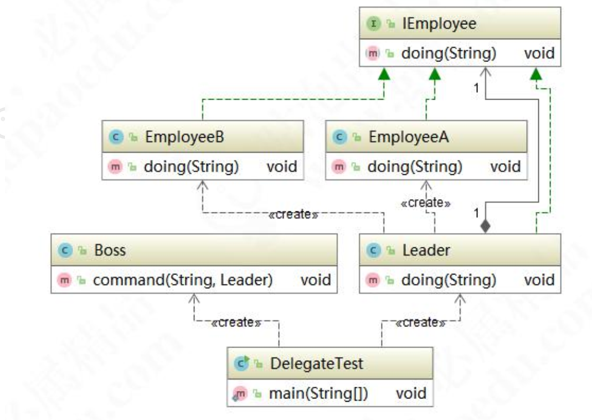
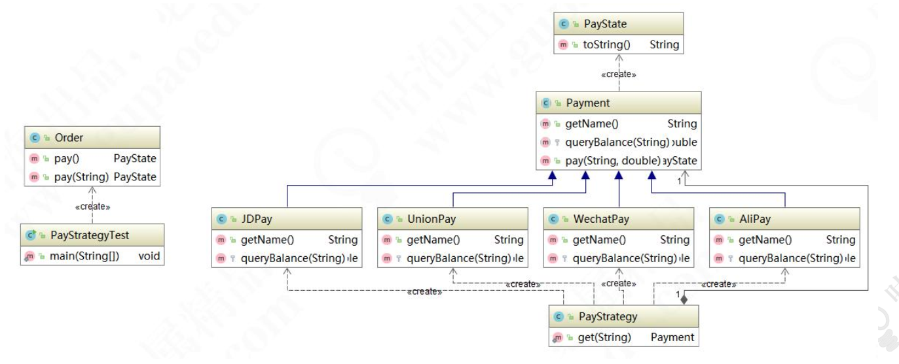
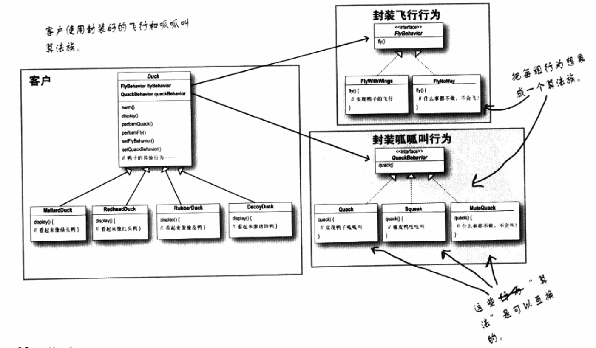
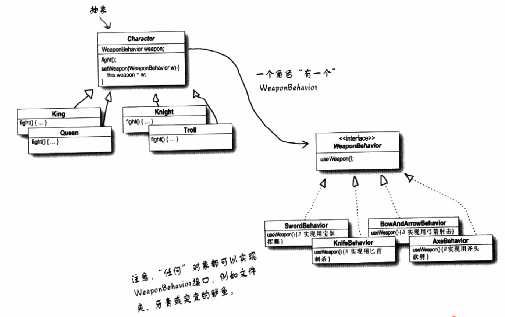

# 委派模式及策略模式

## 委派模式

### 委派模式的定义及应用场景

​	委派模式不属于 GOF23 种设计模式中。委派模式（Delegate Pattern）的基本作用就是负责任务的调用和分配任务，跟代理模式很像，可以看做是一种特殊情况下的静态代理的全权代理，但是代理模式注重过程，而委派模式注重结果。委派模式在 Spring 中应用非常多，大家常用的 `DispatcherServlet` 其实就是用到了委派模式。 



### 委派模式在源码中的体现

​	下面我们再来还原一下 `SpringMVC` 的 `DispatcherServlet` 是如何实现委派模式的。 

​	在 Spring 源码中，只要以 Delegate 结尾的都是实现了委派模式。例如：`BeanDefinitionParserDelegate` 根据不同类型委派不同的逻辑解析 `BeanDefinition`。 

## 策略模式

​	策略模式（Strategy Pattern）是指定义了算法家族、分别封装起来，让它们之间可以互相替换，此模式让算法的变化不会影响到使用算法的用户。 

### 策略模式的应用场景

1、假如系统中有很多类，而他们的区别仅仅在于他们的行为不同。

2、一个系统需要动态地在几种算法中选择一种。

### 用策略模式实现选择支付方式的业务场景

​	相信小伙伴们都用过支付宝、微信支付、银联支付以及京东白条。一个常见的应用场景就是大家在下单支付时会提示选择支付方式，如果用户未选，系统也会默认好推荐的支付方式进行结算。来看一下类图，下面我们用策略模式来模拟此业务场景： 







### 策略模式在 JDK 源码中的体现

​	首先来看一个比较常用的比较器 Comparator 接口，我们看到的一个大家常用的compare()方法，就是一个策略抽象实现： 

```java
public interface Comparator<T> {
    int compare(T o1, T o2);
    ...
}
```

​	Comparator 抽象下面有非常多的实现类，我们经常会把 Comparator 作为参数传入作为排序策略，例如 Arrays 类的 parallelSort 方法等： 

```java
public class Arrays {
    ...
    public static <T> void parallelSort(T[] a, int fromIndex, int toIndex,
    	Comparator<? super T> cmp) {
    ...
    } 
    ...
}
```

​	还有 TreeMap 的构造方法: 

```java
public class TreeMap<K,V> extends AbstractMap<K,V>
	implements NavigableMap<K,V>, Cloneable, java.io.Serializable
{
    ...
    public TreeMap(Comparator<? super K> comparator) {
    	this.comparator = comparator;
    } 
    ...
}
```

### 策略模式的优缺点

优点：

1、策略模式符合开闭原则。

2、避免使用多重条件转移语句，如 if...else...语句、switch 语句

3、使用策略模式可以提高算法的保密性和安全性。

缺点：

1、客户端必须知道所有的策略，并且自行决定使用哪一个策略类。

2、代码中会产生非常多策略类，增加维护难度。 