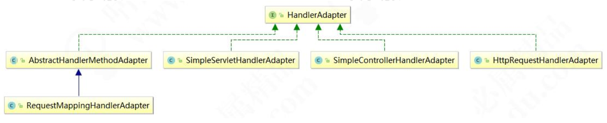

# 模板模式及适配器模式

## 模板模式

### 模板模式的应用场景 

​	模板模式通常又叫模板方法模式（Template Method Pattern）是指定义一个算法的骨架，并允许子类为一个或者多个步骤提供实现。模板方法使得子类可以在不改变算法结构的情况下，重新定义算法的某些步骤，属于行为性设计模式。模板方法适用于以下应用场景：

1、一次性实现一个算法的不变的部分，并将可变的行为留给子类来实现。

2、各子类中公共的行为被提取出来并集中到一个公共的父类中，从而避免代码重复。 

### 利用模板模式重构 JDBC 操作业务场景

​	创建一个模板类 JdbcTemplate，封装所有的 JDBC 操作。以查询为例，每次查询的表不同，返回的数据结构也就不一样。我们针对不同的数据，都要封装成不同的实体对象。而每个实体封装的逻辑都是不一样的，但封装前和封装后的处理流程是不变的，因此，我们可以使用模板方法模式来设计这样的业务场景。 


### 在代码中实现钩子

​	钩子可以实现对代码的顺序的微调

### 模板模式在源码中的体现

​	先来看 JDK 中的 AbstractList，来看代码： 

```java
package java.util;
public abstract class AbstractList<E> extends AbstractCollection<E> implements List<E> {
    ...
    abstract public E get(int index);
    ...
}
```

​	我们看到 get()是一个抽象方法，那么它的逻辑就是交给子类来实现，我们大家所熟知的`ArrayList` 就 是 `AbstractList` 的 子 类 。 同 理 ， 有 `AbstractList` 就 有 `AbstractSet` 和`AbstractMap`，有兴趣的小伙伴可以去看看这些的源码实现。还有一个每天都在用的`HttpServlet`，有三个方法 `service()`和 `doGet()`、`doPost()`方法，都是模板方法的抽象实现。 

​	在 MyBatis 框架也有一些经典的应用，我们来一下 `BaseExecutor` 类，它是一个基础的SQL 执行类，实现了大部分的 SQL 执行逻辑，然后把几个方法交给子类定制化完成，源码如下： 

```java
public abstract class BaseExecutor implements Executor {
    ...
    protected abstract int doUpdate(MappedStatement var1, Object var2) throws SQLException;
    
    protected abstract List<BatchResult> doFlushStatements(boolean var1) throws SQLException;
    
    protected abstract <E> List<E> doQuery(MappedStatement var1, Object var2, RowBounds var3, ResultHandler var4, BoundSql var5) throws SQLException;
    
    protected abstract <E> Cursor<E> doQueryCursor(MappedStatement var1, Object var2, RowBounds var3, BoundSql var4) throws SQLException;
    ...
}
```

​	如doUpdate、doFlushStatements、doQuery、doQueryCursor 这几个方法就是交由子类来实现，那么 BaseExecutor 有哪些子类呢？我们来看一下它的类图： 


### 模板模式的优缺点 

优点：

1、利用模板方法将相同处理逻辑的代码放到抽象父类中，可以提高代码的复用性。

2、将不同的代码不同的子类中，通过对子类的扩展增加新的行为，提高代码的扩展性。

3、把不变的行为写在父类上，去除子类的重复代码，提供了一个很好的代码复用平台，符合开闭原则。

缺点：

1、类数目的增加，每一个抽象类都需要一个子类来实现，这样导致类的个数增加。

2、类数量的增加，间接地增加了系统实现的复杂度。

3、继承关系自身缺点，如果父类添加新的抽象方法，所有子类都要改一遍。
	模板方法模式比较简单，相信小伙伴们肯定能学会，也肯定能理解好！只要勤加练习，多结合业务场景思考问题，就能够把模板方法模式运用好。 

## 适配器模式

### 适配器模式的应用场景

​	适配器模式（Adapter Pattern）是指将一个类的接口转换成客户期望的另一个接口，使原本的接口不兼容的类可以一起工作，属于结构型设计模式。

适配器适用于以下几种业务场景：

1、已经存在的类，它的方法和需求不匹配（方法结果相同或相似）的情况。

2、适配器模式不是软件设计阶段考虑的设计模式，是随着软件维护，由于不同产品、不同厂家造成功能类似而接口不相同情况下的解决方案。有点亡羊补牢的感觉。

### 重构第三登录自由适配的业务场景

​	下面我们来一个实际的业务场景，利用适配模式来解决实际问题。年纪稍微大一点的小伙伴一定经历过这样一个过程。我们很早以前开发的老系统应该都有登录接口，但是随着业务的发展和社会的进步，单纯地依赖用户名密码登录显然不能满足用户需求了。现在，我们大部分系统都已经支持多种登录方式，如 QQ 登录、微信登录、手机登录、微博登录等等，同时保留用户名密码的登录方式。虽然登录形式丰富了，但是登录后的处理逻辑可以不必改，同样是将登录状态保存到 session，遵循开闭原则。 


​	学习到这里，相信小伙伴会有一个疑问了：适配器模式跟策略模式好像区别不大？在这里我要强调一下，适配器模式主要解决的是功能兼容问题，单场景适配大家可能不会和策略模式有对比。但多场景适配大家产生联想和混淆了。其实，大家有没有发现一个细节，我给每个适配器都加上了一个 support()方法，用来判断是否兼容，support()方法的参数也是 Object 的，而 supoort()来自于接口。适配器的实现逻辑并不依赖于接口，我们完全可以将 LoginAdapter 接口去掉。而加上接口，只是为了代码规范。 


### 适配器模式在源码中的体现

​	Spring 中适配器模式也应用得非常广泛，例如：SpringAOP 中的 `AdvisorAdapter` 类，它有三个实现类 `MethodBeforeAdviceAdapter`、`AfterReturningAdviceAdapter` 和`ThrowsAdviceAdapter`，先来看顶层接口 `AdvisorAdapter` 的源代码： 

```java
package org.springframework.aop.framework.adapter;
import org.aopalliance.aop.Advice;
import org.aopalliance.intercept.MethodInterceptor;
import org.springframework.aop.Advisor;

public interface AdvisorAdapter {
    
    boolean supportsAdvice(Advice var1);
    
    MethodInterceptor getInterceptor(Advisor var1);
    
}
```

​	再看 `MethodBeforeAdviceAdapter` 类： 

```java
package org.springframework.aop.framework.adapter;
import java.io.Serializable;
import org.aopalliance.aop.Advice;
import org.aopalliance.intercept.MethodInterceptor;
import org.springframework.aop.Advisor;
import org.springframework.aop.MethodBeforeAdvice;

class MethodBeforeAdviceAdapter implements AdvisorAdapter, Serializable {
    
    MethodBeforeAdviceAdapter() {
    } 
    
    public boolean supportsAdvice(Advice advice) {
    	return advice instanceof MethodBeforeAdvice;
    } 
    
    public MethodInterceptor getInterceptor(Advisor advisor) {
        MethodBeforeAdvice advice = (MethodBeforeAdvice)advisor.getAdvice();
        return new MethodBeforeAdviceInterceptor(advice);
    }
}
```

​	Spring 会根据不同的 AOP 配置来确定使用对应的 Advice，跟策略模式不同的一个方法可以同时拥有多个 Advice。 

​	下面再来看一个 SpringMVC 中的 HandlerAdapter 类，它也有多个子类，类图如下： 



​	其适配调用的关键代码还是在 `DispatcherServlet` 的 `doDispatch()`方法中，在 `doDispatch()`方法中调用了 `getHandlerAdapter()`方法，下面我们还是来看源码： 

```java
protected HandlerAdapter getHandlerAdapter(Object handler) throws ServletException {
    if(this.handlerAdapters != null) {
        Iterator var2 = this.handlerAdapters.iterator();
        while(var2.hasNext()) {
            HandlerAdapter ha = (HandlerAdapter)var2.next();
            if(this.logger.isTraceEnabled()) {
            	this.logger.trace("Testing handler adapter [" + ha + "]");
        	} 
            if(ha.supports(handler)) {
                return ha;
            }
    	}
    } 
    throw new ServletException("No adapter for handler [" + handler + "]: The DispatcherServlet configuration needs to include a HandlerAdapter that supports this handler");
}
```

​	在`getHandlerAdapter()`方法中循环调用了 `supports()`方法判断是否兼容，循环迭代集合中的 `Adapter` 又是在初始化时早已赋值。这里我们不再深入，后面的源码专题中还会继续讲解。 

### 适配器模式的优缺点

优点：

1、能提高类的透明性和复用，现有的类复用但不需要改变。

2、目标类和适配器类解耦，提高程序的扩展性。

3、在很多业务场景中符合开闭原则。

缺点：

1、适配器编写过程需要全面考虑，可能会增加系统的复杂性。

2、增加代码阅读难度，降低代码可读性，过多使用适配器会使系统代码变得凌乱。 