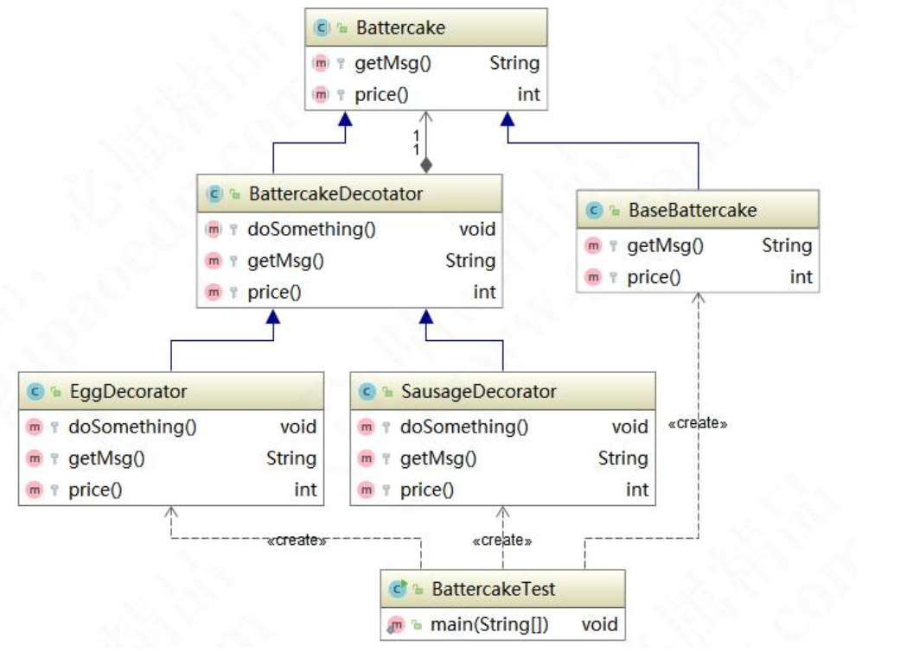
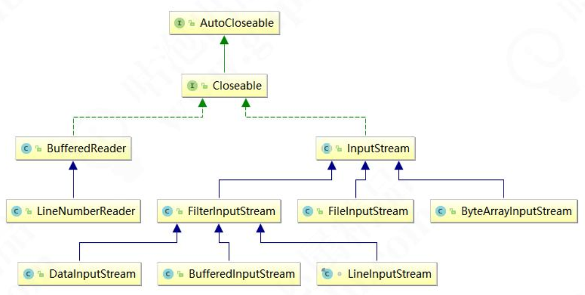

# 装饰者模式及观察者模式

## 装饰者模式

### 装饰者模式的应用场景

​	装饰者模式（Decorator Pattern）是指在不改变原有对象的基础之上，将功能附加到对象上，提供了比继承更有弹性的替代方案（扩展原有对象的功能），属于结构型模式。

​	装饰者模式在我们生活中应用也比较多如给煎饼加鸡蛋；给蛋糕加上一些水果；给房子装修等，为对象扩展一些额外的职责。装饰者在代码程序中适用于以下场景：

1、用于扩展一个类的功能或给一个类添加附加职责。

2、动态的给一个对象添加功能，这些功能可以再动态的撤销。 



​	装饰者模式最本质的特征是讲原有类的附加功能抽离出来，简化原有类的逻辑。通过这样两个案例，我们可以总结出来，其实抽象的装饰者是可有可无的，具体可以根据业务模型来选择。 

### 装饰者模式和适配器模式对比

​	装饰者和适配器模式都是包装模式（Wrapper Pattern），装饰者也是一种特殊的代理模式。

| 2222 | 装饰者模式                                                   | 适配器模式                                                   |
| ---- | ------------------------------------------------------------ | ------------------------------------------------------------ |
| 形式 | 是一种非常特别的适配器模式                                   | 没有层级关系，装饰器模式有层级关系                           |
| 定义 | 装饰者和被装饰者都实现同一个接 口，主要目的是为了扩展之后依旧保 留 OOP 关系 | 适配器和被适配者没有必然的联系，通 常是采用继承或代理的形式进行包装 |
| 关系 | 满足 is-a 的关系                                             | 满足 has-a 的关系                                            |
| 功能 | 注重覆盖、扩展                                               | 注重兼容、转换                                               |
| 设计 | 前置考虑                                                     | 后置考虑                                                     |

### 装饰者模式在源码中的应用

​	装饰器模式在源码中也应用得非常多，在 JDK 中体现最明显的类就是 IO 相关的类，如`BufferedReader`、`InputStream`、`OutputStream`，看一下常用的 `InputStream` 的类结构图： 



### 装饰者模式的优缺点

优点：

1、装饰者是继承的有力补充，比继承灵活，不改变原有对象的情况下动态地给一个对象扩展功能，即插即用。

2、通过使用不同装饰类以及这些装饰类的排列组合，可以实现不同效果。

3、装饰者完全遵守开闭原则。

缺点：

1、会出现更多的代码，更多的类，增加程序复杂性。

2、动态装饰时，多层装饰时会更复杂。
	那么装饰者模式我们就讲解到这里，希望小伙伴们认真体会，加深理解。 

## 观察者模式

### 观察者模式的应用场景

​	观察者模式（Observer Pattern）定义了对象之间的一对多依赖，让多个观察者对象同时监听一个主体对象，当主体对象发生变化时，它的所有依赖者（观察者）都会收到通知并更新，属于行为型模式。观察者模式有时也叫做发布订阅模式。观察者模式主要用于在关联行为之间建立一套触发机制的场景。观察者模式在生活应用也非常广泛，比如：微信朋友圈动态通知、GPser 生态圈消息通知、邮件通知、广播通知、桌面程序的事件响应等.

### 观察者模式在源码中的应用

​	来看一下 Spring 中的 `ContextLoaderListener` 实现了 `ServletContextListener` 接口，`ServletContextListener` 接口又继承了 `EventListener`，在 JDK 中 `EventListener` 有非常广泛的应用。我们可以看一下源代码，`ContextLoaderListener`： 

```java
package org.springframework.web.context;
import javax.servlet.ServletContextEvent;
import javax.servlet.ServletContextListener;

public class ContextLoaderListener extends ContextLoader implements 	ServletContextListener {
    public ContextLoaderListener() {
    } 
    
    public ContextLoaderListener(WebApplicationContext context) {
    	super(context);
    } 
    
    public void contextInitialized(ServletContextEvent event) {
    	this.initWebApplicationContext(event.getServletContext());
    } 
    
    public void contextDestroyed(ServletContextEvent event) {
        this.closeWebApplicationContext(event.getServletContext());
        ContextCleanupListener.cleanupAttributes(event.getServletContext());
    }
}
```

### 基于 Guava API 轻松落地观察者模式

​	在这里，我还推荐给大家一个实现观察者模式非常好用的框架。API 使用也非常简单，举个例子，先引入 maven 依赖包： 

```xml
<dependency>
    <groupId>com.google.guava</groupId>
    <artifactId>guava</artifactId>
    <version>20.0</version>
</dependency>
```

​	创建侦听事件 `GuavaEvent`： 

```java
package com.gupaoedu.vip.pattern.observer.guava;
import com.google.common.eventbus.Subscribe;
 
public class GuavaEvent {
    @Subscribe
    public void subscribe(String str){
        //业务逻辑
        System.out.println("执行 subscribe 方法,传入的参数是:" + str);
    }
}
```

​	客户端测试代码： 

```java
public class GuavaEventTest {
    public static void main(String[] args) {
        EventBus eventbus = new EventBus();
        GuavaEvent guavaEvent = new GuavaEvent();
        eventbus.register(guavaEvent);
        eventbus.post("Tom");
    }
}
```

### 观察者模式的优缺点

优点：

1、观察者和被观察者之间建立了一个抽象的耦合。

2、观察者模式支持广播通信。

缺点：

1、观察者之间有过多的细节依赖、提高时间消耗及程序的复杂度。

2、使用要得当，要避免循环调用。 