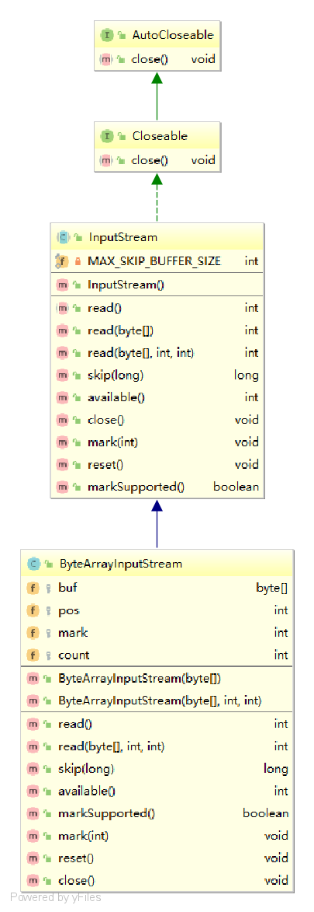

# ByteArrayInputStream

## 类图



## 构造方法

### ByteArrayInputStream(byte buf[])

```java
public ByteArrayInputStream(byte buf[]) {
    this.buf = buf;
    this.pos = 0;
    this.count = buf.length;
}
```

### ByteArrayInputStream(byte buf[], int offset, int length)

```java
public ByteArrayInputStream(byte buf[], int offset, int length) {
    this.buf = buf;
    this.pos = offset;
    this.count = Math.min(offset + length, buf.length);
    this.mark = offset;
}
```

## 属性

### buf[]

```java
/**
 *由流的创建者提供的字节数组。元素buf[0]到buf[count-1]是唯一可以从流中读取的字节;
 *元素buf[pos]是下一个要读取的字节。
 */
protected byte buf[];
```

### pos

```java
/**
 * 偏移量 == offset
 * The index of the next character to read from the input stream buffer.
 * This value should always be nonnegative
 * and not larger than the value of <code>count</code>.
 * The next byte to be read from the input stream buffer
 * will be <code>buf[pos]</code>.
 */
protected int pos;
```

### mark

```java
/**
 * The currently marked position in the stream.
 * ByteArrayInputStream objects are marked at position zero by
 * default when constructed.  They may be marked at another
 * position within the buffer by the <code>mark()</code> method.
 * The current buffer position is set to this point by the
 * <code>reset()</code> method.
 * <p>
 * If no mark has been set, then the value of mark is the offset
 * passed to the constructor (or 0 if the offset was not supplied).
 *
 * @since   JDK1.1
 */
protected int mark = 0;
```

### count

```java
/**
 * The index one greater than the last valid character in the input
 * stream buffer.
 * This value should always be nonnegative
 * and not larger than the length of <code>buf</code>.
 * It  is one greater than the position of
 * the last byte within <code>buf</code> that
 * can ever be read  from the input stream buffer.
 */
protected int count;
```

## 方法

### read()

```java
public synchronized int read() {
    return (pos < count) ? (buf[pos++] & 0xff) : -1;
}
```

### read(byte b[], int off, int len)

```java
public synchronized int read(byte b[], int off, int len) {
    if (b == null) {
        throw new NullPointerException();
    } else if (off < 0 || len < 0 || len > b.length - off) {
        throw new IndexOutOfBoundsException();
    }

    if (pos >= count) {
        return -1;
    }

    int avail = count - pos;
    if (len > avail) {
        len = avail;
    }
    if (len <= 0) {
        return 0;
    }
    System.arraycopy(buf, pos, b, off, len);
    pos += len;
    return len;
}
```

### skip(long n)

```java
public synchronized long skip(long n) {
    long k = count - pos;
    if (n < k) {
        k = n < 0 ? 0 : n;
    }

    pos += k;
    return k;
}
```

### available()

```java
public synchronized int available() {
    return count - pos;
}
```

### markSupported()

```java
public boolean markSupported() {
    return true;
}
```

### mark(int readAheadLimit)

```java
public void mark(int readAheadLimit) {
    mark = pos;
}
```

### reset()

```java
public synchronized void reset() {
    pos = mark;
}
```

### close()

```java
public void close() throws IOException {
}
```

