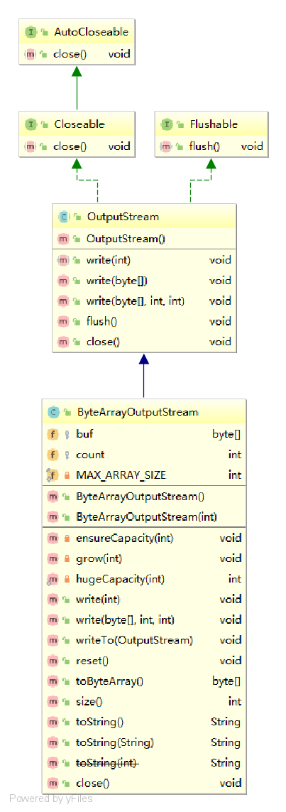

# ByteArrayOutputStream

## 类图



## 构造函数

### ByteArrayOutputStream()

```java
public ByteArrayOutputStream() {
    this(32);
}
```

### ByteArrayOutputStream(int size)

```java
	public ByteArrayOutputStream(int size) {
        if (size < 0) {
            throw new IllegalArgumentException("Negative initial size: " + size);
        }
        buf = new byte[size];
    }
```

## 属性

### buf[]

```java
	/**
     * The buffer where data is stored.
     */
    protected byte buf[];
```

### count

```java
    /**
     * The number of valid bytes in the buffer.
     */
    protected int count;
```

### MAX_ARRAY_SIZE

```java
    /**
     * The maximum size of array to allocate.
     * Some VMs reserve some header words in an array.
     * Attempts to allocate larger arrays may result in
     * OutOfMemoryError: Requested array size exceeds VM limit
     */
    private static final int MAX_ARRAY_SIZE = Integer.MAX_VALUE - 8;
```

## 方法

### ensureCapacity(int minCapacity)

```java
	private void ensureCapacity(int minCapacity) {
        // overflow-conscious code
        if (minCapacity - buf.length > 0)
            grow(minCapacity);
    }
```

### grow(int minCapacity)

```java
    private void grow(int minCapacity) {
        // overflow-conscious code
        int oldCapacity = buf.length;
        int newCapacity = oldCapacity << 1;
        if (newCapacity - minCapacity < 0)
            newCapacity = minCapacity;
        if (newCapacity - MAX_ARRAY_SIZE > 0)
            newCapacity = hugeCapacity(minCapacity);
        buf = Arrays.copyOf(buf, newCapacity);
    }
```

### hugeCapacity(int minCapacity)

```java
    private static int hugeCapacity(int minCapacity) {
        if (minCapacity < 0) // overflow
            throw new OutOfMemoryError();
        return (minCapacity > MAX_ARRAY_SIZE) ?
            Integer.MAX_VALUE :
            MAX_ARRAY_SIZE;
    }
```

### write(int b)

```java
    public synchronized void write(int b) {
        ensureCapacity(count + 1);
        buf[count] = (byte) b;
        count += 1;
    }
```

### write(byte b[], int off, int len)

```java
    public synchronized void write(byte b[], int off, int len) {
        if ((off < 0) || (off > b.length) || (len < 0) ||
            ((off + len) - b.length > 0)) {
            throw new IndexOutOfBoundsException();
        }
        ensureCapacity(count + len);
        System.arraycopy(b, off, buf, count, len);
        count += len;
    }
```

### writeTo(OutputStream out)

```java
public synchronized void writeTo(OutputStream out) throws IOException {
    out.write(buf, 0, count);
}
```
### reset()

```java
public synchronized void reset() {
    count = 0;
}
```
### toByteArray()[]

```java
public synchronized byte toByteArray()[] {
    return Arrays.copyOf(buf, count);
}
```
### size()

```java
public synchronized int size() {
    return count;
}
```
### toString()

```java
public synchronized String toString() {
    return new String(buf, 0, count);
}
```
### toString(String charsetName)

```java
public synchronized String toString(String charsetName)
    throws UnsupportedEncodingException
{
    return new String(buf, 0, count, charsetName);
}
```
### close()

```java
public void close() throws IOException {}
```