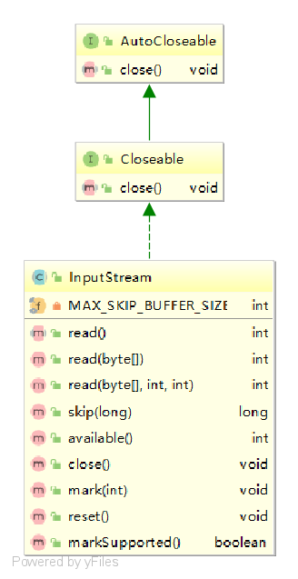

# InputStream

## 类图



## 属性

### MAX_SKIP_BUFFER_SIZE

```java
//MAX_SKIP_BUFFER_SIZE is used to determine the maximum buffer size to use when skipping.
private static final int MAX_SKIP_BUFFER_SIZE = 2048;
```

## 方法

### read()

```java
	/**
	 * 从输入流中读取下一个字节，返回值是0-255，如果没有字节，则返回-1
     * Reads the next byte of data from the input stream. The value byte is
     * returned as an <code>int</code> in the range <code>0</code> to
     * <code>255</code>. If no byte is available because the end of the stream
     * has been reached, the value <code>-1</code> is returned. This method
     * blocks until input data is available, the end of the stream is detected,
     * or an exception is thrown.
     *
     * <p> A subclass must provide an implementation of this method.
     *
     * @return     the next byte of data, or <code>-1</code> if the end of the
     *             stream is reached.
     * @exception  IOException  if an I/O error occurs.
     */
    public abstract int read() throws IOException;
```

### read(byte b[])

```java
public int read(byte b[]) throws IOException {
    return read(b, 0, b.length);
}
```

### read(byte b[], int off, int len)

```java
	/* @param      b     the buffer into which the data is read.
     * @param      off   the start offset in array <code>b</code>
     *                   at which the data is written.
     * @param      len   the maximum number of bytes to read.
     * @return     the total number of bytes read into the buffer, or
     *             <code>-1</code> if there is no more data because the end of
     *             the stream has been reached.
     * @exception  IOException If the first byte cannot be read for any reason
     * other than end of file, or if the input stream has been closed, or if
     * some other I/O error occurs.
     * @exception  NullPointerException If <code>b</code> is <code>null</code>.
     * @exception  IndexOutOfBoundsException If <code>off</code> is negative,
     * <code>len</code> is negative, or <code>len</code> is greater than
     * <code>b.length - off</code>
     * @see        java.io.InputStream#read()
     */
public int read(byte b[], int off, int len) throws IOException {
	if (b == null) {
            throw new NullPointerException();
        } else if (off < 0 || len < 0 || len > b.length - off) {
            throw new IndexOutOfBoundsException();
        } else if (len == 0) {
            return 0;
        }

        int c = read();
        if (c == -1) {
            return -1;
        }
        b[off] = (byte)c;

        int i = 1;
        try {
            for (; i < len ; i++) {
                c = read();
                if (c == -1) {
                    break;
                }
                b[off + i] = (byte)c;
            }
        } catch (IOException ee) {
        }
    return i;
}
```

### skip(long n)

```java
/*
 * @param      n   the number of bytes to be skipped.
 * @return     the actual number of bytes skipped.
 * @exception  IOException  if the stream does not support seek,
 *                          or if some other I/O error occurs.
 */
public long skip(long n) throws IOException {
    long remaining = n;
        int nr;

        if (n <= 0) {
            return 0;
        }

        int size = (int)Math.min(MAX_SKIP_BUFFER_SIZE, remaining);
        byte[] skipBuffer = new byte[size];
        while (remaining > 0) {
            nr = read(skipBuffer, 0, (int)Math.min(size, remaining));
            if (nr < 0) {
                break;
            }
            remaining -= nr;
        }

   return n - remaining;
}
```

### available()

```java
/* <p> This method should be overridden by subclasses.
 *
 * @return     an estimate of the number of bytes that can be read (or skipped
 *             over) from this input stream without blocking or {@code 0} when
 *             it reaches the end of the input stream.
 * @exception  IOException if an I/O error occurs.
 */
public int available() throws IOException {
    return 0;
}
```

### close()

```java
/* <p> The <code>close</code> method of <code>InputStream</code> does
 * nothing.
 *
 * @exception  IOException  if an I/O error occurs.
 */
public void close() throws IOException {}
```

### mark(int readlimit)

```java
/* <p> Marking a closed stream should not have any effect on the stream.
 *
 * <p> The <code>mark</code> method of <code>InputStream</code> does
 * nothing.
 *
 * @param   readlimit   the maximum limit of bytes that can be read before
 *                      the mark position becomes invalid.
 * @see     java.io.InputStream#reset()
 */
public synchronized void mark(int readlimit) {}
```

### reset()

```java
/* <p>The method <code>reset</code> for class <code>InputStream</code>
 * does nothing except throw an <code>IOException</code>.
 *
 * @exception  IOException  if this stream has not been marked or if the
 *               mark has been invalidated.
 * @see     java.io.InputStream#mark(int)
 * @see     java.io.IOException
 */
public synchronized void reset() throws IOException {
    throw new IOException("mark/reset not supported");
}
```

### markSupported()

```java
public boolean markSupported() {
    return false;
}
```

