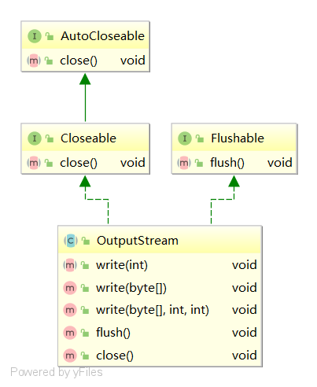

# OutputStream

## 类图



## 方法

### write(int b)

```java
/* Subclasses of <code>OutputStream</code> must provide an
 * implementation for this method.
 *
 * @param      b   the <code>byte</code>.
 * @exception  IOException  if an I/O error occurs. In particular,
 *             an <code>IOException</code> may be thrown if the
 *             output stream has been closed.
 */
public abstract void write(int b) throws IOException;
```

### write(byte b[])

```java
public void write(byte b[]) throws IOException {
    write(b, 0, b.length);
}
```

### write(byte b[], int off, int len)

```java
public void write(byte b[], int off, int len) throws IOException {
    if (b == null) {
        throw new NullPointerException();
    } else if ((off < 0) || (off > b.length) || (len < 0) ||
               ((off + len) > b.length) || ((off + len) < 0)) {
        throw new IndexOutOfBoundsException();
    } else if (len == 0) {
        return;
    }
    for (int i = 0 ; i < len ; i++) {
        write(b[off + i]);
    }
}
```

### flush()

```java
public void flush() throws IOException {}
```

### close()

```java
public void close() throws IOException {}
```