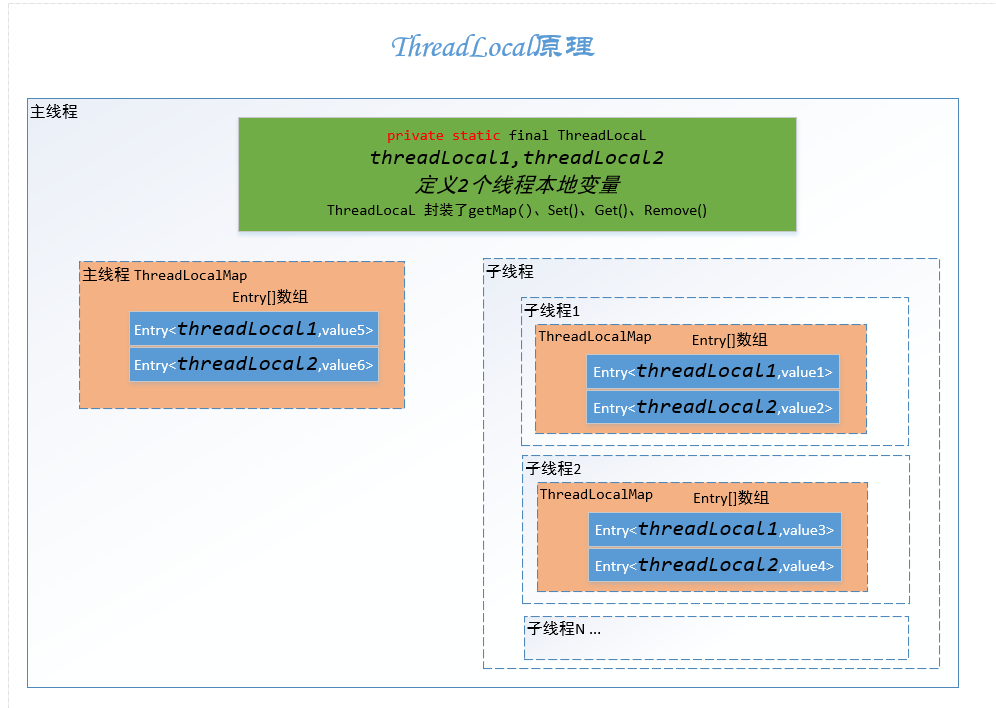
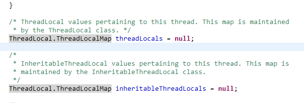
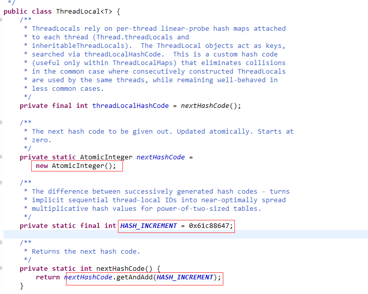
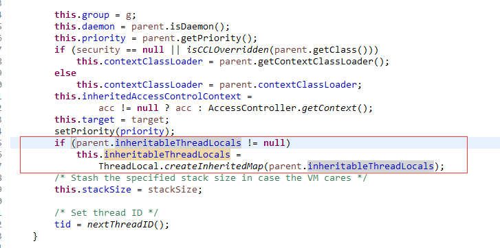

## 一、ThreadLocal

我们使用**ThreadLocal解决线程局部变量统一定义问题，**多线程数据不能共享。（InheritableThreadLocal特例除外）不能解决并发问题。解决了：**基于类级别的变量定义，每一个线程单独维护自己线程内的变量值（存、取、删的功能）**

根据源码，画出原理图如下：



注意点：

**1.ThreadLocal类封装了getMap()、Set()、Get()、Remove()4个核心方法。**

**2.通过getMap()获取每个子线程Thread持有自己的ThreadLocalMap实例, 因此它们是不存在并发竞争的。可以理解为每个线程有自己的变量副本。**

**3.ThreadLocalMap中Entry[]数组存储数据，初始化长度16，后续每次都是2倍扩容。主线程中定义了几个变量，Entry[]才有几个key。**

 **4.Entry的key是对ThreadLocal的弱引用，当抛弃掉ThreadLocal对象时，垃圾收集器会忽略这个key的引用而清理掉ThreadLocal对象， 防止了内存泄漏。**


### 1.1源码注释

理解原理最好的方法是看源码注释：

```
1 This class provides thread-local variables. These variables differ from their normal counterparts in that each thread that accesses one (via its get or set method) has its own, independently initialized copy of the variable. ThreadLocal instances are typically private static fields in classes that wish to associate state with a thread (e.g., a user ID or Transaction ID). 
2 
3 For example, the class below generates unique identifiers local to each thread. A thread's id is assigned the first time it invokes ThreadId.get() and remains unchanged on subsequent calls. 
```

这个类提供线程局部变量。这些变量与正常的变量不同，每个线程访问一个(通过它的get或set方法)都有它自己的、独立初始化的变量副本。ThreadLocal实例通常是类中的私有静态字段，希望将状态与线程关联(例如，用户ID或事务ID)。

**注释中的示例代码：**

下图ThreadId类会在每个线程中生成唯一标识符。线程的id在第一次调用threadid.get()时被分配，在随后的调用中保持不变。

 ThreadId类利用AtomicInteger原子方法getAndIncrement，为每个线程创建一个threadId变量，例如第一个线程是1，第二个线程是2...，并提供一个类静态get方法用以获取当前线程ID。：

```java
 1 import java.util.concurrent.atomic.AtomicInteger;
 2 
 3  public class ThreadId {
 4      // Atomic integer containing the next thread ID to be assigned
 5      private static final AtomicInteger nextId = new AtomicInteger(0);
 6 
 7      // Thread local variable containing each thread's ID
 8      private static final ThreadLocal<Integer> threadId =
 9          new ThreadLocal<Integer>() {
10              @Override protected Integer initialValue() {
11                  return nextId.getAndIncrement();
12          }
13      };
14 
15      // Returns the current thread's unique ID, assigning it if necessary
16      public static int get() {
17          return threadId.get();
18      }
19  }
```

如上图，有一个注意点是：**用户可以自定义initialValue()初始化方法，来初始化threadLocal的值。**


### 1.2 源码剖析

我们来追踪一下ThreadLocal源码：

```java
 1 public T get() {
 2         Thread t = Thread.currentThread();
 3         ThreadLocalMap map = getMap(t);
 4         if (map != null) {
 5             ThreadLocalMap.Entry e = map.getEntry(this);
 6             if (e != null) {
 7                 @SuppressWarnings("unchecked")
 8                 T result = (T)e.value;
 9                 return result;
10             }
11         }
12         return setInitialValue();
13     }
14 
21     private T setInitialValue() {
22         T value = initialValue();
23         Thread t = Thread.currentThread();
24         ThreadLocalMap map = getMap(t);
25         if (map != null)
26             map.set(this, value);
27         else
28             createMap(t, value);
29         return value;
30     }
31 
41     public void set(T value) {
42         Thread t = Thread.currentThread();
43         ThreadLocalMap map = getMap(t);
44         if (map != null)
45             map.set(this, value);
46         else
47             createMap(t, value);
48     }
49 
61      public void remove() {
62          ThreadLocalMap m = getMap(Thread.currentThread());
63          if (m != null)
64              m.remove(this);
65      }
66 
74     ThreadLocalMap getMap(Thread t) {
75         return t.threadLocals;
76     }
```


看源码我们知道不管是set、get、remove操作的都是ThreadLocalMap,key=当前线程，value=线程局部变量缓存值。

上图getMap最终调用的Thread的成员变量 ThreadLocal.ThreadLocalMap threadLocals,如下图：



ThreadLocalMap是ThreadLocal的一个内部类，源码注释：

ThreadLocalMap是一个定制的哈希映射，仅适用于维护线程本地值。ThreadLocalMap类是包私有的，允许在Thread类中声明字段。为了帮助处理非常大且长时间的使用，哈希表entry使用了对键的弱引用。有助于GC回收。


### 散列算法-魔数`0x61c88647`

 ThreadLocal中定义了一个AtomicInteger,一个魔数0x61c88647，利用一定算法实现了元素的完美散列。

**源码中元素散列算法如下：**

```java
1.求hashCode = i*HASH_INCREMENT+HASH_INCREMENT每次新增一个元素（threadLocal）进Entry[],自增0x61c88647
2.元素散列位置（数组下标）= hashCode & (length-1)，
```



下面校验算法的散列性：

```java
 1 /**
 2  * 
 3  * @ClassName:MagicHashCode
 4  * @Description:ThreadLocalMap使用“开放寻址法”中最简单的“线性探测法”解决散列冲突问题
 5  * @author diandian.zhang
 6  * @date 2017年12月6日上午10:53:28
 7  */
 8 public class MagicHashCode {
 9     //ThreadLocal中定义的hash魔数
10     private static final int HASH_INCREMENT = 0x61c88647;
11     
12     public static void main(String[] args) {
13         hashCode(16);//初始化16
14         hashCode(32);//后续2倍扩容
15         hashCode(64);
16     }
17 
18     /**
19      * 
20      * @Description 寻找散列下标（对应数组小标）
21      * @param length table长度
22      * @author diandian.zhang
23      * @date 2017年12月6日上午10:36:53
24      * @since JDK1.8
25      */
26     private static void hashCode(Integer length){
27         int hashCode = 0; 
28         for(int i=0;i<length;i++){
29             hashCode = i*HASH_INCREMENT+HASH_INCREMENT;//每次递增HASH_INCREMENT
30             System.out.print(hashCode & (length-1));//求散列下标，算法公式
31             System.out.print(" ");
32         }
33         System.out.println();
34     }
35 }
```

运行结果：

```
7 14 5 12 3 10 1 8 15 6 13 4 11 2 9 0 --》Entry[]初始化容量为16时，元素完美散列  
7 14 21 28 3 10 17 24 31 6 13 20 27 2 9 16 23 30 5 12 19 26 1 8 15 22 29 4 11 18 25 0--》Entry[]容量扩容2倍=32时，元素完美散列
7 14 21 28 35 42 49 56 63 6 13 20 27 34 41 48 55 62 5 12 19 26 33 40 47 54 61 4 11 18 25 32 39 46 53 60 3 10 17 24 31 38 45 52 59 2 9 16 23 30 37 44 51 58 1 8 15 22 29 36 43 50 57 0 --》Entry[]容量扩容2倍=64时，元素完美散列
```

根据运行结果，代表此算法在长度为2的N次方的数组上，确实可以完美散列。

那么原理是什么？

```java
long l1 = (long) ((1L << 31) * (Math.sqrt(5) - 1));//(根号5-1)*2的31次方=(根号5-1)/2 *2的32次方=黄金分割数*2的32次方
System.out.println("as 32 bit unsigned: " + l1);//32位无符号整数
int i1 = (int) l1;
System.out.println("as 32 bit signed:   " + i1);//32位有符号整数
System.out.println("MAGIC = " + 0x61c88647);
```

运行结果：

```
as 32 bit unsigned: 2654435769
as 32 bit signed:   -1640531527
MAGIC = 1640531527
```

这里不再拓展，跟斐波那契数列（和黄金分割数）有关：

1.0x61c88647对应十进制=1640531527。

2.(根号5-1)*2的31次方，转换成long类型就是2654435769，转换成int类型就是-1640531527。


### set操作

ThreadLocal的set最终调用了ThreadLocalMap的set方法，如下图

```java
 1  private void set(ThreadLocal<?> key, Object value) {
 8             Entry[] tab = table;
 9             int len = tab.length;
10             int i = key.threadLocalHashCode & (len-1);// 根据哈希码和数组长度求元素放置的位置，即数组下标
11             //从i开始往后一直遍历到数组最后一个Entry
12             for (Entry e = tab[i];
13                  e != null;
14                  e = tab[i = nextIndex(i, len)]) {
15                 ThreadLocal<?> k = e.get();
16                 //如果key相等，覆盖value
17                 if (k == key) {
18                     e.value = value;
19                     return;
20                 }
21                 //如果key为null,用新key、value覆盖，同时清理历史key=null的陈旧数据
22                 if (k == null) {
23                     replaceStaleEntry(key, value, i);
24                     return;
25                 }
26             }
27 
28             tab[i] = new Entry(key, value);
29             int sz = ++size;
               //如果超过阀值，就需要再哈希了
30             if (!cleanSomeSlots(i, sz) && sz >= threshold)
31                 rehash();
32 }
```

再哈希：

```java
 1 　　　　　private void rehash() {
 2             expungeStaleEntries();// 清理一次陈旧数据
 3 
 4             // 清理完陈旧数据，如果>= 3/4阀值,就执行扩容，避免迟滞
 5             if (size >= threshold - threshold / 4)
 6                 resize();
 7         }
 8 
 9         /**
10          * 把table扩容2倍，并把老数据重新哈希散列进新table
11          */
12         private void resize() {
13             Entry[] oldTab = table;
14             int oldLen = oldTab.length;
15             int newLen = oldLen * 2;
16             Entry[] newTab = new Entry[newLen];
17             int count = 0;
18             // 遍历Entry[]数组
19             for (int j = 0; j < oldLen; ++j) {
20                 Entry e = oldTab[j];
21                 if (e != null) {
22                     ThreadLocal<?> k = e.get();
23                     if (k == null) {// 如果key=null
24                         e.value = null; // 把value也置null,有助于GC回收对象
25                     } else {// 如果key！=null
26                         int h = k.threadLocalHashCode & (newLen - 1);// 计算hash值 
27                         while (newTab[h] != null)// 如果这个位置已使用
28                             h = nextIndex(h, newLen);// 线性往后查询，直到找到一个没有使用的位置,h递增
29                         newTab[h] = e;//在第一个空节点上塞入Entry e
30                         count++;// 计数++
31                     }
32                 }
33             }
34 
35             setThreshold(newLen);// 设置新的阈值（实际set方法用了2/3的newLen作为阈值）
36             size = count;// 设置ThreadLocalMap的元素个数
37             table = newTab;// 把新table赋值给ThreadLocalMap的Entry[] table
38         }
39 
40         /**
41          * 删除陈旧的数据
42          */
43         private void expungeStaleEntries() {
44             Entry[] tab = table;
45             int len = tab.length;
46             for (int j = 0; j < len; j++) {
47                 Entry e = tab[j];
48                 if (e != null && e.get() == null)//entry不为空且entry的key为null
49                     expungeStaleEntry(j);//删除指定数组下标的陈旧entry
50             }
51         }
52         //删除陈旧entry的核心方法
53         private int expungeStaleEntry(int staleSlot) {
54             Entry[] tab = table;
55             int len = tab.length;
56 
57             
58             tab[staleSlot].value = null;//删除value
59             tab[staleSlot] = null;//删除entry
60             size--;//map的size自减
61 
62             // 遍历指定删除节点，所有后续节点
63             Entry e;
64             int i;
65             for (i = nextIndex(staleSlot, len);
66                  (e = tab[i]) != null;
67                  i = nextIndex(i, len)) {
68                 ThreadLocal<?> k = e.get();
69                 if (k == null) {//key为null,执行删除操作
70                     e.value = null;
71                     tab[i] = null;
72                     size--;
73                 } else {//key不为null,重新计算下标
74                     int h = k.threadLocalHashCode & (len - 1);
75                     if (h != i) {//如果不在同一个位置
76                         tab[i] = null;//把老位置的entry置null(删除)
77 
78                         // 从h开始往后遍历，一直到找到空为止，插入
80                         while (tab[h] != null)
81                             h = nextIndex(h, len);
82                         tab[h] = e;
83                     }
84                 }
85             }
86             return i;
87         }
```

总结set步骤：

1）`根据`哈希码和数组长度求元素放置的位置，即数组下标

2）从第一步得出的下标开始往后遍历，如果key相等，覆盖value，如果key为null,用新key、value覆盖，同时清理历史key=null的陈旧数据

3）如果超过阀值，就需要再哈希：

-  清理一遍陈旧数据 
- \>= 3/4阀值,就执行扩容，把table扩容2倍==》注意这里3/4阀值就执行扩容，避免迟滞
- 把老数据重新哈希散列进新table


###  get操作

```java
 1 　　public T get() {
 2         Thread t = Thread.currentThread();
 3         ThreadLocalMap map = getMap(t);//从当前线程中获取ThreadLocalMap
 4         if (map != null) {
 5             ThreadLocalMap.Entry e = map.getEntry(this);//查询当前ThreadLocal变量实例对应的Entry
 6             if (e != null) {//如果不为null,获取value,返回
 7                 @SuppressWarnings("unchecked")
 8                 T result = (T)e.value;
 9                 return result;
10             }
11         }//如果map为null,即还没有初始化，走初始化方法
12         return setInitialValue();
13     }
14 
21     private T setInitialValue() {
22         T value = initialValue();//该方法默认返回null，用户可自定义
23         Thread t = Thread.currentThread();
24         ThreadLocalMap map = getMap(t);
25         if (map != null)//如果map不为null,把初始化value设置进去
26             map.set(this, value);
27         else//如果map为null,则new一个map,并把初始化value设置进去
28             createMap(t, value);
29         return value;
30     }
31 
32     void createMap(Thread t, T firstValue) {
33         t.threadLocals = new ThreadLocalMap(this, firstValue);
34     }
35 
36     ThreadLocalMap(ThreadLocal<?> firstKey, Object firstValue) {
37     table = new Entry[INITIAL_CAPACITY];//初始化容量16
38     int i = firstKey.threadLocalHashCode & (INITIAL_CAPACITY - 1);
39     table[i] = new Entry(firstKey, firstValue);
40     size = 1;
41     setThreshold(INITIAL_CAPACITY);//设置阈值
42     }
43     //阈值设置为容量的*2/3，即负载因子为2/3，超过就进行再哈希
44     private void setThreshold(int len) {
45         threshold = len * 2 / 3;
46      }
```

总结get步骤：

1）从当前线程中获取ThreadLocalMap，查询当前ThreadLocal变量实例对应的Entry，如果不为null,获取value,返回

2）如果map为null,即还没有初始化，走初始化方法


### remove操作

```java
 1 public void remove() {
 2     ThreadLocalMap m = getMap(Thread.currentThread());
 3     if (m != null)
 4         m.remove(this);//调用ThreadLocalMap删除变量
 5 }
 6 
 7 private void remove(ThreadLocal<?> key) {
 8     Entry[] tab = table;
 9     int len = tab.length;
10     int i = key.threadLocalHashCode & (len-1);
11     for (Entry e = tab[i];
12          e != null;
13          e = tab[i = nextIndex(i, len)]) {
14         if (e.get() == key) {
15             e.clear();//调用Entry的clear方法
16             expungeStaleEntry(i);//清除陈旧数据
17             return;
18         }
19     }
20 }
```


看一下Entry的clear方法，Entry ==extends==》 WeakReference<ThreadLocal<?>>==extends==》 Reference<T>，clear方法是抽象类Reference定义的方法。


```java
1 static class Entry extends WeakReference<ThreadLocal<?>> {
2     /** The value associated with this ThreadLocal. */
3     Object value;
4 
5     Entry(ThreadLocal<?> k, Object v) {
6         super(k);
7         value = v;
8     }
9 }
```


```java
追一下clear方法如下：把弱引用的对象置null。有利于GC回收内存。关于引用，预留飞机票
public void clear() {
    this.referent = null;
}
```


### 1.3 功能测试

开启2个线程，每个个线程都使用类级别的threadLocal，往里面递增数字，i=0，时，set(0),i=1,2,3时 值+1，

```java
 1 /**
 2  * 
 3  * @ClassName:MyThreadLocal
 4  * @Description:ThreadLocal线程本地变量
 5  * @author diandian.zhang
 6  * @date 2017年12月4日上午9:40:52
 7  */
 8 public class MyThreadLocal{
 9     //线程本地共享变量
10     private static final ThreadLocal<Object> threadLocal = new ThreadLocal<Object>(){
11         /**
12          * ThreadLocal没有被当前线程赋值时或当前线程刚调用remove方法后调用get方法，返回此方法值
13          */
14         @Override
15         protected Object initialValue()
16         {
17             System.out.println("[线程"+Thread.currentThread().getName()+"]调用get方法时，当前线程共享变量没值，调用initialValue获取默认值！");
18             return null;
19         }
20     };
21      
22     public static void main(String[] args){
23         //1.开启任务1线程
24         new Thread(new MyIntegerTask("IntegerTask1")).start();
25         //2.中间休息3秒，用以测试数据差异
26         try {
27             Thread.sleep(3000);
28         } catch (InterruptedException e) {
29             e.printStackTrace();
30         }
31         //3.开启任务2线程
32         new Thread(new MyIntegerTask("IntegerTask2")).start();
33     }
34      
35     /**
36      * 
37      * @ClassName:MyIntegerTask
38      * @Description:整形递增线程
39      * @author diandian.zhang
40      * @date 2017年12月4日上午10:00:41
41      */
42     public static class MyIntegerTask implements Runnable{
43         private String name;
44          
45         MyIntegerTask(String name)
46         {
47             this.name = name;
48         }
49  
50         @Override
51         public void run()
52         {
53             for(int i = 0; i < 5; i++)
54             {
55                 // ThreadLocal.get方法获取线程变量
56                 if(null == MyThreadLocal.threadLocal.get())
57                 {
58                     // ThreadLocal.set方法设置线程变量
59                     MyThreadLocal.threadLocal.set(0);
60                     System.out.println("i="+i+"[线程" + name + "]当前线程不存在缓存,set 0");
61                 }
62                 else
63                 {
64                     int num = (Integer)MyThreadLocal.threadLocal.get();
65                     MyThreadLocal.threadLocal.set(num + 1);
66                     System.out.println("i="+i+"[线程" + name + "]往threadLocal中set: " + MyThreadLocal.threadLocal.get());
67                     //当i=3即循环4次时，移除当前线程key
68                     if(i == 3)
69                     {
70                         System.out.println("i="+i+"[线程" + name + "]，threadLocal移除当前线程" );
71                         MyThreadLocal.threadLocal.remove();
72                     }
73                 }
74                 try
75                 {
76                     Thread.sleep(1000);
77                 }
78                 catch (InterruptedException e)
79                 {
80                     e.printStackTrace();
81                 }
82             }  
83         }
84     }
85 }
```

运行结果如下：

```
[线程Thread-0]调用get方法时，当前线程共享变量没值，调用initialValue获取默认值！
i=0[线程IntegerTask1]当前线程不存在缓存,set 0
i=1[线程IntegerTask1]往threadLocal中set: 1
i=2[线程IntegerTask1]往threadLocal中set: 2
[线程Thread-1]调用get方法时，当前线程共享变量没值，调用initialValue获取默认值！
i=0[线程IntegerTask2]当前线程不存在缓存,set 0
i=3[线程IntegerTask1]往threadLocal中set: 3
i=3[线程IntegerTask1]，threadLocal移除当前线程
i=1[线程IntegerTask2]往threadLocal中set: 1
[线程Thread-0]调用get方法时，当前线程共享变量没值，调用initialValue获取默认值！
i=4[线程IntegerTask1]当前线程不存在缓存,set 0
i=2[线程IntegerTask2]往threadLocal中set: 2
i=3[线程IntegerTask2]往threadLocal中set: 3
i=3[线程IntegerTask2]，threadLocal移除当前线程
[线程Thread-1]调用get方法时，当前线程共享变量没值，调用initialValue获取默认值！
i=4[线程IntegerTask2]当前线程不存在缓存,set 0
```

结果验证：

1.2个线程，2个threadLocal变量互不影响。

2.调用get方法时，对应ThreadLocalMap为null会调用initialValue()方法，初始化threadLocal的值。


### 1.4 应用场景

ThreadLocal的实际应用场景：

1**)数据结构**：用Map<String, Object>来避免创建多个ThreadLocal变量的麻烦。只需根据map的key就可以获取想要的value

private static final ThreadLocal<Map<String, Object>> loginContext = new ThreadLocal<>();

2)**业务**：线程级别，维护session,维护用户登录信息userID（登陆时插入，多个地方获取）等，尤其适合使用在WEB项目中（Tomcat容器，工作线程隔离）


## 二、变量可继承的ThreadLocal-->InheritableThreadLocal


### 2.1 源码注释：

这个类扩展ThreadLocal，以提供从父线程到子线程的值的继承:当创建子线程时，子线程会接收父元素所具有值的所有可继承线程局部变量的初始值。正常情况下，子线程的变量值与父线程的相同;然而，子线程可复写childValue方法来自定义获取父类变量。
当变量(例如，用户ID、事务ID)中维护的每个线程属性必须自动传输到创建的任何子线程时，使用InheritableThreadLocal优于ThreadLocal。


### 2.2 源码剖析

**1.子线程启动时，调用init方法，如果父线程有InheritableThreadLocal变量，则在子线程也生成一份**

下图是Thread类在init时执行的逻辑：



调用createInheritedMap方法，并调用childValue方法复制一份变量给子线程

```java
 1 static ThreadLocalMap createInheritedMap(ThreadLocalMap parentMap) {
 2         return new ThreadLocalMap(parentMap);
 3     }
 4 
 5 private ThreadLocalMap(ThreadLocalMap parentMap) {
 6             Entry[] parentTable = parentMap.table;
 7             int len = parentTable.length;
 8             setThreshold(len);
 9             table = new Entry[len];
10 
11             for (int j = 0; j < len; j++) {
12                 Entry e = parentTable[j];
13                 if (e != null) {
14                     @SuppressWarnings("unchecked")
15                     ThreadLocal<Object> key = (ThreadLocal<Object>) e.get();
16                     if (key != null) {
17                         Object value = key.childValue(e.value);
18                         Entry c = new Entry(key, value);
19                         int h = key.threadLocalHashCode & (len - 1);
20                         while (table[h] != null)
21                             h = nextIndex(h, len);
22                         table[h] = c;
23                         size++;
24                     }
25                 }
26             }
27         }
```


**2.支持用户自定义childValue函数，用以子类获取父类变量值的转换：父类变量----childValue转换函数-----》子类变量**

**InheritableThreadLocal默认childValue函数是直接返回：**

```
protected T childValue(T parentValue) {
    return parentValue;
}
```

用户可在创建InheritableThreadLocal变量时，覆盖childValue函数，见3.3测试


### 2.3  功能测试


```java
 1 package threadLocal;
 2 
 3 
 4 /**
 5  * 
 6  * @ClassName:MyInheritableThreadLocal
 7  * @Description:可继承线程本地变量
 8  * @author denny.zhang
 9  * @date 2017年12月7日下午5:24:40
10  */
11 public class MyInheritableThreadLocal{
12     //线程本地共享变量
13     private static final InheritableThreadLocal<Object> threadLocal = new InheritableThreadLocal<Object>(){
14         /**
15          * ThreadLocal没有被当前线程赋值时或当前线程刚调用remove方法后调用get方法，返回此方法值
16          */
17         @Override
18         protected Object initialValue()
19         {
20             System.out.println("[线程"+Thread.currentThread().getName()+"]调用get方法时，当前线程共享变量没值，调用initialValue获取默认值！");
21             return null;
22         }
23         
24         @Override
25         protected Object childValue(Object parentValue) {
26             return (Integer)parentValue*2;
27         }
28         
29     };
30      
31     public static void main(String[] args){
32         //主线程设置1
33         threadLocal.set(1);
34         //1.开启任务1线程
35         new Thread(new MyIntegerTask("IntegerTask1")).start();
36         //2.中间休息3秒，用以测试数据差异
37         try {
38             Thread.sleep(3000);
39         } catch (InterruptedException e) {
40             e.printStackTrace();
41         }
42         //开启任务2线程
43         new Thread(new MyIntegerTask("IntegerTask2")).start();
44     }
45      
46     /**
47      * 
48      * @ClassName:MyIntegerTask
49      * @Description:整形递增线程
50      * @author diandian.zhang
51      * @date 2017年12月4日上午10:00:41
52      */
53     public static class MyIntegerTask implements Runnable{
54         private String name;
55          
56         MyIntegerTask(String name)
57         {
58             this.name = name;
59         }
60  
61         @Override
62         public void run()
63         {
64             for(int i = 0; i < 5; i++)
65             {
66                 // ThreadLocal.get方法获取线程变量
67                 if(null == MyInheritableThreadLocal.threadLocal.get())
68                 {
69                     // ThreadLocal.set方法设置线程变量
70                     MyInheritableThreadLocal.threadLocal.set(0);
71                     System.out.println("i="+i+"[线程" + name + "]当前线程不存在缓存,set 0");
72                 }
73                 else
74                 {
75                     int num = (Integer)MyInheritableThreadLocal.threadLocal.get();
76                     System.out.println("i="+i+"[线程" + name + "]get=" + num);
77                     MyInheritableThreadLocal.threadLocal.set(num + 1);
78                     System.out.println("i="+i+"[线程" + name + "]往threadLocal中set: " + MyInheritableThreadLocal.threadLocal.get());
79                     //当i=3即循环4次时，移除当前线程key
80                     if(i == 3)
81                     {
82                         System.out.println("i="+i+"[线程" + name + "]，remove" );
83                         MyInheritableThreadLocal.threadLocal.remove();
84                     }
85                 }
86                 try
87                 {
88                     Thread.sleep(1000);
89                 }
90                 catch (InterruptedException e)
91                 {
92                     e.printStackTrace();
93                 }
94             }  
95         }
96     }
97 }
```


运行结果：


```
主线程变量值=1-----》主线程中变量值1
i=0[线程IntegerTask1]get=2-----》子线程1中变量值=2*1=2，验证通过！
i=0[线程IntegerTask1]往threadLocal中set: 3
i=1[线程IntegerTask1]get=3
i=1[线程IntegerTask1]往threadLocal中set: 4
i=2[线程IntegerTask1]get=4
i=2[线程IntegerTask1]往threadLocal中set: 5
i=0[线程IntegerTask2]get=2-----》主线程2中变量值=2*1=2，验证通过！
i=0[线程IntegerTask2]往threadLocal中set: 3
i=3[线程IntegerTask1]get=5
i=3[线程IntegerTask1]往threadLocal中set: 6
i=3[线程IntegerTask1]，remove
i=1[线程IntegerTask2]get=3
i=1[线程IntegerTask2]往threadLocal中set: 4
[线程Thread-0]调用get方法时，当前线程共享变量没值，调用initialValue获取默认值！
i=4[线程IntegerTask1]当前线程不存在缓存,set 0
i=2[线程IntegerTask2]get=4
i=2[线程IntegerTask2]往threadLocal中set: 5
i=3[线程IntegerTask2]get=5
i=3[线程IntegerTask2]往threadLocal中set: 6
i=3[线程IntegerTask2]，remove
[线程Thread-1]调用get方法时，当前线程共享变量没值，调用initialValue获取默认值！
i=4[线程IntegerTask2]当前线程不存在缓存,set 0
```


如上图，分析结果我们可知，

1.子线程根据childValue函数获取到了父线程的变量值。

2.多线程InheritableThreadLocal变量各自维护，无竞争关系。


### 2.4 应用场景

**子线程变量数据依赖父线程变量，且自定义赋值函数。**

例如：

开启多线程执行任务时，总任务名称叫mainTask 子任务名称依次递增mainTask-subTask1、mainTask-subTask2、mainTask-subTaskN等等


## 三、总结

本文分析了ThreadLocal原理、set（散列算法原理和测试验证，再哈希扩容）、get、remove源码，实际中的应用场景以及功能测试验证。最后又分析了InheritableThreadLocal,使用该类子线程会继承父线程变量，并自定义赋值函数。
读完本文，相信大家对ThreadLocal一点也不担心了哈哈！

需要注意2点：

***1.ThreadLocal不是用来解决线程安全问题的，多线程不共享，不存在竞争！目的是线程本地变量且只能单个线程内维护使用。***

***2.InheritableThreadLocal对比ThreadLocal唯一不同是子线程会继承父线程变量，并自定义赋值函数。***

***3.项目如果使用了线程池，那么小心线程回收后ThreadLocal、InheritableThreadLocal变量要remove,否则线程池回收后，变量还在内存中，后果不堪设想！（例如Tomcat容器的线程池，可以在拦截器中处理：extends HandlerInterceptorAdapter，然后复写afterCompletion方法，remove掉变量！！！）***