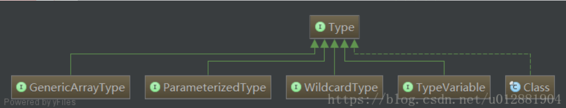

# 你真的了解Java泛型参数？spring ResolvableType更好的处理泛型

​	哈哈！你真的了解？我感觉了解了，但是真正的深入才知道自己了解甚少！spring 对于处理泛型参数使用啦ResolvableType，方便又快捷的帮助我们处理啦！很多类型的抽象，提供了统一的调用方式，更多的使用参考spring源码ResolvableTypeTest 不过我们自己对于Java的类型体系还是需要自己深入的了解的如下：

## Type



​	所有类型的类型是常见的超接口Java编程语言。这些包括原始类型,参数化的类型,数组类型,类型变量和原始类型(These include raw types, parameterized types, array types, type variables and primitive types).它并不是我们平常工作中经常使用的 int、String、List、Map等数据类型，而是从Java语言角度来说，对基本类型、引用类型向上的抽象；

​	Type体系中类型的包括：原始类型(Class)、参数化类型(ParameterizedType)、数组类型(GenericArrayType)、类型变量(TypeVariable)、基本类型(Class);

* 原始类型，不仅仅包含我们平常所指的类，还包括枚举、数组、注解等；
* 参数化类型，就是我们平常所用到的泛型List、Map；
* 数组类型，并不是我们工作中所使用的数组String[] 、byte[]，而是带有泛型的数组，即T[] ；
* 基本类型，也就是我们所说的java的基本类型，即int,float,double等

## ParameterizedType 参数化类型，即泛型；例如：List< T>、Map< K,V>等带有参数化的对象;

### 1、Type[] getActualTypeArguments(); 返回 这个 Type 类型的参数的实际类型数组。 如 Map

``` java
/**
 * ParameterizedType 使用测试 参数化类型
 *
 * @author: wangji
 * @date: 2018/06/25 16:19
 */
@Slf4j
public class ParameterizedTypeTest {

    /**
     * 1、map: 获取ParameterizedType:class java.lang.String
     * 2、map: 获取ParameterizedType:class com.wangji.demo.ParameterizedTypeTest
     * 3、map:getOwnerType is null
     * 4、map:getRawType:interface java.util.Map
     */
    private Map<String, ParameterizedTypeTest> map;
    /**
     * 1、set1: 获取ParameterizedType:class java.lang.String
     * 2、set1:getOwnerType is null
     * 3、set1:getRawType:interface java.util.Set
     */
    private Set<String> set1;
    /**
     * 1、 clz: 获取ParameterizedType:?
     * 2、 clz:getOwnerType is null
     * 3、clz:getRawType:class java.lang.Class
     */
    private Class<?> clz;
    /**
     * 1、holder: 获取ParameterizedType:class java.lang.String
     * 2、holder:getOwnerType:class com.wangji.demo.ParameterizedTypeTest
     * 3、holder:getRawType:class com.wangji.demo.ParameterizedTypeTest$Holder
     */
    private Holder<String> holder;

    /**
     * 1、list: 获取ParameterizedType:class java.lang.String
     * 2、list:getOwnerType is null
     * 3、list:getRawType:interface java.util.List
     */
    private List<String> list;
    /**
     * str:is not ParameterizedType
     */
    private String str;
    /**
     * i:is not ParameterizedType
     */
    private Integer i;
    /**
     * set:is not ParameterizedType
     */
    private Set set;
    /**
     *  aList:is not ParameterizedType
     */
    private List aList;
    /**
     * 1、entry: 获取ParameterizedType:class java.lang.String
     * 2、entry: 获取ParameterizedType:class java.lang.String
     * 3、entry:getOwnerType:interface java.util.Map
     * 4、entry:getRawType:interface java.util.Map$Entry
     */
    private Map.Entry<String, String> entry;


    static class Holder<V> {

    }

    public static void testParameterizedType() {
        Field f = null;
        try {
            Field[] fields = ParameterizedTypeTest.class.getDeclaredFields();
            for (int i = 0; i < fields.length; i++) {
                f = fields[i];
                if(f.getName().equals("log")){
                    continue;
                }
                if(f.getGenericType() instanceof ParameterizedType){
                    ParameterizedType parameterizedType = (ParameterizedType) f.getGenericType();
                    for(Type type :parameterizedType.getActualTypeArguments()){
                        log.info(f.getName()+": 获取ParameterizedType:"+type);
                    }
                    if(parameterizedType.getOwnerType() !=null){
                        log.info(f.getName()+":getOwnerType:"+parameterizedType.getOwnerType());
                    }else{
                        log.info(f.getName()+":getOwnerType is null");
                    }
                    if(parameterizedType.getRawType() !=null){
                        log.info(f.getName()+":getRawType:"+parameterizedType.getRawType());
                    }
                }else{
                    log.info(f.getName() + ":is not ParameterizedType ");
                }
            }
        }catch (Exception e){
            log.error("error",e);
        }
    }


    public static void main(String[] args) {
        testParameterizedType();
    }


}
```

## GenericArrayType—— 泛型数组 泛型数组，描述的是形如：A< T>[]或T[]类型变量和原始类型

```java
/**
 * GenericArrayType—— 泛型数组
 * 泛型数组，描述的是形如：A<T>[]或T[]类型
is either a parameterized type or a type variable.
 * @author: wangji
 * @date: 2018/06/25 17:26
 */
@Slf4j
public class GenericArrayTypeTest<T> {

    /**
     * 含有泛型数组的才是GenericArrayType
     * @param pTypeArray GenericArrayType type :java.util.List<java.lang.String>[];
     * genericComponentType:java.util.List<java.lang.String>
     * @param vTypeArray  GenericArrayType type :T[];genericComponentType:T
     * @param list ParameterizedType type :java.util.List<java.lang.String>;
     * @param strings type :class [Ljava.lang.String;
     * @param test type :class [Lcom.wangji.demo.GenericArrayTypeTest;
     */
    public void testGenericArrayType(List<String>[] pTypeArray, T[] vTypeArray
    , List<String> list, String[] strings, GenericArrayTypeTest[] test) {
    }

    /**
     * 1、getGenericComponentType
     * 返回泛型数组中元素的Type类型，即List<String>[] 中的 List<String>（ParameterizedTypeImpl）
     * 、T[] 中的T（TypeVariableImpl）；
     * 值得注意的是，无论是几维数组，getGenericComponentType()方法都只会脱去最右边的[]，返回剩下的值；
     */
    public static void testGenericArrayType() {
        Method[] declaredMethods = GenericArrayTypeTest.class.getDeclaredMethods();
        for(Method method :declaredMethods){
            if(method.getName().startsWith("main")){
                continue;
            }
            log.info("declare Method:"+method);
            /**
             * 获取当前参数所有的类型信息
             */
            Type[] types = method.getGenericParameterTypes();
            for(Type type: types){
                if(type instanceof ParameterizedType){
                    log.info("ParameterizedType type :"+type);
                }else if(type instanceof  GenericArrayType){
                    log.info("GenericArrayType type :"+type);
                    Type genericComponentType = ((GenericArrayType) type).getGenericComponentType();
                    /**
                     * 获取泛型数组中元素的类型，要注意的是：无论从左向右有几个[]并列，
                     * 这个方法仅仅脱去最右边的[]之后剩下的内容就作为这个方法的返回值。
                     */
                    log.info("genericComponentType:"+genericComponentType);
                }else if(type instanceof WildcardType){
                    log.info("WildcardType type :"+type);
                }else if(type instanceof  TypeVariable){
                    log.info("TypeVariable type :"+type);
                }else {
                    log.info("type :"+type);
                }
            }
        }
    }

    public static void main(String[] args) {
        testGenericArrayType();
    }
}
```


## TypeVariable Interface TypeVariable< D extends GenericDeclaration>


	泛型的类型变量，指的是List< T>、Map< K,V>中的T，K，V等值，实际的Java类型是TypeVariableImpl（TypeVariable的子类；此外，还可以对类型变量加上extend限定，这样会有类型变量对应的上限；值得注意的是，类型变量的上限可以为多个，必须使用&符号相连接，例如 List< T extends Number & Serializable>；其中，& 后必须为接口；

* 1、Type[] getBounds() 类型对应的上限，默认为Object
* 2、D getGenericDeclaration() 获取声明该类型变量实体，也就是TypeVariableTest< T>中的TypeVariableTest
* 3、String getName() 获取类型变量在源码中定义的名称；

```java

/**
 * Interface TypeVariable<D extends GenericDeclaration> ， 
 * D - the type of generic declaration that declared the underlying type variable.
 * 类型变量是类型变量的公共超接口。类型变量是第一次使用反射方法创建的，如在这个包中指定的。
 * 如果类型变量T由类型（即类、接口或注释类型）T引用，并且T由第n个封闭类T（参见JLS.1.2）来声明，
 * 那么T的创建需要T的第i个包围类的分辨率（参见JVMS 5），对于i＝0到n，包含。创建类型变量不能导致其边界的创建。 
 * 重复创建类型变量没有任何效果。
 * <p>
 * 可以在运行时实例化多个对象以表示给定的类型变量。即使类型变量只创建一次， 
 * 但这并不意味着缓存表示类型变量的实例的任何要求。
 * 但是，表示一个类型变量的所有实例必须是相等的（）。因此，类型变量的用户不能依赖实现该接口的类实例的标识。
 * <p>
 * 泛型的类型变量，指的是List<T>、Map<K,V>中的T，K，V等值，实际的Java类型是TypeVariableImpl 
 * （TypeVariable的子类）； 
 * 此外，还可以对类型变量加上extend限定，这样会有类型变量对应的上限；值得注意的是，类型变量的上限可以为多个， 
 * 必须使用&符号相连接，例如 List<T extends Number & Serializable>；其中，& 后必须为接口；
 * @author: wangji
 * @date: 2018/06/25 19:03
 * 没有指定的话 ，V 的 上边界 属于  Object
 */
@Slf4j
public class TypeVariableTest<T extends Number & Serializable, V> {
    /**
     * TypeVariable
     */
    private T key;

    /**
     * TypeVariable
     */
    private V value;

    /**
     * GenericArrayType V[]-> V TypeVariable 两种混合起来了
     */
    private V[] values;
    /**
     * 原始类型，不仅仅包含我们平常所指的类，还包括枚举、数组、注解等；
     * 基本类型，也就是我们所说的java的基本类型，即int,float,double等
     */
    private String str;

    /**
     * 获取ParameterizedType List<T> -> T TypeVariable 两种混合起来了
     */
    private List<T> tList;

    /**
     * 从这个例子中可以看出来各种类型之间是相互在使用的
     * TypeVariable<D extends GenericDeclaration>
     * GenericDeclaration  All Known Implementing Classes: Class, Constructor, Method

     */
    public static void testTypeVariableTest() {
        Field f = null;
        try {
            Field[] fields = TypeVariableTest.class.getDeclaredFields();
            for (int i = 0; i < fields.length; i++) {
                f = fields[i];
                if (f.getName().equals("log")) {
                    continue;
                }
                log.info("begin ******当前field:" + f.getName() + " *************************");
                if (f.getGenericType() instanceof ParameterizedType) {
                    ParameterizedType parameterizedType = (ParameterizedType) f.getGenericType();
                    for (Type type : parameterizedType.getActualTypeArguments()) {
                        log.info(f.getName() + ": 获取ParameterizedType:" + type);
                        if (type instanceof TypeVariable) {
                            printTypeVariable(f.getName(), (TypeVariable) type);
                        }
                    }
                    if (parameterizedType.getOwnerType() != null) {
                        log.info(f.getName() + ":getOwnerType:" + parameterizedType.getOwnerType());
                    } else {
                        log.info(f.getName() + ":getOwnerType is null");
                    }
                    if (parameterizedType.getRawType() != null) {
                        log.info(f.getName() + ":getRawType:" + parameterizedType.getRawType());
                    }
                } else if (f.getGenericType() instanceof GenericArrayType) {
                    GenericArrayType genericArrayType = (GenericArrayType) f.getGenericType();
                    log.info("GenericArrayType type :" + genericArrayType);
                    Type genericComponentType = genericArrayType.getGenericComponentType();
                    if (genericComponentType instanceof TypeVariable) {
                        TypeVariable typeVariable = (TypeVariable) genericComponentType;
                        printTypeVariable(f.getName(), typeVariable);
                    }
                } else if (f.getGenericType() instanceof TypeVariable) {
                    TypeVariable typeVariable = (TypeVariable) f.getGenericType();
                    printTypeVariable(f.getName(), typeVariable);
                } else {
                    log.info("type :" + f.getGenericType());
                }
                log.info("end ******当前field:" + f.getName() + " *************************");
            }
        } catch (Exception e) {
            log.error("error", e);
        }
    }

    /**
     * 1、Type[] getBounds() 类型对应的上限，默认为Object
     * 2、D getGenericDeclaration()  获取声明该类型变量实体，也就是TypeVariableTest<T>中的TypeVariableTest
     * 3、String getName() 获取类型变量在源码中定义的名称；
     *
     * @param fieldName
     * @param typeVariable
     */
    private static void printTypeVariable(String fieldName, TypeVariable typeVariable) {
        for (Type type : typeVariable.getBounds()) {
            log.info(fieldName + ": TypeVariable getBounds " + type);
        }
        log.info("定义Class getGenericDeclaration: " + typeVariable.getGenericDeclaration());
        log.info("getName: " + typeVariable.getName());
    }

    public static void main(String[] args) {
        testTypeVariableTest();
    }

}
```


## WildcardType represents a wildcard type expression, such as ?, ? extends Number, or ? super Integer.

​	通配符表达式，或泛型表达式，它虽然是Type的一个子接口，但并不是Java类型中的一种，表示的仅仅是类似 ? extends T、? super K这样的通配符表达式。 ？—通配符表达式，表示通配符泛型，但是WildcardType并不属于Java-Type中的一钟；例如：List< ? extends Number> 和 List< ? super Integer>；

* 1、Type[] getUpperBounds(); //获得泛型表达式上界（上限） 获取泛型变量的上边界（extends）
* 2、Type[] getLowerBounds(); //获得泛型表达式下界（下限） 获取泛型变量的下边界（super）

```java

/**
 * WildcardType represents a wildcard type expression, such as ?, ? extends Number,  
 * or ? super Integer.
 * 通配符表达式，或泛型表达式，它虽然是Type的一个子接口，但并不是Java类型中的一种，表示的仅仅是类似 
 *  ? extends T、? super K这样的通配符表达式。
 * ？---通配符表达式，表示通配符泛型，但是WildcardType并不属于Java-Type中的一钟； 
 * 例如：List< ? extends Number> 和 List< ? super Integer>；
 * 1、Type[] getUpperBounds();  //获得泛型表达式上界（上限） 获取泛型变量的上边界（extends）
 * 2、Type[] getLowerBounds(); //获得泛型表达式下界（下限） 获取泛型变量的下边界（super）
 *
 * @author: wangji
 * @date: 2018/06/25 19:47
 */
@Slf4j
public class WildcardTypeTest {
    /**
     * 1、 a: 获取ParameterizedType:? extends java.lang.Number
     * 2、上界：class java.lang.Number
     */
    private List< ? extends Number> a;

    /**
     * b: 获取ParameterizedType:? super java.lang.String
     *  上届：class java.lang.Object
     *  下届：class java.lang.String
     */
    private List< ? super String> b;

    /**
     * c: 获取ParameterizedType:class java.lang.String
     */
    private List<String> c;

    /**
     * aClass: 获取ParameterizedType:?
     * 上届：class java.lang.Object
     */
    private Class<?> aClass;

    private String wangji;

    /**
     * 多种数据进行混合
     */
    public static void testWildcardType() {
        Field f = null;
        try {
            Field[] fields = WildcardTypeTest.class.getDeclaredFields();
            for (int i = 0; i < fields.length; i++) {
                f = fields[i];
                if (f.getName().equals("log")) {
                    continue;
                }
                log.info("begin ******当前field:" + f.getName() + " *************************");
                if (f.getGenericType() instanceof ParameterizedType) {
                    ParameterizedType parameterizedType = (ParameterizedType) f.getGenericType();
                    for (Type type : parameterizedType.getActualTypeArguments()) {
                        log.info(f.getName() + ": 获取ParameterizedType:" + type);
                        if (type instanceof WildcardType) {
                            printWildcardType((WildcardType) type);
                        }
                    }
                } else if (f.getGenericType() instanceof GenericArrayType) {
                    GenericArrayType genericArrayType = (GenericArrayType) f.getGenericType();
                    log.info("GenericArrayType type :" + genericArrayType);
                    Type genericComponentType = genericArrayType.getGenericComponentType();
                    if (genericComponentType instanceof WildcardType) {
                        printWildcardType((WildcardType) genericComponentType);
                    }
                } else if (f.getGenericType() instanceof TypeVariable) {
                    TypeVariable typeVariable = (TypeVariable) f.getGenericType();
                    log.info("typeVariable:" + typeVariable);

                } else {
                    log.info("type :" + f.getGenericType());
                    if (f.getGenericType() instanceof WildcardType) {
                        printWildcardType((WildcardType) f.getGenericType());
                    }
                }
                log.info("end ******当前field:" + f.getName() + " *************************");
            }
        } catch (Exception e) {
            log.error("error", e);
        }
    }

    private static void printWildcardType(WildcardType wildcardType) {
        for (Type type : wildcardType.getUpperBounds()) {
            log.info("上界：" + type);
        }
        for (Type type : wildcardType.getLowerBounds()) {
            log.info("下界：" + type);
        }
    }

    public static void main(String[] args) {
        testWildcardType();
    }
}
```


## 获取父接口父类中的泛型参数,使用原生和spring ResolvableType

```java
/**
 * 测试继承获取泛型
 *
 * @author: wangji
 * @date: 2018/06/25 20:34
 */
public class Parent<T> {
}


/**
 * 测试泛型
 *
 * @author: wangji
 * @date: 2018/06/25 20:42
 */
public interface IParent<T> {
}
```

### 使用原生和spring ResolvableType的比较

```java
/**
 * 测试泛型(理解了之前的那几个数据信息，是不是非常好理解处理啦)
 *
 * @author: wangji
 * @date: 2018/06/25 20:34
 */
@Slf4j
public class Children extends Parent<String> implements IParent<Long> {

    public static void main(String[] args) {
        /**
         * 这里是获取父类中泛型，如果有多个也是一样的方式哈哈！获取到的泛型参数还可能是 通配符表达式， 
         * 这里也是可以处理的，多个判断而已
         */
        Type genericSuperclassType = Children.class.getGenericSuperclass();
        if (genericSuperclassType instanceof ParameterizedType) {
            Type[] actualTypeArguments = ((ParameterizedType) genericSuperclassType) 
            .getActualTypeArguments();
            for (Type argumentType : actualTypeArguments) {
                log.info("父类ParameterizedType.getActualTypeArguments:" + argumentType);
            }
        }
        /**
         * 这里获取父接口中的泛型参数
         */
        Type[] genericInterfacesTypes = Children.class.getGenericInterfaces();
        for (Type interfaceType : genericInterfacesTypes) {
            if (interfaceType instanceof ParameterizedType) {
                Type[] actualTypeArguments = ((ParameterizedType) interfaceType) 
                .getActualTypeArguments();
                for (Type argumentType : actualTypeArguments) {
                    log.info("父接口ParameterizedType.getActualTypeArguments:" + argumentType);
                }
            }
        }
        /**
         言归正传，下面讲解ResolvableType。ResolvableType为所有的java类型提供了统一的数据结构以及API 
         ，换句话说，一个ResolvableType对象就对应着一种java类型。 
         我们可以通过ResolvableType对象获取类型携带的信息 
         （举例如下）：
         1.getSuperType()：获取直接父类型
         2.getInterfaces()：获取接口类型
         3.getGeneric(int...)：获取类型携带的泛型类型
         4.resolve()：Type对象到Class对象的转换

         另外，ResolvableType的构造方法全部为私有的，我们不能直接new，只能使用其提供的静态方法进行类型获取：
         1.forField(Field)：获取指定字段的类型
         2.forMethodParameter(Method, int)：获取指定方法的指定形参的类型
         3.forMethodReturnType(Method)：获取指定方法的返回值的类型
         4.forClass(Class)：直接封装指定的类型
         */
        ResolvableType superResolvableType = ResolvableType.forClass(Children.class).getSuperType();
        log.info("supper:"+superResolvableType.resolveGenerics()[0]);

        ResolvableType superInterfaceResolvableType = ResolvableType.
        forClass(Children.class) .getInterfaces()[0];
        log.info("supper:"+superInterfaceResolvableType.resolveGenerics()[0]);

    }
}
//2018-06-25 20:45:09,302  INFO [Children.java:25] :  
父类ParameterizedType.getActualTypeArguments:class java.lang.String
//2018-06-25 20:45:09,304  INFO [Children.java:36] :  
父接口ParameterizedType.getActualTypeArguments:class java.lang.Long
```


## spring 中处理泛型参数

```java
@Slf4j
public class SpringResolvableTypeGenericClass {

    private List<String> listString;
    private List<List<String>> listLists;
    private Map<String, Long> maps;
    private Parent<String> parent;

    public Map<String, Long> getMaps() {
        return maps;
    }

    /**
     *  private Parent<String> parent;
     *  parent type:com.wangji.demo.Parent<java.lang.String>
     *  泛型参数为：class java.lang.String
     */
    public static void  doTestFindParent(){
        ResolvableType parentResolvableType = ResolvableType.forField(ReflectionUtils.findField(
                SpringResolvableTypeGenericClass.class,"parent"));
        log.info("parent type:"+parentResolvableType.getType());

        //获取第0个位置的参数泛型
        Class<?> resolve = parentResolvableType.getGeneric(0).resolve();
        log.info("泛型参数为："+resolve);

    }

    /**
     * private List<String> listString;
     * listString type:java.util.List<java.lang.String>
     * 泛型参数为：class java.lang.String
     */
    public static void  doTestFindListStr(){
        ResolvableType listStringResolvableType = ResolvableType.forField(ReflectionUtils.findField(
                SpringResolvableTypeGenericClass.class,"listString"));
        log.info("listString type:"+listStringResolvableType.getType());

        //获取第0个位置的参数泛型
        Class<?> resolve = listStringResolvableType.getGeneric(0).resolve();
        log.info("泛型参数为："+resolve);

    }

    /**
     * private List<List<String>> listLists;
     * listLists type:java.util.List<java.util.List<java.lang.String>>
     * 泛型参数为：interface java.util.List
     * 泛型参数为：class java.lang.String
     * 泛型参数为：class java.lang.String
     * begin 遍历
     * 泛型参数为：java.util.List<java.lang.String>
     * end 遍历
     */
    public static void  doTestFindlistLists(){
        ResolvableType listListsResolvableType = ResolvableType.forField(ReflectionUtils.findField(
                SpringResolvableTypeGenericClass.class,"listLists"));
        log.info("listLists type:"+listListsResolvableType.getType());

        //获取第0个位置的参数泛型
        Class<?> resolve = listListsResolvableType.getGeneric(0).resolve();
        log.info("泛型参数为："+resolve);

        //region 这两种实现方式一样的 泛型参数为：class java.lang.String
        resolve = listListsResolvableType.getGeneric(0).getGeneric(0).resolve();
        log.info("泛型参数为："+resolve);

        resolve = listListsResolvableType.getGeneric(0,0).resolve();
        log.info("泛型参数为："+resolve);
        //endregion

        ResolvableType[] resolvableTypes = listListsResolvableType.getGenerics();
        log.info("begin 遍历");
        for(ResolvableType resolvableType: resolvableTypes){
             resolve = resolvableType.resolve();
            log.info("泛型参数为："+resolve);
        }
        log.info("end 遍历");
//        2018-06-26 10:02:57,538  INFO [SpringResolvableTypeGenericClass.java:100] : listLists type:java.util.List<java.util.List<java.lang.String>>
//        2018-06-26 10:02:57,538  INFO [SpringResolvableTypeGenericClass.java:104] : 泛型参数为：interface java.util.List
//        2018-06-26 10:02:57,538  INFO [SpringResolvableTypeGenericClass.java:107] : 泛型参数为：class java.lang.String
//        2018-06-26 10:02:57,538  INFO [SpringResolvableTypeGenericClass.java:110] : 泛型参数为：class java.lang.String
//        2018-06-26 10:02:57,538  INFO [SpringResolvableTypeGenericClass.java:113] : begin 遍历
//        2018-06-26 10:02:57,538  INFO [SpringResolvableTypeGenericClass.java:116] : 泛型参数为：interface java.util.List
//        2018-06-26 10:02:57,538  INFO [SpringResolvableTypeGenericClass.java:118] : end 遍历

    }

    /**
     *  private Map<String, Long> maps;
     */
    public static void  doTestFindMaps(){
        ResolvableType mapsResolvableType = ResolvableType.forField(ReflectionUtils.findField(
                SpringResolvableTypeGenericClass.class,"maps"));
        log.info("maps type:"+mapsResolvableType.getType());

        log.info("begin 遍历");
        ResolvableType[] resolvableTypes = mapsResolvableType.getGenerics();
        Class<?> resolve =null;
        for(ResolvableType resolvableType: resolvableTypes){
            resolve = resolvableType.resolve();
            log.info("泛型参数为："+resolve);
        }
        log.info("end 遍历");
//        2018-06-26 10:11:51,833  INFO [SpringResolvableTypeGenericClass.java:144] : maps type:java.util.Map<java.lang.String, java.lang.Long>
//        2018-06-26 10:11:51,833  INFO [SpringResolvableTypeGenericClass.java:146] : begin 遍历
//        2018-06-26 10:11:51,833  INFO [SpringResolvableTypeGenericClass.java:151] : 泛型参数为：class java.lang.String
//        2018-06-26 10:11:51,833  INFO [SpringResolvableTypeGenericClass.java:151] : 泛型参数为：class java.lang.Long
//        2018-06-26 10:11:51,833  INFO [SpringResolvableTypeGenericClass.java:153] : end 遍历

    }

    /**
     * Map<String, Long>
     */
    public static void doTestFindReturn(){
        // Spring的提供工具类,用于方法的返回值的泛型信息
        ResolvableType resolvableType = ResolvableType.forMethodReturnType(ReflectionUtils.findMethod(SpringResolvableTypeGenericClass.class, "getMaps"));
        log.info("maps type:"+resolvableType.getType());
        log.info("begin 遍历");
        ResolvableType[] resolvableTypes = resolvableType.getGenerics();
        Class<?> resolve =null;
        for(ResolvableType resolvableTypeItem: resolvableTypes){
            resolve = resolvableTypeItem.resolve();
            log.info("泛型参数为："+resolve);
        }
        log.info("end 遍历");
//        2018-06-26 10:18:49,613  INFO [SpringResolvableTypeGenericClass.java:134] : maps type:java.util.Map<java.lang.String, java.lang.Long>
//        2018-06-26 10:18:49,613  INFO [SpringResolvableTypeGenericClass.java:135] : begin 遍历
//        2018-06-26 10:18:49,613  INFO [SpringResolvableTypeGenericClass.java:140] : 泛型参数为：class java.lang.String
//        2018-06-26 10:18:49,613  INFO [SpringResolvableTypeGenericClass.java:140] : 泛型参数为：class java.lang.Long
//        2018-06-26 10:18:49,613  INFO [SpringResolvableTypeGenericClass.java:142] : end 遍历

    }

    /**
     * 总结一句话就是使用起来非常的简单方便，更多超级复杂的可以参考spring 源码中的测试用例：ResolvableTypeTests
     * 其实这些的使用都是在Java的基础上进行使用的哦！
     Type是Java 编程语言中所有类型的公共高级接口（官方解释），也就是Java中所有类型的“爹”；其中，“所有类型”的描述尤为值得关注。它并不是我们平常工作中经常使用的 int、String、List、Map等数据类型，
     而是从Java语言角度来说，对基本类型、引用类型向上的抽象；
     Type体系中类型的包括：原始类型(Class)、参数化类型(ParameterizedType)、数组类型(GenericArrayType)、类型变量(TypeVariable)、基本类型(Class);
     原始类型，不仅仅包含我们平常所指的类，还包括枚举、数组、注解等；
     参数化类型，就是我们平常所用到的泛型List、Map；
     数组类型，并不是我们工作中所使用的数组String[] 、byte[]，而是带有泛型的数组，即T[] ；
     基本类型，也就是我们所说的java的基本类型，即int,float,double等
     * @param args
     */
    public static void main(String[] args) {
        doTestFindParent();
        doTestFindListStr();
        doTestFindlistLists();
        doTestFindMaps();
        doTestFindReturn();
    }
    /**
     言归正传，下面讲解ResolvableType。ResolvableType为所有的java类型提供了统一的数据结构以及API，换句话说，一个ResolvableType对象就对应着一种java类型。我们可以通过ResolvableType对象获取类型携带的信息（举例如下）：
     1.getSuperType()：获取直接父类型
     2.getInterfaces()：获取接口类型
     3.getGeneric(int...)：获取类型携带的泛型类型
     4.resolve()：Type对象到Class对象的转换

     另外，ResolvableType的构造方法全部为私有的，我们不能直接new，只能使用其提供的静态方法进行类型获取：
     1.forField(Field)：获取指定字段的类型
     2.forMethodParameter(Method, int)：获取指定方法的指定形参的类型
     3.forMethodReturnType(Method)：获取指定方法的返回值的类型
     4.forClass(Class)：直接封装指定的类型
     5.ResolvableType.forInstance 获取指定的实例的泛型信息
     */
}
```

## 参考文章

    spring更好的处理泛型
    Spring-ResolvableType可解决的数据类型
    随着泛型用的越来越多，获取泛型实际类型信息的需求
    Java中的Type
    Type Java类型
    java Type 详解
    spring 源码ResolvableTypeTest
---------------------
作者：汪小哥 
来源：CSDN 
原文：https://blog.csdn.net/u012881904/article/details/80813294 
版权声明：本文为博主原创文章，转载请附上博文链接！