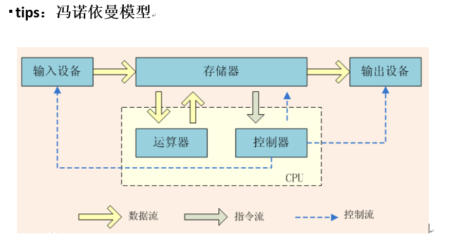

# 漫谈分布式架构

## 一、分布式架构的发展历史

## 二、分布式系统的难点

​         毫无疑问，分布式系统对于集中式系统而言，在实现上会更加复杂。分布式系统将会是更难理解、设计、构建 和管理的，同时意味着应用程序的根源问题更难发现。

### 三态

​         在集中式架构中， 我们调用一个接口返回的结果只有两种， 成功或者失败，但是在分布式领域中，会出现“超时”这个状态。

### 分布式事务

​         这是一个老生常谈的问题，我们都知道事务就是一些列操作的原子性保证，在单机的情况下，我们能够依靠本机的数据库连接和组件轻易做到事务的控制，但是分布式情况下，业务原子性操作很可能是跨服务的，这样就导致了分布式事务，例如 A和 B 操作分别是不同服务下的同一个事务操作内的操作， A 调用 B， A 如果可以清楚的知道 B 是否成功提交从而控制自身的提交还是回滚操作，但是在分布式系统中调用会出现一个新状态就是超时，就是 A 无法知道 B 是成功还是失败，这个时候 A是提交本地事务还是回滚呢？其实这是一个很难的问题，如果强行保证事务一致性，可以采取分布式锁，但是那样会增加系统复杂度而且会增大系统的开销，而且事务跨越的服务越多，消耗的资源越大，性能越低，所以最好的解决方案就是避免分布式事务。

​       还有一种解决方案就是重试机制，但是重试如果不是查询接口，必然涉及到数据库的变更，如果第一次调用成功但是没返回成功结果，那调用方第二次调用对调用方来说依然是重试，但是对于被调用方来说是重复调用，例如 A 向 B 转账， A-100,B +100，这样会导致 A 扣了 100，而 B 增加 200。这样的结果不是我们期望的，因此需在要写入的接口做幂等设计。多次调用和单次调用是一样的效果。通常可以设置一个唯一键，在写入的时候查询是否已经存在，避免重复写入。但是幂等设计的一个前提就是服务是高可用，否则无论怎么重试都不能调用返回一个明确的结果调用方会一直等待，虽然可以限制重试的次数，但是这已经进入了异常状态了，甚至到了极端情况还是需要人肉补偿处理。其实根据 CAP 和 BASE 理论，不可能在高可用分布式情况下做到一致性，一般都是最终一致性保证。

### 负载均衡

​         每个服务单独部署，为了达到高可用，每个服务至少是两台机器，因为互联网公司一般使用可靠性不是特别高的普通机器，长期运行宕机概率很高，所以两台机器能够大大降低服务不可用的可能性，这正大型项目会采用十几台甚至上百台来部署一个服务，这不仅是保证服务的高可用，更是提升服务的 QPS，但是这样又带来一个问题，一个请求过来到底路由到哪台机器？

​         路由算法很多，有 DNS 路由，如果 session 在本机，还会根据用户 id 或则 cookie 等信息路由到固定的机器，当然现在应用服务器为了扩展的方便都会设计为无状态的， session 会保存到专有的 session 服务器，所以不会涉及到拿不到 session 问题。那路由规则是随机获取么？这是一个方法，但是据我所知，实际情况肯定比这个复杂，在一定范围内随机，但是在大的范围也会分为很多个域，例如如果为了保证异地多活的多机房，夸机房调用的开销太大，肯定会优先选择同机房的服务，这个要参考具体的机器分布来考虑。

### 一致性

​         数据被分散或者复制到不同的机器上，如何保证各台主机之间的数据的一致性将成为一个难点。

### 故障的独立性

​         分布式系统由多个节点组成，整个分布式系统完全出问题的概率是存在的，但是在时间中出现更多的是某个节点出问题，其他节点都没问题。这种情况下我们实现分布式系统时需要考虑得更加全面些。

## 三、主流架构模型-SOA架构和微服务架构

​         SOA 全称（Service Oriented Architecture），中文意思为“面向服务的架构”， 他是一种设计方法， 其中包含多个服务，服务之间通过相互依赖最终提供一系列的功能。一个服务通常以独立的形式存在与操作系统进程中。各个服务之间通过网络调用跟 SOA 相提并论的还有一个 ESB（企业服务总线）， 简单来说 ESB 就是一根管道，用来连接各个服务节点。为了集成不同系统，不同协议的服务， ESB 做了消息的转化解释和路由工作，让不同的服务互联互通；

### SOA 所解决的核心问题

1. 系统集成：站在系统的角度，解决企业系统间的通信问题，把原先散乱、无规划的系统间的网状结构，梳理成规整、可治理的系统间星形结构，这一步往往需要引入一些产品，比如 ESB、以及技术规范、服务管理规范；这一步解决的核心问题是【有序】

2. 系统的服务化：站在功能的角度，把业务逻辑抽象成可复用、可组装的服务，通过服务的编排实现业务的快速再生，目的：把原先固有的业务功能转变为通用的业务服务，实现业务逻辑的快速复用；这一步解决的核心问题是【复用】

3. 业务的服务化：站在企业的角度，把企业职能抽象成可复用、可组装的服务； 把原先职能化的企业架构转变为服务化的企业架构，进一步提升企业的对外服务能力； “前面两步都是从技术层面来解决系统调用、系统功能复用的问题”。第三步，则是以业务驱动把一个业务单元封装成一项服务。这一步解决的核心问题是【高效】

### 微服务架构

​         微服务架构其实和 SOA 架构类似,微服务是在 SOA 上做的升华，微服务架构强调的一个重点是“业务需要彻底的组件化和服务化”，原有的单个业务系统会拆分为多个可以独立开发、设计、运行的小应用。这些小应用之间通过服务完成交互和集成。

​         组件表示一个可以独立更换和升级的单元，就像 PC 中的CPU、内存、显卡、硬盘一样，独立且可以更换升级而不影响其他单元。 如果我们把 PC 作为组件以服务的方式构建，那么这台 PC 只需要维护主板和一些必要的外部设备。 CPU、内存、硬盘都是以组件方式提供服务， PC 需要调用 CPU 做计算处理，只需要知道 CPU 这个组件的地址即可。

### 微服务的特征

1. 通过服务实现组件化

2. 按业务能力来划分服务和开发团队

3. 去中心化

4. 基础设施自动化（devops、自动化部署）

### SOA 和微服务架构的差别

1. 微服务不再强调传统 SOA 架构里面比较重的 ESB 企业服务总线，同时 SOA 的思想进入到单个业务系统内部实现真正的组件化

2. Docker 容器技术的出现，为微服务提供了更便利的条件，比如更小的部署单元，每个服务可以通过类似 Node或者 Spring Boot 等技术跑在自己的进程中。

3. 还有一个点大家应该可以分析出来， SOA 注重的是系统集成方面，而微服务关注的是完全分离

## 四、分布式架构的基本理论 CAP、 BASE 以及应用 

​         说CAP、 BASE 理论之前，先要了解下分布式一致性的这个问题实际上，对于不同业务的产品，我们对数据一致性的要求是不一样的，比如 12306，他要求的是数据的严格一致性，不能说把票卖给用户以后发现没有座位了；比如银行转账，你们通过银行转账的时候，一般会收到一个提示：转账申请将会在 24 小时内到账；实际上这个场景满足的是最终钱只要汇出去了即可，同时以及如果钱没汇出去要保证资金不丢失就行； 所以说，用户在使用不同的产品的时候对数据一致性的要求是不一样的

### 关于分布式一致性问题

​         在分布式系统中要解决的一个重要问题就是数据的复制。在我们的日常开发经验中，相信很多开发人员都遇到过这样的问题：在做数据库读写分离的场景中，假设客户端 C1将系统中的一个值 K 由 V1 更新为 V2，但客户端 C2 无法立即读取到 K 的最新值，需要在一段时间之后才能 读取到。这很正常，因为数据库复制之间存在延时。

​         所谓的分布式一致性问题，是指在分布式环境中引入数据复制机制之后，不同数据节点之间 可能出现的，并无法依靠计算机应用程序自身解决的数据不一致的情况。简单讲，数据一致性就是指在对一个副本数据进行更新的时候，必须确保也能够更新其他的 副本，否则不同副本之间的数据将不一致。

​         那么如何去解决这个问题？按照正常的思路，我们可能会想，既然是因为网络延迟导致的问题，那么我们可以把同步动作进行阻塞，用户 2 在查询的时候必须要等到数据同步完成以后再来做。但是这个方案带来的问题是性能会收到非常大的影响。如果同步的数据比较多或者比较频繁，那么因为阻塞操作可能将导致整个新系统不可用的情况；

​         总结： 所以我们没有办法找到一种能够满足数据一致性、又不影响系统运行的性能的方案，所以这个地方就诞生了一个一致性的级别：

1. 强一致性：这种一致性级别是最符合用户直觉的，它要求系统写入什么，读出来的也会是什么，用户体验好，但实现起来往往对系统的性能影响大

2. 弱一致性：这种一致性级别约束了系统在写入成功后，不承诺立即可以读到写入的值，也不承诺多久之后数据能够达到一致，但会尽可能地保证到某个时间级别（比如秒级别）后，数据能够达到一致状态

3. 最终一致性：最终一致性是弱一致性的一个特例，系统会保证在一定时间内，能够达到一个数据一致的状态。这里之所以将最终一致性单独提出来，是因为它是弱一致性中非常推崇的一种一致性模型，也是业界在大型分布式系统的数据一致性上比较用的多的模型

### CAP 理论

​         一个经典的分布式系统理论。 CAP 理论告诉我们：一个分布式系统不可能同时满足一致性（C： Consistency）、可用性（A：Availability）和分区容错性（P：Partition tolerance）这三个基本需求，最多只能同时满足其中两项。 CAP 理论在互联网界有着广泛的知名度，也被称为“帽子理论”，它是由 Eric Brewer 教授在 2000 年举行的 ACM 研讨会提出的一个著名猜想：

​         一致性（Consistency）、可用性（Availability）、分区容错（Partition-tolerance）三者无法在分布式系统中同时被满足，并且最多只能满足两个！

> 一致性： 所有节点上的数据时刻保持同步

> 可用性：每个请求都能接收一个响应，无论响应成功或失败

> 分区容错：系统应该持续提供服务，即时系统内部（某个节点分区）有消息丢失。比如交换机失败、网址网络被分成几个子网，形成脑裂；服务器发生网络延迟或死机，导致某些 server 与集群中的其他机器失去联系

​         分区是导致分布式系统可靠性问题的固有特性，从本质上来看， CAP 理论的准确描述不应该是从 3 个特性中选取两个，所以我们只能被迫适应，根本没有选择权；

​         总结一下： CAP 并不是一个普适性原理和指导思想，它仅适用于原子读写的 NoSql 场景中，并不适用于数据库系统。

### BASE 理论

​         从前面的分析中知道：在分布式（数据库分片或分库存在的多个实例上）系统下， CAP 理论并不适合数据库事务（因为更新一些错误的数据而导致的失败，无论使用什么样的高可用方案都是徒劳，因为数据发生了无法修正的错误）。

​         此外 XA 事务虽然保证了数据库在分布式系统下的 ACID（原子性、一致性、隔离性、持久性）特性，但也带来了一些性能方面的代价，对于并发和响应时间要求比较高的电商平台来说，是很难接受的。

​         eBay 尝试了另外一条完全不同的路，放宽了数据库事务的ACID 要求，提出了一套名为 BASE 的新准则。 BASE 全称是 Basically available,soft-state,Eventually Consistent.系统基本可用、软状态、数据最终一致性。相对于 CAP 来说，它大大降低了我们对系统的要求。 Basically available（基本可用），在分布式系统出现不可预知的故障时，允许瞬时部分可用性

1. 比如我们在淘宝上搜索商品，正常情况下是在 0.5s 内返回查询结果，但是由于后端的系统故障导致查询响应时间变成了 2s

2. 再比如数据库采用分片模式， 100W 个用户数据分在 5个数据库实例上，如果破坏了一个实例，那么可用性还有 80%，也就是 80%的用户都可以登录，系统仍然可用

3. 电商大促时，为了应对访问量激增， 部分用户可能会被引导到降级页面，服务层也可能只提供降级服务。这就是损失部分可用性的体现

> ​       soft-state（软状态） . 表示系统中的数据存在中间状态，并且这个中间状态的存在不会影响系统的整体可用性，也就是表示系统允许在不同节点的数据副本之间进行数据同步过程中存在延时； 比如订单状态，有一个待支付、 支付中、支付成功、 支付失败， 那么支付中就是一个中间状态， 这个中间状态在支付成功以后， 在支付表中的状态同步给订单状态之前， 中间会存在一个时间内的不一致。

> ​        Eventually consistent（数据的最终一致性），表示的是所有数据副本在一段时间的同步后最终都能达到一个一直的状态，因此最终一致性的本质是要保证数据最终达到一直，而不需要实时保证系统数据的强一致

> ​        BASE 理论的核心思想是： 即使无法做到强一致性，但每个应用都可以根据自身业务特点，采用适当的方式来使系统达到最终一致性

### 什么是分布式架构下的高可用设计

#### 1. 避免单点故障

​	负载均衡技术（failover/选址/硬件负载/软 件负载 /去中心化的 软件负载（gossip(rediscluster)））

​	热备（linux HA）

​	多机房（同城灾备、 异地灾备）

#### 2. 应用的高可用性

​	故障监控（系统监控（cpu、 内存） /链路监控/日志监控） 自动预警

​	应用的容错设计、（服务降级、 限流） 自我保护能力

​	数据量（数据分片、 读写分离）

### 分布式架构下的可伸缩设计

垂直伸缩 提升硬件能力

水平伸缩 增加服务器

### 加速静态内容访问速度的 CDN

​         CDN 是 Content Delivery Network 的缩写，表示的是内容分发网络。 CDN 的作用是把用户需要的内容分发到离用户最近的地方，这样可以是用户能够快熟获取所需要的内容。

CDN 其实就是一种网络缓存技术，能够把一些相对稳定的资源放到距离最终用户较近的地方，一方面可以节省整个广域网的贷款消耗，另外一方面可以提升用户的访问速度，改进用户体验。我们一般会把静态的文件（图片、脚本、静态页面）放到 CDN 中

1. 当用户点击网站页面上的内容 URL，经过本地 DNS 系统解析， DNS系统会最终将域名的解析权交给 CNAME 指向的 CDN 专用 DNS 服务器

2. CDN 的 DNS 服务器将 CDN 的全局负载均衡设备 IP 地址返回用户

3. 用户向 CDN 的全局负载均衡设备发起内容 URL 访问请求

4. CDN全局负载均衡设备根据用户 IP地址，以及用户请求的内容 URL，选择一台用户所属区域的区域负载均衡设备，告诉用户向这台设备发起请求。

5. 区域负载均衡设备会为用户选择一台合适的缓存服务器提供服务，选择的依据包括：根据用户 IP 地址，判断哪一台服务器距用户最近；根据用户所请求的 URL 中携带的内容名称，判断哪一台服务器上有用户所需内容；查询各个服务器当前的负载情况，判断哪一台服务器尚有服务能力。基于以上这些条件的综合分析之后，区域负载均衡设备会向全局负载均衡设备返回一台缓存服务器的 IP 地址

6. 局负载均衡设备把服务器的 IP 地址返回给用户用户向缓存服务器发起请求，缓存服务器响应用户请求，将用户所需内容传送到用户终端。如果这台缓存服务器上并没有用户想要的内容，而区域均衡设备依然将它分配给了用户，那么这台服务器就要向它的上一级缓存服务器请求内容，直至追溯到网站的源服务器将内容拉到本地。

#### 什么情况下用 CDN

​         最适合的是那些不会经常变化的内容，比如图片，JS 文件，CSS 文件，图片文件包括程序模板中的， CSS 文件中用到的背景图片，还有就是作为网站内容组成部分的那些图片，都可以；

**灰度发布**

​         我们的应用虽然经过了测试部门的测试，但是仍然很难全面覆盖用户的使用场景，为了保证万无一失，我们在进行发布的时候一般会采用灰度发布，也就是会对新应用进行分批发布，逐步扩大新应用在整个及群众的比例直到最后全部完成。灰度发布是针对新引用在用户体验方面完全无感知。 

​	灰度发布系统的作用在于，可以根据自己的配置，来将用户的流量导到新上线的系统上，来快速验证新的功能修改，而一旦出问题，也可以马上的恢复，简单的说，就是一套A/BTest 系统．

